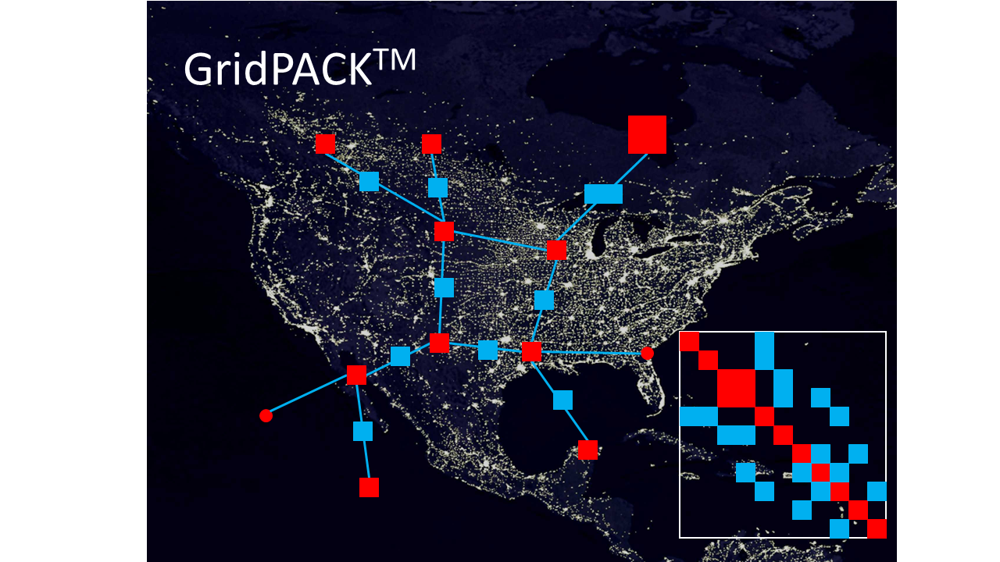

<!---

# GridPACK<sup>TM</sup>-->
# GridPACK: High-Performance Electric Grid Simulation


GridPACK is an open-source high-performance (HPC) package for simulation of large-scale electrical grids. Powered by distributed (parallel) computing and high-performance numerical solvers, GridPACK offers several applications forfast simulation of electrical transmission systems. GridPACK includes a number of prebuilt applications that can be directly used. The most commonly used and well-developed are:
- AC Power Flow
- Dynamics Simulation
- Contingency Analysis

Other applications under development or not full featured are
- Dynamic security assessment
- State estimation

In addition, GridPACK is also a framework to simplify the development of new applications on HPC platforms. To ease the development, GridPACK offers several building blocks such as setting up and distributing (partitioning) power grid networks, support for custom components on buses and branches, converting the network models to the corresponding algebraic equations, parallel routines for manipulating and solving large algebraic systems, and input and output modules as well as basic profiling and error management. GridPACK is written in C++ with python wrappers available.

## Installation
See the [instructions](docs/markdown/BASIC_INSTALL.md) for installing GridPACK, prerequisite software, and installation notes for different platforms.

## Usage
See [User manual](docs/user_manual/GridPACK.pdf) for a deep dive on GridPACK internals and/or refer to the [tutorials](docs/markdown/TUTORIALS.md) for more info.

- Quick Guide (To do)

## Documentation
- [User manual](docs/user_manual/GridPACK.pdf)
- [Tutorials](docs/markdown/TUTORIALS.md)
- [FAQS](docs/markdown/FAQS.md)
- [License](docs/markdown/LICENSE.md)
<!--- [Data Sets](docs/markdown/DATASETS.md)
- [Downloads](https://github.com/GridOPTICS/GridPACK/releases)
-->

## Contact us
The best (and fastest) way to reach us for any technical questions is by posting an issue [here](https://github.com/GridOPTICS/GridPACK/issues). You can also reach us via email   gridpack.account@pnnl.gov.

## Citing GridPACK
```
@article{doi:10.1177/1094342015607609,
author = {Bruce Palmer and William Perkins and Yousu Chen and Shuangshuang Jin and David C allahan and Kevin Glass and Ruisheng Diao and Mark Rice and Stephen Elbert and Mallikarjun a Vallem and Zhenyu Huang},
title ={GridPACKTM: A framework for developing power grid simulations on high-performance computing platforms},
journal = {The International Journal of High Performance Computing Applications},
volume = {30},
number = {2},
pages = {223-240},
year = {2016},
doi = {10.1177/1094342015607609},
URL = {https://doi.org/10.1177/1094342015607609},
eprint = {https://doi.org/10.1177/1094342015607609}
```

## Authors
- Bruce Palmer
- William Perkins
- Yousu Chen
- Renke Huang
- Yuan Liu
- Shuangshuang Jin
- Shrirang Abhyankar

## Acknowledgement
GridPACK has been developed through funding from various sources over the years.
- PNNL LDRD Future Grid Initiative
- DOE OE [Advanced Grid Modeling (AGM)](https://www.energy.gov/oe/advanced-grid-modeling) program
- [Grid Modernization Laboratory Consortium](https://www.energy.gov/gmi/grid-modernization-lab-consortium)
- DOE EERE [Solar Energy Technologies Office](https://www.energy.gov/eere/solar/solar-energy-technologies-office)
- DOE EERE [Wind Energy Technologies Office](https://www.energy.gov/eere/wind/wind-energy-technologies-office)

## Copyright
Copyright &copy; 2013, Battelle Memorial Institute.

GridPACK<sup>TM</sup> is a free software distributed under a BSD 2-clause license. You may reuse, modify, and redistribute the software.

See the [license](src/LICENSE.md) file for details.


## Disclaimer
The Software was produced by Battelle under Contract No. DE-AC05-76RL01830 with
the Department of Energy. For five years from October 10, 2013, the Government is granted
for itself and others acting on its behalf a nonexclusive, paid-up, irrevocable worldwide license in this data to reproduce, prepare derivative works, and perform publicly and display
publicly, by or on behalf of the Government. There is provision for the possible extension
of the term of this license. Subsequent to that period or any extension granted, the Government is granted for itself and others acting on its behalf a nonexclusive, paid-up, irrevocable
worldwide license in this data to reproduce, prepare derivative works, distribute copies to
the public, perform publicly and display publicly, and to permit others to do so. The specific
term of the license can be identified by inquiry made to Battelle or DOE. Neither the United
States nor the United States Department of Energy, nor any of their employees, makes any
warranty, express or implied, or assumes any legal liability or responsibility for the accuracy,
completeness or usefulness of any data, apparatus, product or process disclosed, or represents that its use would not infringe privately owned rights.
