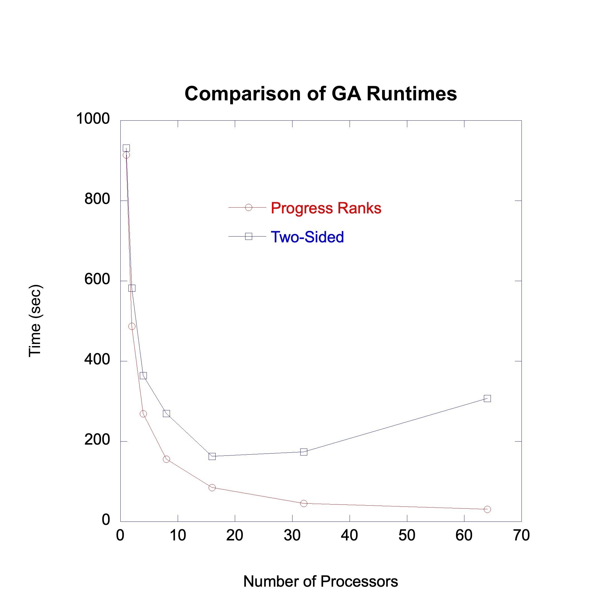

## Global Arrays

GridPACK depends heavily on [Global Arrays](https://github.com/GlobalArrays/ga).
The download page for recent releases can be found
[here](https://github.com/GlobalArrays/ga/releases).  The GA libraries used with
GridPACK must have the C++ interface enabled and the Fortran interface disabled.
More information on building GA can be found in the descriptions for building
GridPACK on individual platforms. The GridPACK configuration is not able to
identify additional required libraries if the Fortran interface is enabled or
independent BLAS/LAPACK libraries are used.  The following configuration options
should always be included when configuring GA on any platform

```
    --enable-cxx --without-blas --disable-f77
```

The `--without-blas` guarantees that GA does not try and build with the
BLAS libraries (which are downloaded and built with PETSc).

To configure GridPACK to recognize GA, specify the directory where Global Arrays
is installed and any extra libraries that are required:

```
    -D GA_DIR:PATH=/path/to/ga/install \
    -D GA_EXTRA_LIBS:STRING="..." \
    -D USE_PROGRESS_RANKS:BOOL=FALSE \
```

The `GA_EXTRA_LIBS` variable is used to include required libraries not
identified in the configuration. In most cases, this variable should not be
needed. The `USE_PROGRESS_RANKS` variable
depends on the runtime used to build GA and should only be set to `TRUE`
if GA was configured using the `--with-mpi-pr` option.

We have used two different configurations of GA to build and run GridPACK.
For any system with a working version of MPI, you can
use the MPI two-sided runtime or the progress ranks runtime with GA. Use the
`--with-mpi-ts` or `--with-mpi-pr` options when configuring GA.
The two-sided runtime is the simplest runtime and is suitable for workstations
with a limited number of cores. This runtime provides reasonable performance on
a small number of cores but slows down considerably at larger core counts(our
experience is that you should limit this runtime to 8 or less processors). It is
not recommended for large-scale parallel computation.  The progress ranks
runtime is much higher performing.
It is very reliable and runs on any platform that supports MPI.
However, it has one peculiarity in that it reserves one MPI process on each SMP
node to act as a communication manager. Thus, if you are running your
calculation on 2 nodes with 5 processes on each node, the GridPACK application
will only see 8 processes (4 on each node). To make sure that the GridPACK build
is aware of this, the `USE_PROGRESS_RANKS` parameter should be set to
`TRUE` when using the progress ranks build of GA.

A comparison of the performance of the progress ranks and two-sided runtimes is
shown below for the Polish network test calculation included as part of the
contingency analysis application. The progress ranks runtime shows significantly
better performance for all process counts, especially after four processors or
so.



Global Arrays is a relatively straightforward build if MPI is available on your
system. To configure GA with the basic two-sided runtime (suitable for
workstations with a limited number of cores) use the configuration line

```
../configure --enable-i4 --enable-cxx --without-blas --disable-f77 \
  --prefix=/path/to/my/local/build_ts CC=mpicc CXX=mpicxx \
  CFLAGS=-g CXXFLAGS=-g
```

This configuration line assumes that the build directory is located directly
below the top level GA directory. If you want to build someplace else, the `../`
before `configure` needs to be replaced with the path to `configure`.
The two-sided build will work with almost any version of MPI and is easy to use
but is
slow for more than a few processors. For higher performance, particularly on
clusters with a high performance network, the progress ranks runtime is
preferable. To configure GA with this runtime, use the configure command

```
../configure --enable-i4 --enable-cxx --with-mpi-pr --without-blas --disable-f77
  --prefix=/pic/projects/gridpack/software/ga-5.8/build_pr CC=mpicc CXX=mpicxx
  CFLAGS=-g CXXFLAGS=-g
```

If you want to build GA with shared libraries, include the option
`--enable-shared=yes` in the configuration line.
