GridPACK Framework Components
=============================

This section will describe the GridPACK components and the functionality
they support. The four major GridPACK components are networks, bus and
branch components, the mappers and the math module. The math module is
relatively self-contained and can be used as a conventional library, but
the other three are tightly coupled and need to be used together to do
anything useful. A schematic that illustrates the relationship between
these components is shown in Figure 1.

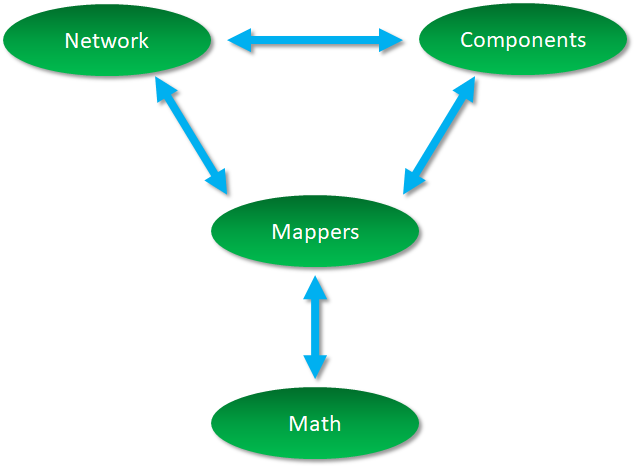

   Relationship between major GridPACK components.

A full description of a power grid network requires specification of
both the network topology and the physical properties of the bus and
branch components. The combination of the models and the network
generate algebraic equations that can be solved to get desired system
properties. GridPACK supplies numerous modules to simplify the process
of specifying the model and solving it. These include power grid
components that describe the physics of the different network models or
analyses, grid component factories that initialize the grid components,
mappers that convert the current state of the grid components into
matrices and vectors, solvers that supply the preconditioner and solver
functionality necessary to implement solution algorithms, input and
output modules that allow developers to import and export data, and
other utility modules that support standard code development operations
like timing, event logging, and error handling.

Many of these modules are constructed using libraries developed
elsewhere so as to minimize framework development time. However, by
wrapping them in interfaces geared towards power grid applications these
libraries can be made easier to use by power grid engineers. The
interfaces also make it possible in the future to exchange libraries for
new or improved implementations of specific functionality without
requiring application developers to rewrite their codes. This can
significantly reduce the cost of introducing new technology into the
framework. The software layers in the GridPACK framework are shown
schematically in Figure 2.

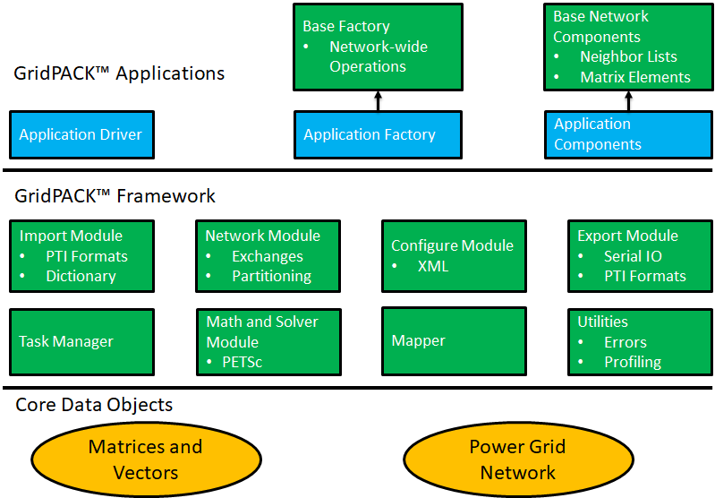

   A schematic diagram of the GridPACK framework software data stack.
   Green represents components supplied by the framework and blue
   represents code that is developed by the user.

Core framework components are described below. Before discussing the
components themselves, some of the coding conventions and libraries used
in GridPACK will be described.

Preliminaries
-------------

The GridPACK software uses a few coding conventions to help improve
memory management and to minimize run-time errors. The first of these is
to employ namespaces for all GridPACK modules. The entire GridPACK
framework uses the **gridpack** namespace, individual modules within
GridPACK are further delimited by their own namespaces. For example, the
BaseNetwork class discussed in the next section resides in the
**gridpack::network** namespace and other modules have similar
delineations. The example applications included in the source code also
have their own namespaces, but this is not a requirement for developing
GridPACK-based applications.

To help with memory management, many GridPACK functions return boost
shared pointers instead of conventional C++ pointers. These can be
converted to a conventional pointer using the ``get()`` command. We
also recommend that the type of pointers be converted using a
``dynamic_cast`` instead of conventional C-style cast. Application
files should include the ``gridpack.hpp`` header file. This can be
done by adding the line

::

   #include "gridpack/include/gridpack.hpp"

at the top of the application .hpp and/or .cpp files. This file contains
definitions of all the GridPACK modules and their associated functions.

Matrices and vectors in GridPACK were originally complex but now either
complex or real matrices can be created using the library. Inside the
GridPACK implementation, the underlying distributed matrices are either
complex or real, but the framework adds a layer that supports both types
of objects, even if the underlying math library does not. However,
computations on complex matrices will perform better if the underlying
math library is configured to use complex matrices directly. This should
be kept in mind when choosing the math library to build GridPACK on. The
underlying PETSc library can be configured to support either real or
complex matrices, but not both at the same time. Complex numbers are
represented in GridPACK as having type ``ComplexType``. The real and
imaginary parts of a complex number ``x`` can be obtained using the
functions ``real(x)`` and ``imag(x)``.

Network Module
--------------

The network module is designed to represent the power grid and has four
major functions:

#. The network is a container for the grid topology. The connectivity of
   the network is maintained by the network object and can be made
   available through requests to the network. The network also maintains
   the “ghost” status of buses and branches and determines whether a bus
   or branch is owned by a particular processor or represents a ghost
   image of a bus or branch owned by a neighboring processor.

#. The network topology can be decorated with bus and branch objects
   that describe the properties of the particular physical system under
   investigation. Bus and branch objects are written by the application
   developer and incorporate the grid model and the analyses that need
   to be performed on it. Different applications will use different bus
   and branch implementations.

#. The network module is responsible for supplying update operations
   that can be used to fill in the value of ghost cell fields with
   current data from other processors. The updates of ghost buses and
   ghost branches have been split into separate operations to give users
   flexibility in optimizing performance by minimizing the amount of
   data that needs to be communicated in the code. Many applications do
   not require exchanges of branch data.

#. The network contains the partitioner. The partitioner is embedded in
   the network module but it is a substantial computational technology
   in its own right. Partitioning is a key part of parallel application
   development. It represents the act of dividing up the problem so that
   each processor is left with approximately equal amounts of work. At
   the same time, the partition is chosen so that communication between
   processors (a major source of computational inefficiency in HPC
   programs) is minimized.

A network is illustrated schematically in Figure 3.
Each bus and branch has an associated bus or branch object. The buses
and branches are derived from base classes that specify certain
functions that must be implemented by the application developer so that
the network can interact with other GridPACK modules. In addition, the
application can have functionality outside the base class that is unique
to the particular application.

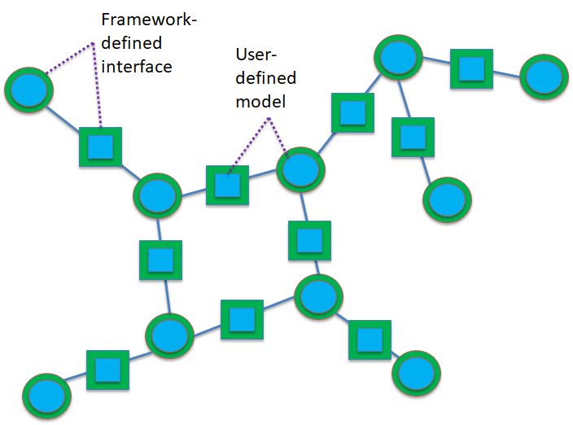

   Schematic representation of a GridPACK network. The squares are
   branch objects and the circles are bus objects. Framework-specified
   interfaces are green and user supplied functionality is blue.

A major use of the partitioner is to rearrange the network in a form
that is useful for computation immediately after it is read in from an
external file. Typically, the information in the external file is not
organized in a way that is necessarily optimal for computation, so the
partitioner must redistribute data such that each processor contains at
most a few large connected subsets of the network. The partitioner is
also responsible for adding the ghost buses and branches to the system.

Ghost buses and branches in a parallel program represent images of buses
and branches that are owned by other processes. In order to carry out
operations on buses and branches it is frequently necessary to gain
access to data associated with attached buses and branches. If the
attached bus or branch resides on the same process, this is easily done
but if they are located on another process, then some other mechanism is
needed. The most efficient way to access remote data is to create copies
of the buses and branches from other processors that are connected to
locally owned objects. All local network components then have a complete
set of attached neighbors. The ghost objects are updated collectively
with current information from their home processors at points in the
computation. Updating all ghosts at once is almost always more efficient
than accessing data from one remote bus or branch at a time.

The use of the partitioner to distribute the network between different
processors and create ghost nodes and branches is illustrated in
Figure 4. Figure 4(a)
shows a connected network that has been partitioned between two
processors such that each processor owns roughly equally sized connected
pieces. Figure 4(b) and
Figure 4(c) show the pieces of the network on
each processor after the ghost buses and branches have been added. Note
that the ghost buses and branches represent connections that are split
by the partition in Figure 4(a).

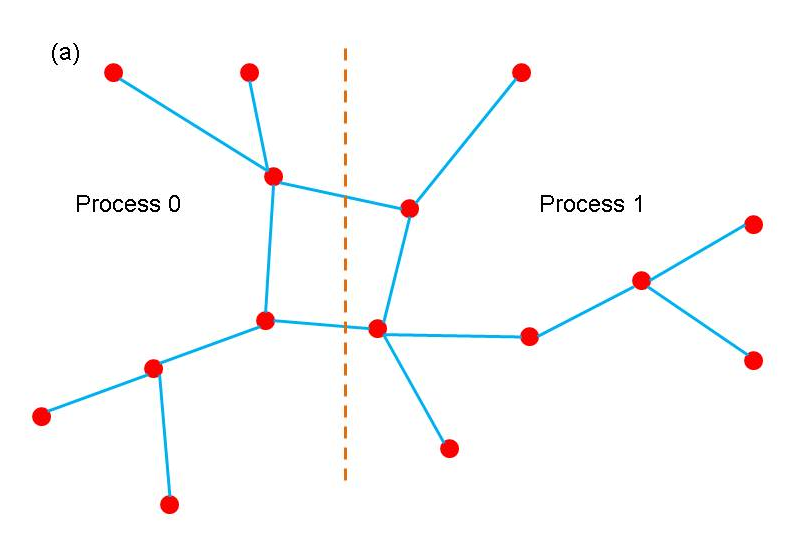

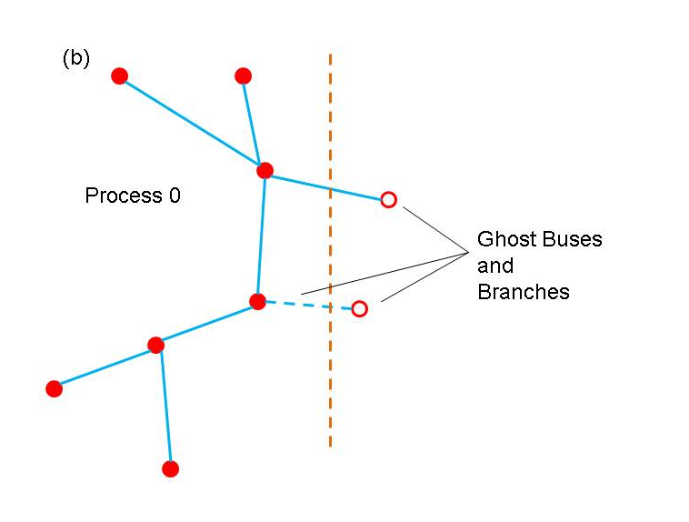

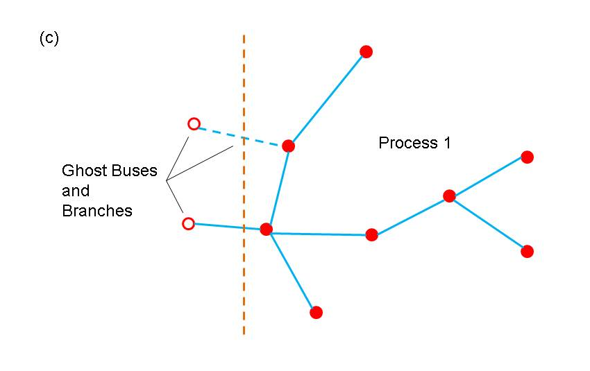

   (a) simple network, (b) partition of network on processor 0,
   and (c) partition of network on processor 1. Open circles indicate
   ghost buses and dotted lines indicate ghost branches.

Networks can be created using the templated base class
``BaseNetwork<class Bus, class Branch>``,
where ``Bus`` and ``Branch`` are application-specific classes
describing the properties of buses and branches in the network. The
``BaseNetwork`` class is defined within the
``gridpack::network`` namespace. In addition to the ``Bus`` and
``Branch`` classes, each bus and branch has an associated
``DataCollection`` object, which is described in more detail in the
data `interface section <#data_interface>`__. The
``DataCollection`` object is a collection of key-value pairs that
acts as an intermediary between data that is read in from external
configuration files and the bus and branch classes that define the
network.

The ``BaseNetwork`` class contains a large number of methods, but
only a relatively small number will be of interest to most application
developers. Users that are interested in building networks from from an
external file that is not supported by one of the GridPACK parser
modules can read the section on advanced network functionality. This
describes methods used primarily within other GridPACK modules to
implement higher level capabilities. This section will focus on calls
that are likely to be used by application developers.

The constructor for the network class is the function

::

   BaseNetwork(const parallel::Communicator &comm)

The ``Communicator`` object is used to define the set of processors
over which the network is distributed. Communicators are discussed in
more detail in section `6.1 <#communicator>`__. The network constructor
creates an empty shell that does not contain any information about an
actual network. The remainder of the network must be built up by adding
buses and branches to it. Typically, buses and branches are added by
passing the network to a parser (see import module) which will create an
initial version of the network. The constructor is paired with a
corresponding destructor

::

   ~BaseNetwork()

that is called when the network object passes out of scope or is
explicitly deleted by the user.

Two functions are available that return the number of buses or branches
that are available on a process. This number includes both buses and
branches that are held locally as well as any ghosts that may be located
on the process.

::

   int numBuses()

   int numBranches()

There are also functions that will return the total number of buses or
branches in the network. These numbers ignore ghost buses and ghost
branches.

::

   int totalBuses()

   int totalBranches()

Buses and branches in the network can be identified using a local index
that runs from 0 to the number of buses or branches on the process minus
1 (0-based indexing). For some calculations, it is necessary to identify
one bus in the network as a reference bus. This bus is usually set when
the network is created using an import parser. It can subsequently be
identified using the function

::

   int getReferenceBus()

If the reference bus is located on this processor (either as a local bus
or a ghost) then this function returns the local index of the bus,
otherwise it returns -1.

Ghost buses and branches are distinguished from locally owned buses and
branches based on whether or not they are “active”. The two functions

::

   bool getActiveBus(int idx)

   bool getActiveBranch(int idx)

provide the active status of a bus or branch on a process. The index
``idx`` is a local index for the bus or branch. Buses and branches
are characterized by a number of different indices. One is the local
index, already discussed above, but there are several others. Most of
these are used internally by other parts of the framework but one index
is of interest to application developers. This is the “original” bus
index. When the network is described in the input file, the buses are
labeled with a (usually) positive integer. There or no requirements that
these integers be consecutive, only that each bus has its own unique
index. The value of this index can be recovered using the function

::

   int getOriginalBusIndex(int idx)

The variable ``idx`` is the local index of the bus. Branches are
usually described in terms of the original bus indices for the two buses
at each end of the branch, so there is no corresponding function for
branches. Instead, the procedure is to get the local indices of the two
buses at each end of the branch and then get the corresponding original
indices of the buses. This information is usually used for output.

It is frequently necessary to gain access to the objects associated with
each bus or branch. The following four methods can be used to access
these objects

::

   boost::shared_ptr<Bus> getBus(int idx)

   boost::shared_ptr<Branch> getBranch(int idx)

   boost::shared_ptr<DataCollection> getBusData(int idx)

   boost::shared_ptr<DataCollection> getBranchData(int idx)

The first two methods can be used to get Boost shared pointers to
individual bus or branch objects indexed by local indices ``idx``.
The last two functions return pointers to the
``DataCollection`` objects associated with each bus or
branch. These ``DataCollection`` objects can be used to initialize
the bus and branch objects at the start of a calculation but they are
also useful when converting a network of one type to a network of
another type. This often happens when different computations are chained
together. The following functions can be useful for handling input that
is directed at certain network components

::

   std::vector<int> getLocalBusIndices(int idx)

   std::vector<int> getLocalBranchIndices(int idx1, int idx2)

These functions return a list of local indices that correspond to either
the original bus index ``idx`` for a bus, or the pair of
indices ``idx1``, ``idx2`` for a branch. The reason that a list
is returned instead of a single index is that in the case of ghost buses
and branches, more than one copy of a network component may exist on a
process. If no copies of a network component exist on a process then the
returned vector has zero length. These functions can be used for
applications such as contingency analysis, where modifications are made
to a single network component and the modifications are specified in
terms of the original bus indices. These functions can be used to find
the local index of the component, if it exists.

The network partitioner can be accessed via the function

::

   void partition()

The partition function distributes the buses and branches across
processors such that the connectivity to branches and buses on other
processors is minimized. It is also responsible for adding ghost buses
and branches to the network. This function should be called after the
network is read in but before any other operations, such as setting up
exchange buffers or creating neighbor lists, have been performed.
Finally, two sets of functions are required in order to set up and
execute data exchanges between buses and branches in a distributed
network. These exchanges are used to move data from active components to
ghost components residing on other processors. Before these functions
can be called, the buffers in individual network components must be
allocated. See the documentation on network components in
section `4.4 <#network_components>`__ and the network factory in
section `4.6 <#factory>`__ for more information on how to do this.

Once the buffers are in place, bus and branch exchanges can be set up
and executed with just a few calls. The functions

::

   void initBusUpdate()

   void initBranchUpdate()

are used to initialize the data structures inside the network object
that manage data exchanges. Exchanges between buses and branches are
handled separately, since not all applications will require exchanges
between both sets of objects. The initialization routines are relatively
complex and allocate several large internal data structures, so they
should not be called if there is no need to exchange data as part of the
algorithm.

After the updates have been initialized, it is possible to execute a
data exchange at any point in the code by calling the functions

::

   void updateBuses()

   void updateBranches()

These functions will cause data on ghost buses and branches to be
updated with current values from active buses and branches located on
other processors.

One additional network function that can be useful in certain
circumstances is the capability for recovering the communicator on which
the network is defined

::

   const Communicator& communicator() const

This function can be used in implementing algorithms based on multilevel
parallelism. Recovering the communicator is also needed for converting
applications to modules that can be used to create higher level
workflows that combine multiple different types of applications. This is
discussed in more detail below.

Finally, two functions that can be of use in a variety of contexts
return the local index of a bus or branch given the original indices of
the bus or the original indices of the buses defining the endpoints of a
branch. These functions are

::

   std::vector<int> getLocalBusIndices(int idx)

   std::vector<int> getLocalBranchIndices(int idx1, int idx2)

These can be used to easily modify individual buses or branches based on
user input. The functions return a vector of local indices, since it is
possible that multiple buses may correspond to an original index. This
can happen if the original index happens to correspond to a ghost bus on
a particular process.

The ``BaseNetwork`` methods described in this section are only a
subset of the total functionality available but they represent most of
the methods that a typical developer would use. The remaining functions
are primarily used to implement other parts of the GridPACK framework
but are generally not required by people writing applications. More
information on how the functions described above are used in practice
can be found in the section on GridPACK factories.

Math Module
-----------

The math module provides support in GridPACK for distributed matrices
and vectors, linear solvers, non-linear solvers with preconditioning and
DAE/ODE system time integration. Once created, vectors and matrices can
be treated as opaque objects and manipulated using a high level syntax
that is comparable to writing Matlab code. The distributed matrix and
vector data structures themselves are based on external solver libraries
and represent relatively lightweight wrappers on multipurpose HPC codes.
The current math module is built on the PETSc library but other
libraries, such as Hypre and Trilinos could potentially be used instead.

The main functionality associated with the math module is the ability to
instantiate new matrices and vectors, add individual matrix and vector
elements (and their values) to the matrix/vector objects, invoke the
assemble operation on the object, perform basic algebraic operations,
such as matrix-vector multiply, and solve systems of algebraic
equations. The assemble operation is designed to give the library a
chance to set up internal data structures and repartition the matrix
elements, etc. in a way that will optimize subsequent calculations.
Inclusion of this operation follows the syntax of most solver libraries
when they construct a matrix or vector.

In addition to basic matrix operations, the math module contains linear
and non-linear solvers and preconditioners. The module provides a simple
interface on top of the PETSc libraries that will allow users access to
this functionality without having to be familiar with the libraries
themselves. This should make it possible to construct solver routines
that are comparable in complexity to Matlab scripts. The use of a
wrapper instead of having users directly access the libraries will also
make it simpler to switch the underlying library in an application. All
that will be required is that developers link to an implementation of
the math module interface that is built on a different library. There
will not be a need to rewrite any application code. This has the
advantage that if a different library is used for the math module in one
application, it instantly becomes available for other applications.

The functionality in the math component is distributed between the
classes ``Matrix`` , ``RealMatrix``, ``Vector``,
``RealVector``, ``LinearSolver``,
``RealLinearSolver``, ``NonLinearSolver``,
``RealNonlinearSolver``, ``DAESolver``, and
``RealDAESolver``

Each of these classes is in the ``gridpack::math`` namespace and is
described below. Like the ``BaseNetwork`` class, there are a lot of
functions in ``Matrix`` and ``Vector`` that do not need to be
used by users. Most of the functions related to matrix/vector
instantiation and creation are used inside the mapper classes described
in section `4.7 <#mapper>`__, which eliminates the need for users to
deal with them directly. However, users may be interested in creating
functions not covered by existing library methods and in this case
access to these functions is useful.

An additional note on the math module class names is in order.
Originally, GridPACK only supported complex objects and used the names
``Vector``, ``Matrix``, etc. More recently, the capability for
supporting real values was added and hence the new names
``RealVector``, etc. The original names continued to be used for
complex objects to maintain backwards compatibility. Complex objects can
also be accessed using the names ``ComplexVector``,
``ComplexMatrix``, etc., which are mapped to the original complex
objects.

Matrices
~~~~~~~~

The ``Matrix and RealMatrix`` classes are designed to create
distributed matrices. ``Matrix`` is used for complex matrices and
``RealMatrix`` is used for real matrices. The matrix classes support
two types of matrix, ``Dense`` and ``Sparse``. In most cases
users will want to use the sparse matrix but some applications require
dense matrices. The ``Matrix`` and ``RealMatrix`` classes are
nearly identical in functionality, so in the following we will only
outline operations on the ``Matrix`` class. In most cases, the
``RealMatrix`` class contains the same operations. The only point to
note is that for any operations that involve multiple matrices or a
matrix and a vector, all matrix and vector objects must be either all
complex or all real. In the future, we plan on adding some operations
that will allow users to convert between types.

The matrix constructor is

::

   Matrix(const parallel::Communicator &comm,
              const int &local_rows,
              const int &cols,
              const StorageType &storage_type=Sparse)

The communicator object ``comm`` specifies the set of processors
that the matrix is defined on, the ``local_rows`` parameter
corresponds to the number of rows contributed to the matrix by the
processor, the ``cols`` parameter indicates what the second
dimension of the matrix is and the ``storage_type`` parameter
determines whether the matrix is sparse or dense. If the total dimension
of the matrix is M\ :math:`\mathrm{\times}`\ N, then the sum of the
``local_rows`` parameters over all processors must equal M and the
``cols`` parameter is equal to N.

The matrix destructor is

::

   ~Matrix()

Once a matrix has been created some inquiry functions can be used to
probe the matrix size and distribution. The following functions return
information about the matrix.

::

   int rows() const

   int localRows() const

   void localRowRange(int &lo, int &hi) const

   int cols()

The function ``rows`` will return the total number of rows in the
matrix, ``localRows`` returns the number of rows associated with the
calling processor, ``localRowRange`` returns the ``lo`` and
``hi`` index of the rows associated with the calling processor and
``cols`` returns the number of columns in the matrix. Note that
matrices are partitioned into row blocks on each processor.

Additional functions can be used to add matrix elements to the matrix,
either one at a time or in blocks. The following two calls can be used
to reset existing elements or insert new ones.

::

   void setElement(const int &i, const int &j,
                   const ComplexType &x)

   void setElements(const int &n, const int *i, const int *j,
                    const ComplexType *x)

For real matrices, all variables of type ``ComplexType`` should be
switched to type ``double``. The first function will set the matrix
element at the index location ``(i,j)`` to the value ``x``. If
the matrix element already exists, this function overwrites the value,
if the element is not already part of the matrix, it gets added with the
value ``x``. Note that both ``i`` and ``j`` are zero-based
indices. For the current PETSc based implementation of the math module,
it is not required that the index ``i`` lie between the values of
``lo`` and ``hi`` obtained with ``localRowRange`` function,
but for performance reasons it is desirable. Other implementations may
require that ``i`` lie in this range. The second function can be
used to add a collection of elements all at once. The variable ``n``
is the number of elements to be added, the arrays ``i`` and
``j`` contain the row and column indices of the matrix elements and
the array ``x`` contains their values. Again, it is preferable that
all values in ``i`` lie within the range ``[lo,hi]``.

Two functions that are similar to the set element functions above are
the functions

::

   void addElement(const int &i, const int &j,
                   const ComplexType &x)

   void addElements(const int &n, const int *i, const int *j,
                    const ComplexType *x)

These differ from the set element functions only in that instead of
overwriting the new values into the matrix, these functions will add the
new values to whatever is already there. If no value is present in the
matrix at that location the function inserts it.

In addition to setting or adding new elements, it is possible to
retrieve matrix values using the functions

::

   void getElement(const int &i, const int &j,
                   ComplexType &x) const

   void getElements(const int &n, const int *i, const int *j,
                    ComplexType *x) const

These functions can only access elements that are local to the
processor. This means that the index ``i`` must lie in the range
``[lo,hi]`` returned by the function ``localRowRange``.

Finally, before a matrix can be used in computations, it must be
assembled and internal data structures must be set up. This can be
accomplished by calling the function

::

   void ready()

After this function has been invoked, the matrix is read for use and can
be used in computations. In general, the procedure for building a matrix
is 1) create the matrix object 2) determine local parameters such as
``lo`` and ``hi`` 3) set or add matrix elements and 4) assemble
the matrix using the ``ready`` function. For most applications,
users can avoid these operations by building matrices and vectors using
the mapper functionality described in section `4.7 <#mapper>`__ and
chapter `7.1 <#gen_matvec>`__.

Some additional functions have been included in the matrix class that
can be useful for creating matrices or writing out their values (e.g.
for debugging purposes). It is often useful to create a copy of a
matrix. This can be done using the clone method

::

   Matrix* clone() const

The new matrix is an exact replica of the matrix that invokes this
function.

Two functions that can be used to write the contents of a matrix, either
to standard output or to a file are

::

   void print (const char *filename=NULL) const

   void save(const char *filename) const

The first function will write the contents of the matrix to standard
output if no filename is specified, otherwise it writes to the specified
file, the second function will write a file in MatLAB format. These
functions can be used for debugging or to create matrices that can be
fed into other programs.

Once a matrix has been created, a variety of methods can be applied to
it. Most of these are applied after the ``ready`` call has been made
by the matrix, but some operations can be used to actually build a
matrix. These functions are listed below.

::

   void equate(const Matrix &A)

This function sets the calling matrix equal to matrix ``A``.

::

   void scale(const ComplexType &x)

Multiply all matrix elements by the value ``x`` (use a value of type
``double`` for a real matrix).

::

   void multiplyDiagonal(const Vector &x)

Multiply all elements on the diagonal of the calling matrix by the
corresponding element of the vector ``x``. The ``Vector`` class
is described in section `4.3.2 <#vectors>`__.

::

   void addDiagonal(const Vector &x)

Add elements of the vector x to the diagonal elements of the calling
matrix.

::

   void add(const Matrix &A)

Add the matrix ``A`` to the calling matrix. The two matrices must
have the same number of rows and columns, but otherwise there are no
restrictions on the data layout or the number and location of the
non-zero entries.

::

   void identity()

Create an identity matrix. This function assumes that the calling matrix
has been created but no matrix elements have been assigned to it.

::

   void zero()

Set all non-zero entries to zero.

::

   void conjugate(void)

Set all entries to their complex conjugate value. This function only
applies to complex matrices. The following functions create a new matrix
or vector.

::

   Matrix *multiply(const Matrix &A, const Matrix& B)

Multiply matrix ``A`` times matrix ``B`` to create a new matrix.

::

   Vector *multiply(const Matrix &A, const Vector &x)

Multiply matrix ``A`` times vector ``x`` to get a new vector.

::

   Matrix *transpose(const Matrix &A)

Take the transpose of matrix ``A``.

Vectors
~~~~~~~

The vector class operates in much the same way as the matrix class. As
above, most functions apply to both the ``Vector`` and
``RealVector`` class so only the ``Vector`` operations are
described here. The vector constructor is

::

   Vector(const parallel::Communicator& comm, const int& local_length)

The parameter ``local_length`` is the number of contiguous elements
in the vector that are held on the calling processor. The sum of
``local_length`` over all processors must equal the total length of
the vector. The functions

::

   int size(void) const

   int localSize(void) const

   void localIndexRange(int &lo, int &hi) const

can by used to get the global size of the vector or the size of the
vector segment held locally on the calling processor. The
``localIndexRange`` function can be used to find the indices of the
vector elements that are held locally.

Vector elements can be set and accessed using the functions

::

   void setElement(const int &i, const ComplexType &x)

   void setElementRange(const int& lo, const int &hi, ComplexType *x)

   void setElements(const int &n, const int *i, const ComplexType *x)

   void addElement(const int &i, const ComplexType &x)

   void addElements(const int& n, const int *i, const ComplexType *x)

   void getElement(const int& i, ComplexType& x) const

   void getElements(const int& n, const int *i, ComplexType *x) const

   void getElementRange(const int& lo, const int& hi,
                        ComplexType *x) const

   void ready(void)

These functions all operate in a similar way to the corresponding matrix
operations. The ``setElementRange`` function, etc. are similar to
the ``setElements`` function except that instead of specifying
individual element indices in a separate vector, the low and high
indices of the segment to which the values are assigned is specified
(this assumes that the values in the array ``x`` represent a
contiguous segment of the vector). Again, for real vectors, all values
of type ``ComplexType`` should be replaced by values of type double.
The utility functions

::

   Vector *clone(void) const

   void print(const char* filename = NULL) const

   void save(const char *filename) const

also have similar behaviors to their matrix counterparts.

Additional operations that can be performed on the entire vector include

::

   void zero(void)

   void equate(const Vector &x)

   void fill(const ComplexType& v)

   ComplexType norm1(void) const

   ComplexType norm2(void) const

   ComplexType normInfinity(void) const

   void scale(const ComplexType& x)

   void add(const ComplexType& x)

   void add(const Vector& x, const ComplexType& scale = 1.0)

   void elementMultiply(const Vector& x)

   void elementDivide(const Vector& x)

The ``zero`` function sets all vector elements to zero, the
``equate`` function copies all values of the vector ``x`` to the
corresponding elements of the calling vector, ``fill`` sets all
elements to the value ``v``, ``norm1`` returns the
L\ :math:`{}_{1}` norm of the vector, ``norm2`` returns the
L\ :math:`{}_{2}` norm and ``normInfinity`` returns the
L\ :math:`{}_{\mathrm{\infty }}` norm. The ``scale`` function can be
used to multiply all vector elements by the value ``x``, the first
``add`` function can be used to add the constant ``x`` to all
vector elements and the second ``add`` function can be used to add
the vector ``x`` to the calling vector after first multiplying it by
the value ``scale``. The final two functions multiply or divide each
element of the calling vector by the value in the vector ``x``.

The following methods modify the values of the vector elements using
some function of the element value.

::

   void abs(void)

   void real(void)

   void imaginary(void)

   void conjugate(void)

   void exp(void)

   void reciprocal(void)

The function ``abs`` replaces each element with its complex norm
(absolute value), ``real`` and ``imaginary`` replace the
elements with their real or imaginary values, ``conjugate`` replaces
the vector elements with their conjugate values, ``exp`` replaces
each vector element with the exponential of its original value and
``reciprocal`` replaces each element by its reciprocal. The
``real``, ``imaginary`` and ``conjugate`` functions only
apply to complex vectors.

Linear Solvers
~~~~~~~~~~~~~~

The math module also contains solvers. The ``LinearSolver`` class
contains a constructor

::

   LinearSolver(const Matrix &A)

that creates an instance of the solver. The matrix ``A`` defines the
set of linear equations ``Ax=b`` that must be solved. If matrix
``A`` is a ``RealMatrix`` then the corresponding class and its
constructor is

::

   RealLinearSolver(const RealMatrix &A)

The properties of the solver can be modified by calling the function

::

   void configure(utility::Configuration::Cursor *props)

The ``Configuration`` module is described in more detail
section `4.10 <#configuration>`__. This function can be used to pass
information from the input file to the solver to alter its properties.
For the PETSc library, the solver algorithm can be controlled using
PETSc’s runtime options database. Different options can be passed to
PETSc by including a block in the input deck (there is more
documentation on input decks in the section on the ``Configuration``
module). An example of this type of input is

::

   <LinearSolver>
     <PETScOptions>
       -ksp_view
       -ksp_type richardson
       -pc_type lu
       -pc_factor_mat_solver_package superlu_dist
       -ksp_max_it 1
     </PETScOptions>
   </LinearSolver>

The ``LinearSolver`` block is where different solver parameters are
defined and the ``PETScOptions`` block is where a string can be
passed to the runtime options database. Additional parameters that can
be passed to the solver include ``SolutionTolerance``,
``MaxIterations`` and ``FunctionTolerance``.

Some solvers that are available in PETSc only run serially and will fail
if run on more than one processor. However, for the problem size ranges
frequently encountered in power grid analysis, the serial solvers may be
the fastest options. Other parts of the code may be more scalable so it
is desirable to run them in parallel. GridPACK has options that allow
users to run the code in parallel while using a serial solver, without
the need to modify any application source code. This can be done by
including the options

::

   <ForceSerial>true</ForceSerial>
   <InitialGuessZero>true</InitialGuessZero>
   <SerialMatrixConstant>true</SerialMatrixConstant>

in the LinearSolver block. The first option can be used to replicate the
linear solver across all processors in the system and then distribute
the answer to processors. The second option eliminates the need for
obtaining an initial guess for the solution from all processors and
provides additional performance gains. The final option can be used if
the matrix does not change between function calls. Only new versions of
the RHS vector need to be replicated on each processor after the first
call. This can also result in performance gains.

After configuring the solver, it can be used to solve the set of linear
equations by calling the method

::

   void solve(const Vector &b, Vector &x) const

This function returns the solution ``x`` based on the right hand
side vector ``b``.

Non-linear Solvers
~~~~~~~~~~~~~~~~~~

The math module also supports non-linear solvers for systems of the type
``A(x)``\ :math:`\boldsymbol{\mathrm{\bullet}}`\ ``x = b(x)`` but
the interface is more complicated than for the linear solvers. In order
for the non-linear solver to work, two functions must be defined by the
user. The first evaluates the Jacobian of the system for a given trial
state ``x`` of the system and the second computes the right hand
side vector for a given trial state ``x``. The two functions are of
type ``JacobianBuilder`` and ``FunctionBuilder``. The
``JacobianBuilder`` function is a function with arguments

::

   (const math::Vector &vec, math::Matrix &jacobian)

and ``FunctionBuilder`` is a function with arguments

::

   (const math::Vector &xCurrent, math::Vector &newRHS)

These functions need to be added to the system somewhere. They can then
be assigned to objects of type ``JacobianBuilder`` and
``FunctionBuilder`` and passed to the constructor of the non-linear
solver. There are a number of ways to do this. In the following
discussion, we will adopt the method used in the non-linear solver
version of the power flow code that is distributed with GridPACK.

The first step is to define a struct that can be used to implement the
functions needed by the non-linear solver (the actual implementation
contains additional declarations and code, but the important features of
this helper class are outlined here)

::

   struct SolverHelper : private utility::Uncopyable
   {
     //Constructor
     SolverHelper(// Arguments to initialize helper //)
     {
        // Initialize non-linear calculation
     }
         :
     boost::shared_ptr<math::Matrix> matrix; // Jacobian matrix
     boost::shared_ptr<math::Vector> X; // Current state
         :
     void operator() (const math::Vector &xCurrent, math::vector &newRHS)  {
        // Evaluate RHS vector from current state xCurrent
     }
     void operator() (const math::Vector &xCurrent,
                      math::Matrix &Jacobian)
     {
         // Evaluate Jacobian from current state xCurrent
     }
   }

The important functions for this discussion are the overloaded
``operator()`` functions. In the application code, this helper
struct can be initialized and used to create two functions of type
``JacobianBuilder`` and ``FunctionBuilder`` using the syntax

::

   SolverHelper helper(//Arguments to initialize helper //);
   math::JacobianBuilder jbuild = boost::ref(helper);
   math::FunctionBuilder fbuild = boost::ref(helper);

At this point ``jbuild`` and ``fbuild`` are pointing to the
overloaded functions in ``helper`` that have the appropriate
arguments for a function of type ``JacobianBuilder`` and type
``FunctionBuilder``. The ``boost::ref`` command provides a
reference to the appropriate function in ``helper`` instead of
making a copy, this preserves any state that might be present in
``helper`` between invocations of the functions ``jbuild`` and
``fbuild`` by the solver.

For the power flow application using a non-linear solver, the creation
of the solver is a two-step process. First, a pointer to a non-linear
solver interface is created and then a particular solver instance is
assigned to this interface. The power flow application can point to a
hand-coded Newton-Raphson solver or a wrapper to the PETSc library of
solvers. The code for this is the following

::

   boost::scoped_ptr<math::NonlinearSolverInterface> solver;
   if (useNewton) {
     math::NewtonRaphsonSolver *tmpsolver =
       new math::NewtonRaphsonSolver(*(helper.matrix), jbuild, fbuild);
     solver.reset(tmpsolver);
   } else {
     solver.reset(new math::NonlinearSolver(*(helper.matrix), jbuild, fbuild));
   }

If you are only interested in using the ``NonlinearSolver``, then it
is possible to dispense with the ``NonlinearSolverInterface`` and
just use the ``NonlinearSolver`` directly. The remaining call to
invoke the solver is just

::

   solver->solver(*helper.X);

Additional calls are likely to be added to these to allow user-specified
parameters from the input deck to be sent to the solver. In the case of
the ``NonlinearSolver``, these can be used to specify which PETSc
solver should be used. More details on how to use the non-linear solvers
can be found by looking at the powerflow module in the GridPACK source
code.

.. _`sec:dae-solver`:

Differential Algebraic Equation Solvers
~~~~~~~~~~~~~~~~~~~~~~~~~~~~~~~~~~~~~~~

The ``DAESolver`` is used to integrate systems of differential and
algebraic equations (DAE) of the form

.. math::

   \mathbf{F} \left( t, \mathbf{u}, \mathbf{\dot{u}} \right) ~=~ 0,
   ~~ \mathbf{u} \left( t_{0} ~ = ~ \mathbf{u}_{0} \right)

It can also be used to solve systems of ordinary differential equations
(ODE). As with other GridPACK math classes, ``DAESolver`` has real
and complex versions. The complex version is discussed here, but the
real version behaves identically.

At its simplest, a ``DAESolver`` is instantiated with the
constructor

::

   DAESolver(const parallel::Communicator& comm, 
                 const int local_size,
                 DAESolver::JacobianBuilder& jbuilder,
                 DAESolver::FunctionBuilder& fbuilder)

``DAESolver``, like ``NonlinearSolver``, requires some helper
functions. A helper function can be an actual function or a functor.

The system Jacobian matrix is computed by the
``DAESolver::JacobianBuilder`` helper which requires the following
arguments:

::

   (const double& time, 
        const DAESolver::VectorType& x, const DAESolver::VectorType& xdot, 
        const double& shift, DAESolver::MatrixType& J)

where the vectors ``x`` and ``xdot`` are the system variable
state and its time derivative at ``time``.

The ``DAESolver::FunctionBuilder`` helper is used to compute
:math:`\mathbf{F} \left( t, \mathbf{u},  \mathbf{\dot{u}} \right)`
and requires these arguments:

::

   (const double& time, 
        const DAESolver::VectorType& x, const DAESolver::VectorType& xdot, 
        DAESolver::VectorType& F)

It’s usually best to create a functor class or struct with appropriate
methods and the necessary data for these helpers. For example,

::

   struct MyDAEHelper {
          void operator() (const double& time, 
                           const DAESolver::VectorType& X, 
                           const DAESolver::VectorType& Xdot, 
                           const double& shift, DAESolver::MatrixType& J);
          void operator() (const double& time, 
                           const DAESolver::VectorType& X, 
                           const DAESolver::VectorType& Xdot, 
                           DAESolver::VectorType& F);
       };

which can be used to create a ``DAESolver`` like this.

::

   gridpack::parallel::Communicator comm;
       MyDAEHelper myhelper;
       DAESolver::JacobianBuilder jbuilder = boost::ref(myhelper);
       DAESolver::FunctionBuilder fbuilder = boost::ref(myhelper);
       DAESolver solver(comm, lrows, jbuilder, fbuilder);

To use the solver, first it must be initialized, which is done with

::

   DAESolver::initialize(const double& t0,
                             const double& deltat0,
                             DAESolver::VectorType& x0);

where ``t0`` and ``deltat0`` are the initial time and time step
and ``x0`` is the initial state. The system is then solved with

::

   DAESolver::solve(double& maxtime, int& maxsteps);

This advances the time integration until ``maxtime`` is reached or
``maxsteps`` time steps are completed. The actual integration time
and steps taken are returned in ``maxtime`` and ``maxsteps``
upon completion and the resulting state is placed in the ``x0``
vector passed to ``initialize()``. A subsequent call to
``solve`` will continue where the previous call left off.

In addition to the Jacobian and function builder helper functions, the
``DAESolver`` accepts functions executed before and after each time
step that can be used to manipulate, or just report, ``DAESolver``
progression. These functions take the current time as the only argument.
To illustrate ways to use these, ``MyDAEHelper`` might be modified
to add some facilities and pass those to the solver:

::

   struct MyDAEHelper {
          [...]
          void operator() (const double& time); 
          static void postTimeStep (const double& time);
       };
       [...] 
       DAESolver::StepFunction sfunc;
       sfunc = boost::ref(myhelper);
       solver.preStep(sfunc);
       sfunc = &MyDAEHelper::postTimeStep;
       solver.postStep(sfunc);

The evolution of a ``DAESolver`` time integration can be manipulated
with the use of events. Events can be used to modify the value of one or
more time integration variables when a variable value changes sign.
Three kinds of events can be created, based on how a variable changes
sign:

``CrossZeroNegative``: variable value changes from positive to negative

``CrossZeroPositive``: variable value changes from negative to positive

``CrossZeroEither``: variable changes sign in either direction

Events are described using subclasses of ``DAESolver::Event``, which
should override

::

   void p_handle(const bool *triggered, const double& t, T *state)

which does whatever is necessary to adjust the internals of the
internals of the event when it is triggered, and

::

   void p_update(const double& t, T *state)

which is used to modify the time integration state vector.

An arbitrary number of events can be managed using a
``DAESolver::EventManager`` instance. In order to use the event
facility, an event manager must be created and populated with event
instances, then the manager is used when creating the solver using this
constructor:

::

   DAESolver(const parallel::Communicator& comm, 
                 const int local_size,
                 DAESolver::JacobianBuilder& jbuilder,
                 DAESolver::FunctionBuilder& fbuilder,
                 DAESolver::EventManagerPtr eman);

``DAESolver`` can be configured from input. There is one option,
``Adaptive``, which, if true, causes a variable time step to be used
in the integration. Also, PETSc options can be specified, including an
optional prefix. Some example configuration language might look like

::

   <DAESolver>
     <Adaptive>true</Adaptive>
     <PETScPrefix>dsim_</PETScPrefix>
     <PETScOptions>
        -ts_type euler
        -ts_view
        -ts_monitor
     </PETScOptions>
   </DAESolver>

.. _network_components:

Network Components
------------------

Network component is a generic term for objects representing buses and
branches. These objects determine the behavior of the system and the
type of analyses being done. Branch components can represent
transmission lines and transformers while bus components could model
loads, generators, or something else. Both kinds of components could
represent measurements (e.g. for a state estimation analysis).

Network components cover a fairly broad range of behaviors and there is
little that can be said about them outside the context of a specific
problem. Each component inherits from a matrix-vector interface, which
enables the framework to generate matrices and vectors from the network
in a straightforward way. In addition, buses inherit from a base bus
interface and branches inherit from a base branch interface. The
relationship between these interfaces is shown in
Figure 5.

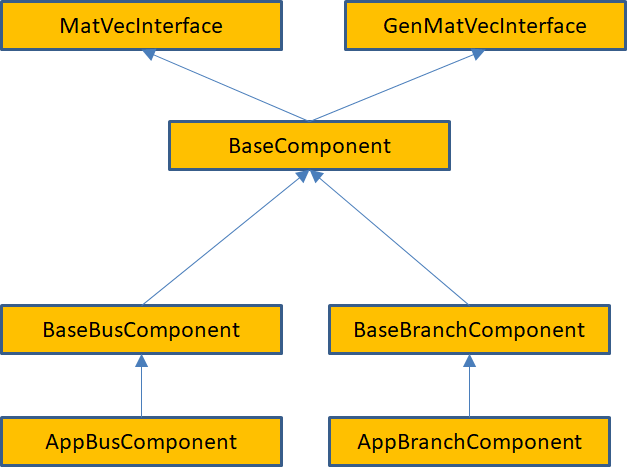

   Schematic diagram showing the interface hierarchy for network
   components.

These base interfaces provide mechanisms for accessing the neighbors of
a bus or branch and allow developers to specify what data is transferred
in ghost exchanges. They do not define any physical properties of the
bus or branch, it is up to application developers to do this.

Of these interfaces, the matrix-vector interfaces are the most
important. The ``MatVecInterface`` is used for most calculations
that directly model the physics of the power grid and described problems
where the dependent and independent variables are associated with buses.

The ``GenMatVecInterface`` is used for problems where variables are
also associated with branches, such as state estimation or Kalman filter
calculations. This section will describe the ``MatVecInterface``,
the ``GenMatVecInterface`` is described in more detail later in this
document. The ``MatVecInterface`` is designed to answer the question
of what block of data is contributed by a bus or branch to a matrix or
vector and what the dimensions of the block are. For example, in
constructing the Y-matrix for a power flow problem using a real-valued
formulation, the grid components representing buses contribute a
2\ :math:`\mathrm{\times}`\ 2 block to the diagonal of the matrix.
Similarly, the grid components representing branches contribute a
2\ :math:`\mathrm{\times}`\ 2 block to the off-diagonal elements. (Note
that if the Y-matrix is expressed as a complex matrix, then the blocks
are of size 1\ :math:`\mathrm{\times}`\ 1.) The location of these blocks
in the matrix is determined by the relative locations of the
corresponding buses and branches in the network and the ordering of
buses. The indexing calculations required to determine how these
locations map to a location in the matrix can be quite complicated,
particularly when combined with a parallel decomposition of the data,
but can be made completely transparent to the user via the mapper
module.

Because the matrix-vector interface focuses on small blocks, it is
relatively easy for power grid engineers to write the corresponding
methods. The full matrices and vectors can then be generated from the
network using simple calls to the mapper interface (see the discussion
below on the mapper module). All of the base network component classes
reside in the ``gridpack::component`` namespace.

The primary function of the ``MatVecInterface`` class is to enable
developers to build the matrices and vectors used in the solution
algorithms for the network. It eliminates a large number of tedious and
error-prone index calculations that would otherwise need to be performed
in order to determine where in a matrix a particular data element should
be placed. The ``MatVecInterface`` includes basic constructors and
destructors. The first set of non-trivial operations are implemented on
buses and set the values of diagonal blocks in the matrix. Additional
functions are implemented on branches and set values for off-diagonal
elements. Vectors can be created by calling functions defined on buses.
These functions are described in detail below.

The functions that are used to create diagonal matrix blocks are

::

   virtual bool matrixDiagSize(int *isize, int *jsize) const

   virtual bool matrixDiagValues(ComplexType *values)

   virtual bool matrixDiagValues(RealType *values)

These functions are virtual functions and are expected to be overwritten
by application-specific bus and branch classes. Depending on whether the
application should create real or complex matrices, either the real or
complex versions of ``matrixDiagValues`` can be implemented. The
default behavior is to return 0 for ``isize`` and ``jsize`` for
``matrixDiagSize`` and to return false for all functions. These
functions will not build a matrix unless overwritten by the application.
Not all functions need to be overwritten by a given bus or branch class.
Generally, only a subset of functions may be needed by an application.

The ``matrixDiagSize`` function returns the size of the matrix block
that is contributed by the bus to a matrix. If a single number is
contributed by the bus, the ``matrixDiagSize`` function returns 1
for both ``isize`` and ``jsize``. Similarly, for a
2\ :math:`\mathrm{\times}`\ 2 block then both ``isize`` and
``jsize`` are set to 2. The return value is true if the bus
contributes to the matrix, otherwise it is false. Returning false can
occur, for example, if the bus is the reference bus in a power flow
calculation. For a more complicated calculation, such as a dynamic
simulation with multiple generators on some buses, the size of the
matrix blocks can differ from bus to bus. Note that the values returned
by ``matrixDiagSize`` refer only to the particular bus on which the
function is invoked. It does not say anything about other buses in the
system.

The ``matrixDiagValues`` function returns the actual values for the
matrix block associated with the bus for which the function is invoked.
The values are returned as a linear array with values returned in
column-major order. For a 2\ :math:`\mathrm{\times}`\ 2 block, this
means the first value is at the (0,0) position, the second value is at
the (1,0) position, the third value is at the (0,1) position and the
fourth value is at the (1,1) position. This function also returns true
if the bus contributes to the matrix and false otherwise. This may seem
redundant, since the ``matrixDiagSize`` function has already
returned this information but it turns out there are certain
applications where it is desirable for the ``matrixDiagSize``
function to return true and the ``matrixDiagValues`` function to
return false. The buffer ``values`` is supplied by the calling
program and is expected to be big enough, based on the dimensions
returned by the ``matrixDiagSize`` function, to contain all returned
values.

The functions that are used to return values for off-diagonal matrix
elements are listed below. These are only implemented for branches.

::

   virtual bool matrixForwardSize(int *isize, int *jsize) const

   virtual bool matrixForwardValues(ComplexType *values)

   virtual bool matrixReverseSize(int *isize, int *jsize) const

   virtual bool matrixReverseValues(ComplexType *values)

Only the complex versions of these functions are listed but equivalent
functions for real matrices are available. These functions work in a
similar way to the functions for creating blocks along the diagonal,
except that they split off-diagonal matrix calculations into forward
elements and reverse elements. The initial approximate location of an
off-diagonal matrix element in a matrix is based in some internal
indices assigned to the buses at either end of the branch. Suppose that
these indices are ``i``, corresponding to the “from” bus and
``j``, corresponding to the “to” bus. The “forward” functions assume
that the request is for the ``ij`` block of elements while the
“reverse” functions assume that the request is for the ``ji`` block
of elements. Another way of looking at this is the following: as
discussed below, branches contain pointers to two buses. The first is
the “from” bus and the second is the “to” bus. The forward functions
assume that the “from” bus corresponds to the first index of the
element, the reverse functions assume that the “from” bus corresponds to
the second index of the element. Note that if a bus does not contribute
to a matrix, then the branches that are connected to the bus should also
not contribute to the matrix.

The final set of functions in the ``MatVecInterface`` that are of
interest to application developers are designed to set up vectors. These
are usually implemented only for buses. These functions are analogous to
the functions for creating matrix elements

::

   virtual bool vectorSize(int *isize) const

   virtual bool vectorValues(ComplexType *values)

The ``vectorSize`` function returns the number of elements
contributed to the vector by a bus and the ``vectorValues`` returns
the corresponding values. The ``vectorValues`` function expects the
buffer values to be allocated by the calling program. In addition to
functions that can be used to specify a vector, there is an additional
function that can be used to push values from a vector back onto a bus.
This function is

::

   virtual void setValues(ComplexType *values)

The buffer contains values from the vector corresponding to internal
variables in the bus and this function can be used to set the bus
variables. The ``setValues`` function could be used to assign bus
variables so that they can be used to recalculate matrices and vectors
for an iterative loop in a non-linear solver or so that the results of a
calculation can be exported to an output file. Real versions of the
``vectorValues`` and ``setValues`` functions are available for
real vectors.

The ``BaseComponent`` class contains additional functions that
contribute to the base properties of a bus or branch. Again, most of the
functions in this class are virtual and are expected to be overwritten
by actual implementations. However, not all of them need to be
overwritten by a particular bus or branch class. Many of these functions
are used in conjunction with the ``BaseFactory`` class, which
defines methods that run over all buses and branches in the network and
invokes the functions defined below.

The ``load`` function

::

   virtual void load(const boost::shared_ptr<DataCollection> &data)

is used to instantiate components based on data in the network
configuration file that is used to create the network. It is used in
conjunction with the ``DataCollection`` object, which is described
in more detail below (section `4.5 <#data_interface>`__). Networks are
generally created by first instantiating a network parser. The parser is
used to read in an external network file and create the network
topology. The next step is to invoke the partition function on the
network to get all network elements properly distributed between
processors. At this point, the network, including ghost buses and
branches, is complete and each bus and branch has a
``DataCollection`` object containing all the data in the network
configuration file that pertains to that particular bus or branch. The
data in the ``DataCollection`` object is stored as simple key-value
pairs. This data is used to initialize the corresponding bus or branch
by invoking the load function on all buses and branches in the system.
The bus and branch classes must implement the ``load`` function to
extract the correct parameters from the ``DataCollection`` object
and use them to assign internal component parameters.

Only one type of bus and one type of branch is associated with each
network but many different types of equations can be generated by the
network. To allow developers to embed many different behaviors into a
single network and to control at what points in the simulation those
behaviors can be manifested, the concept of modes is used. The function

::

   virtual void setMode(int mode)

can be used to set an internal variable in the component that tells it
how to behave. The variable “``mode``” usually corresponds to an
enumerated constant that is part of the application definition. For
example, in a power flow calculation it might be necessary to calculate
both the Y-matrix and the equations for the power flow solution
containing the Jacobian matrix and the right-hand side vector. To
control which matrix gets created, two modes are defined: “``YBus``”
and “``Jacobian``”. Inside the matrix functions in the
``MatVecInterface``, there is a condition

::

   if (p_mode == YBus) {
         // Return values for Y-matrix calculation
       } else if (p_mode == Jacobian) {
         // Return values for power flow calculation
       }

The variable “``p_mode``” is an internal variable in the bus or
branch that is set using the ``setMode`` function.

The function

::

   virtual bool serialWrite(char *string, const int bufsize,
                            const char *signal = NULL)

is used in the serial IO modules described below to write out properties
of buses or branches to standard output. The character buffer
“``string``” contains a formatted line of text representing the
properties of the bus or branch that is written to standard output, the
variable “``bufsize``” gives the number of characters that
“``string``” can hold, and the variable “``signal``” can be used
to control what data is written out. The return value is true if the bus
or branch is writing out data and false otherwise. For example, if the
application is writing out the properties of all buses with generators,
then the signal “``generator``” might be passed to this subroutine.
If a bus has generators, then a string is copied into the buffer
“``string``” and the function returns true, otherwise it returns
false. The buffer “``string``” is allocated by the calling program.
The variable “bufsize” is provided so that the bus or branch can
determine if it is overwriting the buffer. Returning to the generator
example, if this call returns a separate line for each generator, then
it is possible that a bus with too many generators might exceed the
buffer size. This could be detected by the implementation if the buffer
size is known. More information on how this function is used can be
found in the discussion of the serial IO modules.

The ``BaseComponent`` class also contains two functions that must be
implemented if buses and/or branches need to exchange data with other
processors. Data that must be exchanged needs to be placed in buffers
that have been allocated by the network. The bus and branch objects
specify how large the buffers need to be by implementing the function

::

   virtual int getXCBufSize()

This function must return the same value for all buses and all branches
in the same bus or branch classes. Buses can return a different value
than branches. For example, in a power flow calculation, it is necessary
that ghost buses get new values of the phase angle and voltage magnitude
increments. These are both real numbers so the ``getXCBusSize``
routine needs to return the value ``2*sizeof(double)``. Note that
all buses must return this value even if the bus is a reference bus and
does not participate in the calculation.

This function is queried by the network and used to allocate a buffer of
the appropriate size. The network then informs the bus and branch
objects where the location of the buffer is by invoking the function

::

   virtual void setXCBuf(void *buf)

The bus or branch can use this function to set internal pointers to this
buffer that can be used to assign values to the buffer (which is done
before a ghost exchange) or to collect values from the buffer (which is
done after a ghost exchange). Continuing with the powerflow example, the
bus implemention of the ``setXCBuf`` function would look like

::

   setXCBuf(void *buf)
       {
         p_Ang_ptr = static_cast<double*>(buf);
         p_Mag_ptr = p_Ang_ptr+1;
       }

The pointers ``p_Ang_ptr`` and ``p_Mag_ptr`` of type
``double`` are internal variables of the bus implementation and can
be used elsewhere in the bus whenever the voltage angle and voltage
magnitude variables are needed. After a network update operation, ghost
buses will contain values for these variables that were calculated on
the home processor that owns the corresponding bus.

The ``BaseBusComponent`` and ``BaseBranchComponent`` classes
contain a few additional functions that are specific to whether or not a
component is a bus or a branch. The ``BaseBusComponent`` class
contains functions that can be used to identify attached buses or
branches, determine if the bus is a reference bus, and recover the
original indices of the bus. Other functions are included in the
``BaseBusClass`` but these are not usually required by application
developers and are used primarily to implement other GridPACK functions.

To get a list of pointers to all branches connected to a bus, the
function

::

   void getNeighborBranches(
      std::vector<boost::shared_ptr<BaseComponent> > &nghbrs) const

can be called. This provides a list of pointers to all branches that
have the calling bus as one of its endpoints. This function can be used
inside a bus method to loop over attached branches, which is a common
motif in matrix calculations. For example, to evaluate the contribution
to a diagonal element of the Y-matrix coming from transmission lines, it
is necessary to perform the sum\ 

.. math:: Y_{ii}=-\sum_{j\neq i}{Y_{ij}}

where the *Y\ :math:`{}_{ij}`* are the contribution due to transmission
lines from the branch connecting i and j. The code inside a bus
component that evaluates this sum can be written as

::

   std::vector<boost::shared_ptr<BaseComponent> > branches;
   getNeighborBranches(branches);
   ComplexType y_diag(0.0,0.0);
   for (int i=0; i<branches.size(); i++) {
     YBranch *branch = dynamic_cast<YBranch*>(branches[i].get());
     y_diag += branch->getYContribution();
   }

The function ``getYContribution`` evaluates the quantity
*Y\ :math:`{}_{ij}`* using parameters that are local to the branch. The
return value is then accumulated into the bus variable ``y_diag``,
which is eventually returned through the ``matrixDiagValues``
function. The ``dynamic_cast`` is necessary to convert the pointer
from a ``BaseComponent`` object to the application class
``YBranch``. The ``BaseComponent`` class has no knowledge of the
``getYContribution`` function, this is only implemented in the class
``YBranch``.

A function that is similar to ``getNeighborBranches`` is

::

   void getNeighborBuses(
      std::vector<boost::shared_ptr<BaseComponent> > &nghbrs) const

which can be used to get a list of the buses that are connected to the
calling bus via a single branch.

Many power grid problems require the specification of a special bus as a
reference bus. This designation can be handled by the two functions

::

   void setReferenceBus(bool status)

   bool getReferenceBus() const

The first function can be used (if called with the argument true) to
designate a bus as the reference bus and the second function can be
called to inquire whether a bus is the reference bus. A reference bus is
usually set when the network configuration file is read in and does not
need to be set explicitly by the application.

Finally, it is often useful when exporting results if the original index
of the bus is available. This can be recovered using the function

::

   int getOriginalIndex() const

The functions in the ``BaseBusComponent`` class only work correctly
after a call to the base factory method ``setComponents``, which is
described in section `4.6 <#factory>`__. Other functions in the
``BaseBusComponent`` class are needed within the framework but are
not usually required by application developers.

The ``BaseBranchComponent`` class is similar to the
``BaseBusComponent`` class and provides basic information about
branches and the buses at either end of the branch. To retrieve pointers
to the buses at the ends of the branch, the following two functions are
available

::

   boost::shared_ptr<BaseComponent> getBus1() const

   boost::shared_ptr<BaseComponent> getBus2() const

The ``getBus1`` function returns a pointer to the “from” bus, the
``getBus2`` function returns a pointer to the “to” bus.

Two other functions in the ``BaseBranchComponent`` class that are
useful for writing output are

::

   int getBus1OriginalIndex() const

   int getBus2OriginalIndex() const

These functions get the original index of “from” and “to” buses. Similar
to the functions in the ``BaseBusComponent`` class, the functions in
the ``BaseBranchComponent`` class will not work correctly until the
``setComponents`` method has been called in the base factory class.

.. _data_interface:

Data Interface
--------------

The main route for incorporating information about buses and branches
into GridPACK applications is the ``DataCollection`` class. Each bus
and branch (including ghost buses and ghost branches) has an associated
``DataCollection`` object that contains all the parameters
associated with that object. The ``DataCollection`` class works in
conjunction with the ``dictionary.hpp`` header file, which defines a
unified vocabulary for labeling power grid parameters that are used in
applications. The ``dictionary.hpp`` file includes a collection of
files in the ``parser/variables_defs`` directory that represent
variables associated with different network components, such as buses,
branches, transformers, generators, etc. The goal of using the
dictionary is to create a unified vocabulary for power grid parameters
within GridPACK that is independent of the source of the parameters.

The ``DataCollection`` class is a simple container that can be used
to store key-value pairs and resides in the ``gridpack::component``
namespace. When the network is created using a standard parser to read a
network configuration file (see more on parsers in
section `4.8 <#parsers>`__), each bus and branch created in the network
has an associated ``DataCollection`` object. This object, in turn,
contains all parameters from the configuration file that are associated
with that particular bus or branch. The possible key values in the
``DataCollection`` object are defined in ``dictionary.hpp`` and
represent parameters found in power grid applications. Parameters
associated with a given key can be retrieved from the
``DataCollection`` object using some simple accessors.

Data can be stored in two ways inside the ``DataCollection`` object.
The first method assumes that there is only a single instance of the
key-value pair, the second assumes there are multiple instances. This
second case can occur, for example, if there are multiple generators on
a bus. Generators are characterized by a collection of parameters and
each generator has its own set of parameters. The generator parameters
can be indexed so that they can be matched with a specific generator.

When a network is created by parsing an external configuration file, for
example a PSS/E format .raw file, the network topology and component
objects are created and distributed over processors. All network
components are in an initial state that is determined by the constructor
for that object. This is usually very simple, since at the moment when
the object is created, there is very little information available about
how to initialize it. Along with the component object, a
``DataCollection`` object is also created. The
``DataCollection`` object stores all the parameters from the
network configuration file using a key-value scheme. The situation is
illustrated schematically in Figure 6.

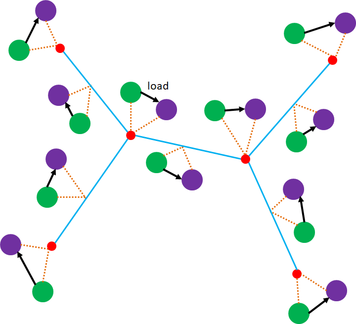

   Schematic diagram representing relationship between the
   **DataCollection** objects (green) and the network components
   (purple). The arrows represent the transfer of data from the data
   collections to the network components during the **load** operation.

After the network is created, the ``DataCollection`` objects are
filled with key-value pairs while network components are in an
uninitialized state. The information can be transferred from the
``DataCollection`` objects to the network components by implementing
the network component ``load`` function. The load function has a
pointer to the associated ``DataCollection`` object passed when it
is called, so that the contents of the data collection can be accessed
using the functions described below.

Assuming that a parameter only appears once in the data collection, the
contents of a ``DataCollection`` object can be accessed using the
functions

::

   bool getValue(const char *name, int *value)
   bool getValue(const char *name, long *value)
   bool getValue(const char *name, bool *value)
   bool getValue(const char *name, std::string *value)
   bool getValue(const char *name, float *value)
   bool getValue(const char *name, double *value)
   bool getValue(const char *name, ComplexType *value)

These functions return true if a variable of the correct type is stored
in the ``DataCollection`` object with the key ``name``,
otherwise it returns false. For example, there is only one parameter
``BUS_VOLTAGE_MAG`` for each bus, so this value can be obtained
using the ``double`` variant of ``getValue``. All
``getValue`` functions (including the functions below) leave the
value of the variable unchanged if the corresponding name is not found
in the data collection. This can be used to implement default values
using the following construct

::

   double var;
   var = 1.0;
   getValue("SOME_VARIABLE_NAME",&var);

If the variable is not found in the data collection, the default value
is 1. The returned bool value can also be used to implement defaults or
take alternative actions if the value is not found. Note that it is
important to make match the variable type correctly when calling
getValue. For example, if a variable is stored as type ``double`` in
the data collection, but you try and access it by passing in a variable
of type ``float`` or ``int``, the ``getValue`` call will
return false.

If the variable is stored multiple times in the ``DataCollection``,
then it can be accessed with the functions

::

   bool getValue(const char *name, int *value, const int idx)
   bool getValue(const char *name, long *value, const int idx)
   bool getValue(const char *name, bool *value, const int idx)
   bool getValue(const char *name, std::string *value, const int idx)
   bool getValue(const char *name, float *value, const int idx)
   bool getValue(const char *name, double *value, const int idx)
   bool getValue(const char *name, ComplexType *value, const int idx)

where ``idx`` is an index that identifies a particular instance of
the key. In this case, the key is essentially a combination of the
character string ``name`` and the index. An example is the parameter
describing the generator active power output, ``GENERATOR_PG``.
Because there can be more than one generator on the bus, it is necessary
to include an additional index to indicate which generator values are
required. Internally, the key then becomes the combination
``GENERATOR_PG:idx``. The index values are 0-based, so the first
value has index 0, the second value has index 1 and so on up to N-1,
where N is the total number of values. Because the combination of name
and index is actually stored internally as a key, it is not necessary
that all values of the index between 0 and N-1 be stored in the data
collection. If some generators are missing some parameters, that is
allowed. It is up to the application to account for these missing
values. It is also important to note that variables without an index and
those with an index are considered different, so if you attempt to
access a variable that is indexed without using the indexed version of
``getValue``, and visa-versa, the function will return false.

The data collection is generally filled with values after the parser is
called to create the network. The nomenclature for these values can be
found in the ``dictionary.hpp`` file in the main GridPACK directory.
This file contains additional files that include definitions for bus
variables, branch variables, etc. in the
``src/parser/variable_defs`` directory. Users are encouraged to look
at these files to find out what parameters might be available to their
applications. Different parameters may be available depending on the
source file that was used to create that calculation. The PSS/E version
23 and versions 33-35 files currently supported in GridPACK have
significant differences and values that are present in the 33-35 files
are often not available from a version 23 file.

The aim of using the dictionary is to separate GridPACK applications
from data sources so that applications can easily switch between
different file formats without having to rewrite code within the
application itself. In computure science parlance, this is known as an
intermediate representation. The dictionary provides a common internal
nomenclature for power grid parameters. Parsers for different file
formats need to map the input data from those formats to the dictionary,
but once this is done, all GridPACK applications should, in principle,
be able to use any source of data. The definition files themselves have
a very simple structure that consists of parameter definitions and some
supporting documentation. Some examples of entries to the
``bus_defs.hpp`` and ``generator_defs.hpp`` files are given
below.

::

   /**
    * Bus voltage magnitude, in p.u.
    * type: real float
    */
   #define BUS_VOLTAGE_MAG "BUS_VOLTAGE_MAG"

   /**
    * Bus voltage phase angle, in degrees
    * type: real float
    */
   #define BUS_VOLTAGE_ANG "BUS_VOLTAGE_ANG"

   /**
    * Number of generators on a bus
    * type: integer
    */
   #define GENERATOR_NUMBER "GENERATOR_NUMBER"

   /**
    * Non-blank alphanumeric machine identifier, used to distinguish
    * among multiple machines connected to the same bus  
    * type: string
    * indexed
    */
   #define GENERATOR_ID "GENERATOR_ID"

   /**
    * Generator active power output, entered in MW 
    * type: real float
    * indexed
    */
   #define GENERATOR_PG "GENERATOR_PG"

The names of these parameters follow the pattern that the first part of
the name describes the type of network object that the parameter is
associated with and the remainder of the name is descriptive of the
particular parameter associated with that object. The second part of the
name is frequently derived from the corresponding nomenclature used in
PSS/E format files.

The ``#define`` statements that assign each character string to a C
preprocessor symbol are used as a debugging tool. The ``getValue``
calls should use the preprocessor string instead of including the
quotes. If a string has been mistyped or misspelled, the compiler will
throw an error. The difference between using

::

   getValue("BUS_VOLTAGE_MAG",&val);

and

::

   getValue(BUS_VOLTAGE_MAG,&val);

is that the second construct will throw an error if
``BUS_VOLTAGE_MAG`` was misspelled or not included in the
dictionary.

The dictionary entries also contain some descriptive information about
the parameter itself. The two most important pieces of information are
the type of data the string represents and whether or not the parameter
is indexed. The type should be used to match the type of variable with
the corresponding parameter and the indexed keyword can be used to
determine if an index needs to be included when accessing the data. For
indexed quantities, there should be a parameter that indicates how many
times the value appears in the data collections. In the snippet above,
the generator parameters are indexed, while the bus variables are not.
The ``GENERATOR_NUMBER`` parameter is also not indexed and indicates
how many generators are associated with the bus, as well as the number
of times an indexed value associated with generators can appear in the
data collection.

The ``DataCollection`` objects can also be used to transfer data
between different networks. This is important for chaining different
types of calculations together. For example, a powerflow or state
estimation calculation might be used to initialize a dynamic simulation
and the ``DataCollection`` object can be used as a mechanism for
transferring data between the two different networks. Because of this,
the functions for adding more data to the ``DataCollection`` and the
functions for overwriting the values of existing data are useful. New
key value pairs can be added to a data collection object using the
functions

::

   void addValue(const char *name, int value)
   void addValue(const char *name, long value)
   void addValue(const char *name, bool value)
   void addValue(const char *name, char *value)
   void addValue(const char *name, float value)
   void addValue(const char *name, double value)
   void addValue(const char *name, ComplexType value)

   void addValue(const char *name, int value, const int idx)
   void addValue(const char *name, long value, const int idx)
   void addValue(const char *name, bool value, const int idx)
   void addValue(const char *name, char *value, const int idx)
   void addValue(const char *name, float value, const int idx)
   void addValue(const char *name, double value, const int idx)
   void addValue(const char *name, ComplexType value, const int idx)

Existing values can be overwritten with the functions

::

   bool setValue(const char *name, int value)
   bool setValue(const char *name, long value)
   bool setValue(const char *name, bool value)
   bool setValue(const char *name, char *value)
   bool setValue(const char *name, float value)
   bool setValue(const char *name, double value)
   bool setValue(const char *name, ComplexType value)

   bool setValue(const char *name, int value, const int idx)
   bool setValue(const char *name, long value, const int idx)
   bool setValue(const char *name, bool value, const int idx)
   bool setValue(const char *name, char *value, const int idx)
   bool setValue(const char *name, float value, const int idx)
   bool setValue(const char *name, double value, const int idx)
   bool setValue(const char *name, ComplexType value, const int idx)

.. _factory:

Factories
---------

The network component factory is an application-dependent piece of
software that is designed to manage interactions between the network and
the network component objects. Most operations in the factory run over
all buses and all branches and invoke some operation on each component.
An example is the “``load``” operation. After the network is read in
from an external file, it consists of a topology and a set of simple
data collection objects containing key-value pairs associated with each
bus and branch. The ``load`` operation then runs over all buses and
branches and instantiates the appropriate objects by invoking a local
``load`` method that takes the values from the data collection
object and uses it to instantiate the bus or branch. The application
network factory is derived from a base network factory class that
contains some additional routines that set up indices, assign neighbors
to individual buses and branches and assign buffers. The neighbors are
originally only known to the network, so a separate operation is needed
to push this information down into the bus and branch components. The
network component factory may also execute other routines that
contribute to setting up the network and creating a well-defined state.

Factories can be derived from the ``BaseFactory`` class, which is a
templated class that is based on the network type. It resides in the
``gridpack::factory`` namespace. The constructor for a
``BaseFactory`` object has the form

::

   BaseFactory<MyNetwork>(boost::shared_ptr<MyNetwork> network)

The ``BaseFactory`` class supplies some basic functions that can be
used to help instantiate the components in a network. Other methods can
be added for particular applications by inheriting from the
``BaseFactory`` class. The two most important functions in
``BaseFactory`` are

::

   virtual void setComponents()

   virtual void setExchange()

The ``setComponents`` method pushes topology information available
from the network into the individual buses and branches using methods in
the base component classes. This operation ensures that operations in
the ``BaseBusComponent`` and ``BaseBranchComponent`` classes,
such as ``getNeighborBuses``, etc. work correctly. The topology
information is originally only available in the network and it requires
additional operations to imbed it in individual buses and branches.
Being able to access this information directly from the buses and
branches can simplify application programming substantially.

The ``setExchange`` function allocates buffers and sets up pointers
in the components so that exchange of data between buses and branches
can occur and ghost buses and branches can receive updated values of the
exchanged parameters. This function loops over the ``getXCBusSize``
and ``setXCBuf`` commands defined in the network component classes
and guarantees that buffers are properly allocated and exposed to the
network components. If the application does not use exchanges, then this
operation is unecessary and need not be called.

Two other functions are defined in the ``BaseFactory`` class as
convenience functions. The first is

::

   virtual void load()

This function loops over all buses and branches and invokes the
individual bus and branch ``load`` methods. This moves information
from the ``DataCollection`` objects that are instantiated when the
network is created from a network configuration file to the bus and
branch objects themselves. The second convenience function is

::

   virtual void setMode(int mode)

This function loops over all buses and branches in the network and
invokes each bus and branch ``setMode`` method. It can be used to
set the behavior of the entire network in single function call. The
``setMode`` function has been refined to include

::

   virtual void setBusMode(int mode)

   virtual void setBranchMode(int mode)

These functions can be used to set modes on only the bus or branch
classes. In some instances, a matrix or vector may be constructed using
only buses or branches.

Some utility functions in the ``BaseFactory`` class that are
occasionally useful are

::

   bool checkTrue(bool flag)

   bool checkTrueSomewhere(bool flag)

The ``checkTrue`` function returns true if the variable ``flag``
is true on all processors, otherwise it returns false. This function can
be used to check if a condition has been violated somewhere in the
network. The ``checkTrueSomewhere`` function returns true if
``flag`` is true on at least one processor. This function can be
used to check if a condition is true anywhere in the system.

In the context of debugging, it is occasionally useful to dump the
contents of the ``DataCollection`` objects associated with the
network components. The factory command

::

   void dumpData()

will list the contents of each data collection object in the network to
standard out. This output can be large for large networks so the use of
this function should be restricted to smaller networks.

.. _mapper:

Mapper Module
-------------

The mappers are a collection of generic capabilities that can be used to
generate matrices or vectors from the network components. This is done
by looping over all the network components and invoking methods in the
matrix-vector interface. The mapper then uses the information gleaned
from these functions to set up a matrix representing the entire system.
The mapper is basically a transformation that converts the information
generated by the matrix-vector interface into a set of algebraic
equations represented by matrixes and vectors. It has no explicit
dependencies on either the network components or the type of analyses
being performed so this capability is applicable across a wide range of
problems. At present there are three types of mapper, the standard
mapper described here that is implemented on top of the
``MatVecInterface``, a more generalized mapper that utilizes the
``GenMatVecInterface`` and a mapper for generating matrices
resembling “fat” vectors. These are dense matrices that are basically a
collection of column vectors. The generalized mapper and its
corresponding interface are described in section `7.1 <#gen_matvec>`__,
along with the mapper for generating fat vectors. The mapper discussed
in this section is used for problems where both dependent and
independent variables are associated with buses, which is the case for
problems such as power flow calculations and dynamic simulation. Other
problems, such as state estimation, have variables associated with both
buses and branches and require the more general interface. See
section `7.1 <#gen_matvec>`__ for details.

The basic matrix-vector interface contains functions that provide two
pieces of information about each network component. The first is the
size of the matrix block that is contributed by the component and the
second is the values in that block. Using this information, the mapper
can calculate the dimensions of the matrix and where individual elements
in the matrix are located. The construction of a matrix by the mapper is
illustrated in Figure 7 for a small network.
Figure 7(a) shows a hypothetical network. The
contributions from each network component are shown in
Figure 7(b). Note that some buses and branches do
not contribute to the matrix. This could occur in real systems because
the transmission line corresponding to the branch has failed or because
a bus represents the reference bus. In addition, it is possible that
buses and branches can contribute different size blocks to the matrix.
The mapping of the individual contributions from the network in Figure
7(b) to initial matrix locations is shown in
Figure 7(c). This is followed by elimination of
gaps in the matrix in Figure 7(d).

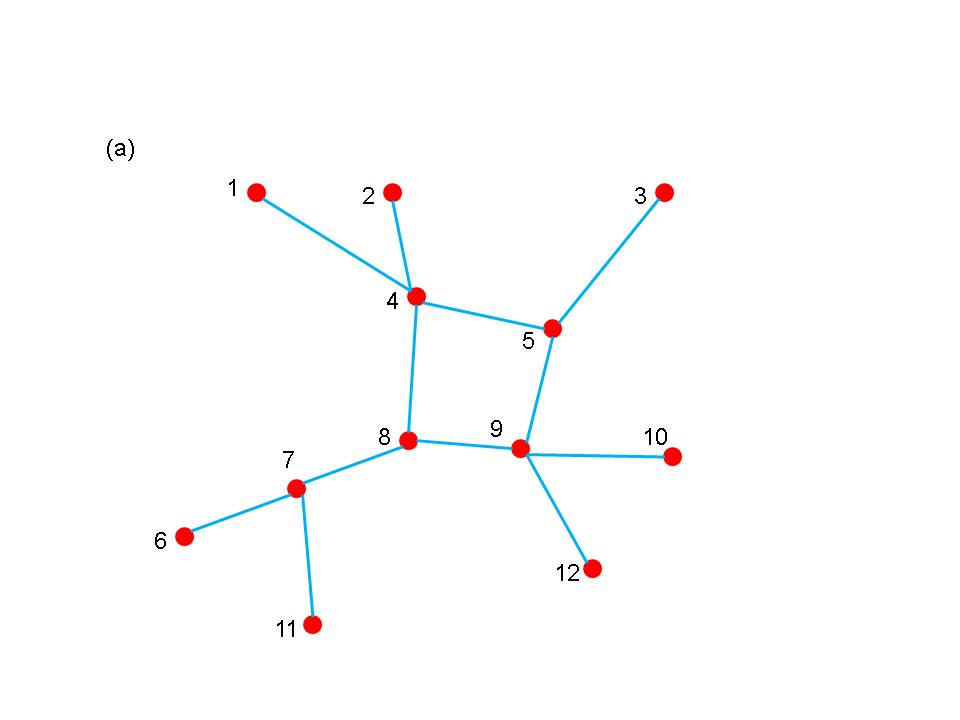

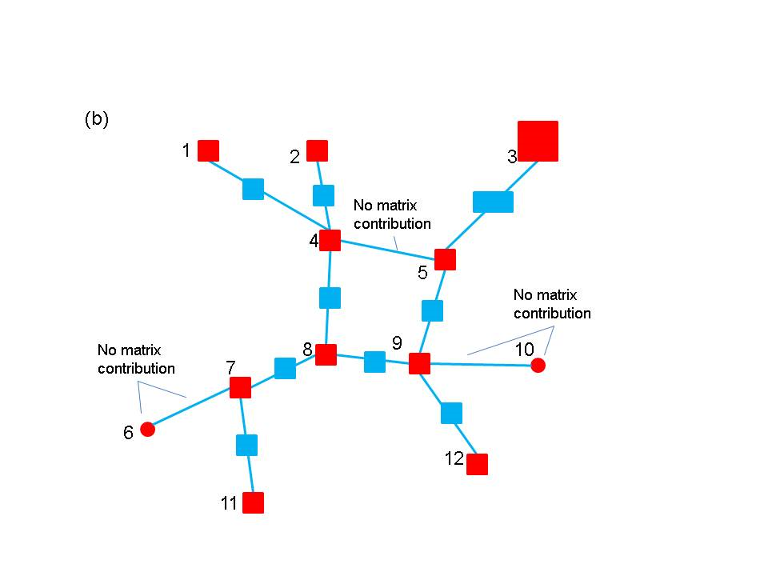

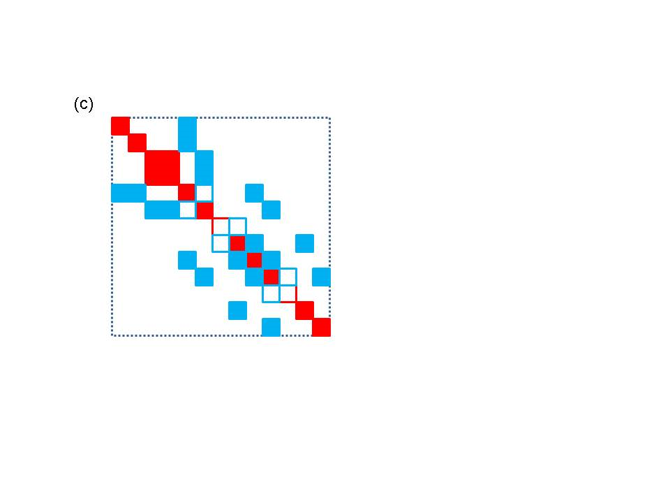

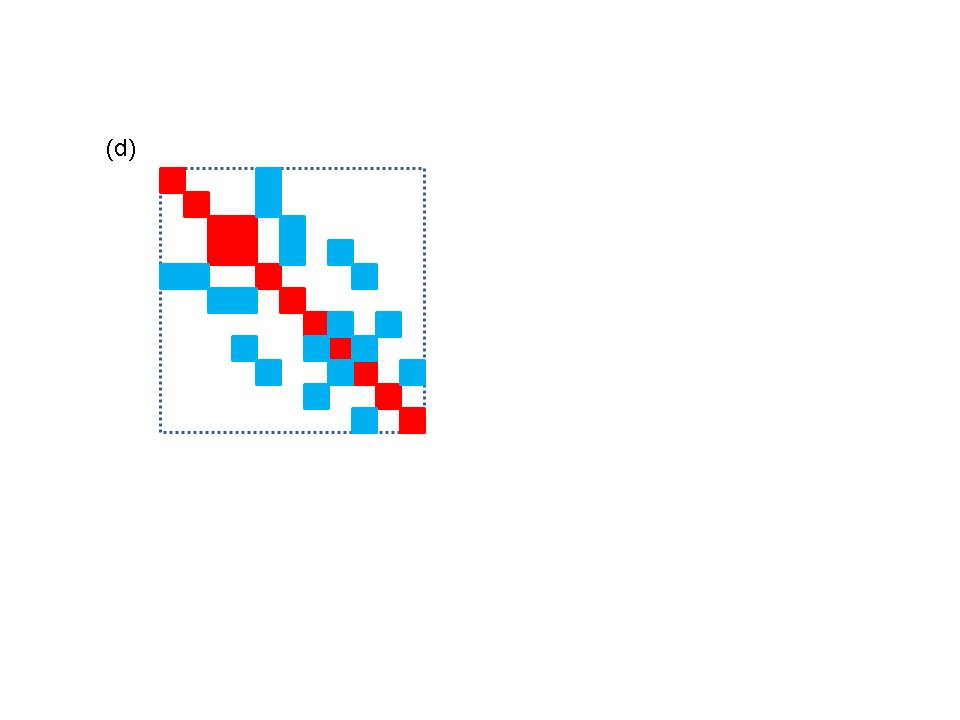

   A schematic diagram of the matrix map function. The bus numbers in (a)
   and (b) map to approximate row and column locations in (c). (a) a small
   network (b) matrix blocks associated with branches and buses. Note that
   not all blocks are the same size and not all buses and branches
   contribute (c) initial construction of matrix based on network indices
   (d) final matrix after eliminating gaps.

The most complex part of generating matrices and vectors is implementing
the functions in the ``MatVecInterface.`` Once this has been done,
actually creating matrices and vectors using the mappers is quite
simple. The ``MatVecInterface`` is associated with two mappers, one
that creates matrices from buses and branches and a second that can
create vectors from buses. Both mappers are templated objects based on
the type of network being used and use the ``gridpack::mapper``
namespace. The ``FullMatrixMap`` object runs over both buses and
branches to set up a matrix. The constructor is

::

   FullMatrixMap<MyNetwork>(boost::shared_ptr<MyNetwork> network)

The network is passed in to the object via the constructor. The
constructor sets up a number of internal data structures based on what
mode has been set in the network components. For example, for a power
flow application where it might be necessary to create both a Y-matrix
and a Jacobian matrix, it would be necessary to create two mappers. If
the first mapper is created while the mode is set to construct the
Y-matrix, then it will be necessary to instantiate a second mapper to
create the Jacobian for a power flow calculation. Before instantiating
the second matrix, the mode should be set to Jacobian. Once the mapper
has been created, a complex matrix can be generated using the call

::

   boost::shared_ptr<gridpack::math::Matrix> mapToMatrix(bool isDense = false)

This function creates a new matrix and returns a pointer to it. The
parameter ``isDense`` can be set to ``true`` if a matrix that is
stored internally using a dense representation is desired. The
corresponding function call for real matrices is

::

   boost::shared_ptr<gridpack::math::RealMatrix> mapToRealMatrix(bool isDense = false)

If a matrix already exists and it is only necessary to update the
values, then the functions

::

   void mapToMatrix(
      boost::shared_ptr<gridpack::math::Matrix> &matrix)
   void mapToRealMatrix(
      boost::shared_ptr<gridpack::math::RealMatrix> &matrix)

   void mapToMatrix(gridpack::math::Matrix &matrix)
   void mapToRealMatrix(gridpack::math::RealMatrix &matrix)

can be used. These functions use the existing matrix data structures and
overwrite the values of individual elements. For these to work, it is
necessary to use the same mapper that was used to create the original
matrix and to have the same mode set in the network components.

Additional operations that can be used on existing matrices include

::

   void overwriteMatrix(boost::shared_ptr<gridpack::math::Matrix> matrix)
   void overwriteRealMatrix(boost::shared_ptr<gridpack::math::RealMatrix> matrix)

   void overwriteMatrix(gridpack::math::Matrix &matrix)
   void overwriteRealMatrix(gridpack::math::RealMatrix &matrix)

   void incrementMatrix(boost::shared_ptr<gridpack::math::Matrix> matrix)
   void incrementRealMatrix(boost::shared_ptr<gridpack::math::RealMatrix> matrix)

   void incrementMatrix(gridpack::math::Matrix &matrix)
   void incrementRealMatrix(gridpack::math::RealMatrix &matrix)

These operations are designed to support making small changes in an
existing matrix instead of reconstructing the full matrix from scratch.
This can happen in contingency calculations or simulations of faults
where a single grid element goes out or changes value. Instead of
rebuilding the entire matrix, it is possible to modify only a small
portion if it. To use these functions, it is necessary to define at
least two modes in the network components. The first mode is used to
build the original matrix, the second is used to make changes. All
``MatVecInterface`` functions that return true using the second mode
(the one making changes) must return true for the first mode (used to
build the original matrix). Furthermore, all block sizes for the second
mode must match the block sizes in the first mode. The
``overwriteMatrix`` functions replace the values in the matrix with
the values returned by the ``MatVecInterface`` functions, the
``incrementMatrix`` functions add these values to whatever is
already in the matrix.

The vector mapper works in an entirely analogous way to the matrix
mapper. The constructor for the ``BusVectorMap`` class is

::

   BusVectorMap<MyNetwork>(boost::shared_ptr<MyNetwork> network)

and the function for building a new vector is

::

   boost::share_ptr<gridpack::math::Vector> mapToVector()
   boost::share_ptr<gridpack::math::RealVector> mapToRealVector()

The functions for overwriting the values of an existing vector are

::

   void mapToVector(
       boost::shared_ptr<gridpack::math::Vector> &vector)
   void mapToRealVector(
       boost::shared_ptr<gridpack::math::RealVector> &vector)

   void mapToVector(gridpack::math::Vector &vector)
   void mapToRealVector(gridpack::math::RealVector &vector)

The vector map can also be used to write values back to buses using the
function

::

   void mapToBus(const gridpack::math::Vector &vector)
   void mapToBus(const gridpack::math::RealVector &vector)

This function will copy values from the vector into the bus using the
``setValues`` function in the ``MatVecInterface``.

.. _parsers:

Parser Module
-------------

The parser modules are designed to read an external network file, set up
the network topology and assign any parameter fields in the file to
simple fields. The parsers do not partition the network, they are only
responsible for reading in the network and distributing the different
network elements in a way that guarantees that not too much data ends up
on any one processor. The parsers are also not responsible for
determining if the input is compatible with the analysis being
performed. This can be handled, if desired, by building checks into the
network factory. The parsers are only responsible for determining if
they can read the file.

Currently, GridPACK supports five file formats. Files based on the PSS/E
PTI version 23, 33, 34 and 35 formats can be read in using the classes
``PTI23_parser``, ``PTI33_parser``, ``PTI34_parser``, ``PTI35_parser``
and ``PTI36_parser``. These parsers can also read PSS/E formatted .dyr
files that are used to read in extra parameters used in dynamic
simulation. In addition, there is a parser that can read MatPower
formatted files, ``MAT_Parser``. The parsers are templated classes
that again use the network type as a template argument. All parsers are
located in the ``gridpack::parser`` namespace. These classes have
only a few important functions. The first are the constructors

::

   PTI23_parser<MyNetwork>(boost::shared_ptr<MyNetwork> network)

   PTI33_parser<MyNetwork>(boost::shared_ptr<MyNetwork> network)

   PTI34_parser<MyNetwork>(boost::shared_ptr<MyNetwork> network)

   PTI35_parser<MyNetwork>(boost::shared_ptr<MyNetwork> network)

   PTI36_parser<MyNetwork>(boost::shared_ptr<MyNetwork> network)

   MAT_parser<MyNetwork>(boost::shared_ptr<MyNetwork> network)

The remaining functions are common to all parsers. To read a PSS/E PTI
file containing a network configuration and generate a network, the
parser calls the method

::

   void parse(const std::string &filename)

where filename refers to the location of the network configuration file.
To use this parser, the network object with the appropriate bus and
branch classes is instantiated and then passed to the constructor of the
parser object. The parse method is then invoked with the name of the
network configuration file passed in as an argument and the network is
filled out with buses and branches. The parameters in the network
configuration file are stored as key-value pairs in the
``DataCollection`` object associated with each bus and branch. Once
the network partition method has been called, the network is fully
distributed and ghost buses and branches have been created. Other
operations operations can then be performed. A variant on parse is the
command

::

   void externalParse(const std::string &filename)

This command can be used to parse .dyr files containing dynamic
simulation parameters. The difference between this function and
``parse`` is that ``externalParse`` assumes that the network
already exists and that the parameters that are read in will be added to
it. This command should therefore only be called after a network has
been created using ``parse``.

As discussed in section `4.5 <#data_interface>`__, another key part of
the parsing capability is the ``dictionary.hpp`` file. This is
designed to provide a common nomenclature for parameters associated with
power grid components. The definitions in the ``dictionary.hpp`` and
the files in the ``src/parser/variable_defs`` subdirectory are used
to extract parameters from the ``DataCollection`` objects created by
the parser. For example, the parameter describing the resistance of a
transmission element is given the common name ``BRANCH_R``. This
string is defined as a macro in the
``variable_defs/branch_defs.hpp``, which provides compile time error
checking on the name. The goal of using the dictionary is that all
parsers will eventually store the branch resistance parameter in the
``DataCollection`` object using this common name. Applications can
then switch easily between different network configuration file formats
by simply exchanging parsers, which will all store corresponding
parameters using a common naming convention that can used within the
code to access data.

Serial IO Module
----------------

The serial IO module is designed to provide a simple mechanism for
writing information from selected buses and/or branches to standard
output or a file using a consistent ordering scheme. Individual buses
and/or branches implement a write method that will write bus/branch
information to a single string. This information usually consists of bus
or branch identifiers plus some parameters that are desired in the
output. The serial IO module then gathers this information, moves it to
the head node, and writes it out in a consistent order. An example of
this type of output is shown in below.

::

      Bus Voltages and Phase Angles

         Bus Number      Phase Angle      Voltage Magnitude

                1          0.000000             1.060000
                2         -4.982589             1.045000
                3        -12.725100             1.010000
                4        -10.312901             1.017671
                5         -8.773854             1.019514
                6        -14.220946             1.070000
                7        -13.359627             1.061520
                8        -13.359627             1.090000
                9        -14.938521             1.055932
               10        -15.097288             1.050985
               11        -14.790622             1.056907
               12        -15.075585             1.055189
               13        -15.156276             1.050382
               14        -16.033645             1.035530

Note that the output is ordered by bus index (which matches the ordering
of the buses in the original network configuration file). This ordering
would be preserved regardless of the number of processors used in the
calculation.

Like the mapper, the serial IO classes are relatively easy to use. Most
of the complexity is associated with implementing the
``serialWrite`` methods in the buses and branches. Data can be
written out for buses and/or branches using either the
``SerialBusIO`` class or the ``SerialBranchIO`` class. These are
again templated classes that take the network as an argument in the
constructor. Both classes reside in the ``gridpack::serial_io``
namespace. The ``SerialBusIO`` constructor has the form

::

   SerialBusIO<MyNetwork>(int max_str_len,
      boost::shared_ptr<MyNetwork> network)

The variable ``max_str_len`` is the length, in bytes, of the maximum
size string you would want to write out using this class and
``network`` is a pointer to the network that is used to generate
output. The value of max_str_len is used to allocate internal memory and
also determines how much data needs to be moved around each time data
from the entire network is written out. As the value of this parameter
increases, the amount of memory needed and the amount of data that needs
to move increases, so this value should be kept to a minimum, if
possible.

Two additional functions can be used to actually generate output. They
are

::

   void header(const char *string) const

and

::

   void write(const char *signal = NULL)

The ``header`` method is a convenience function that will only write
the buffer string from the head processor (process 0) and can be used
for creating the headings above an output listing. The ``write``
function traverses all the buses in the network and writes out the
strings generated by the ``serialWrite`` methods in the buses. The
``SerialBusIO`` object is responsible for reordering these strings
in a consistent manner, even if the buses are distributed over many
processors. The optional variable “``signal``” is passed to the
``serialWrite`` methods and can be used to control what output is
listed. For example, in one part of a simulation it might be desirable
to list the voltage magnitude and phase angle from a powerflow
calculation and in another part of the calculation to list the rotor
angle for a generator. These two outputs could be distinguished from
each other in the ``serialWrite`` function using the ``signal``
variable.

To generate the output shown above, the
following calls are used

::

   gridpack::serial_io::SerialBusIO<MyNetwork> busIO(128,network);
   busIO.header("\n   Bus Voltages and Phase Angles\n");
   busIO.header(
     "\n   Bus Number      Phase Angle      Voltage Magnitude\n");
   busIO.write();

The first call creates the ``SerialIOBus`` object and specifies the
internal buffer size (128 bytes). This buffer must be large enough to
incorporate the output from any call to one of the ``serialWrite``
calls in the bus components. The next two lines print out the header on
top of the bus listing and the last line generates the listing itself.
The ``serialWrite`` implementation looks like

::

   bool gridpack::myapp::MyBus::serialWrite(char *string,
          const int bufsize, const char *signal)
   {  
     double pi = 4.0*atan(1.0);
     double angle = p_a*180.0/pi;
     sprintf(string, "     %6d      %12.6f         %12.6f\n",
             getOriginalIndex(),angle,p_v);
     return true;
   }

For this simple case, ``signal`` is ignored as well as the variable
``bufsize``. The return value of the function is set to
``true``. If more than one type of bus listing is desired,
additional conditions based on the value of ``signal`` could be
included. For the case of generators, the length of the output may vary
from one bus to the next since buses can have different numbers of
generators associated with them. It may therefore be important to check
the length of the output string being generated against the size of the
buffer to make sure there is no overwrite and to take some kind of
appropriate action if there is. Output from generators is also
conditional on the bus having some generators. In this case, the return
value, ``true`` or ``false`` can be used to signal whether of
not the bus is returning some data.

If you wish to direct the output to a file, then calling the function

::

   void open(const char *filename)

will direct all output from the serial IO object to the file specified
in the variable filename. Similarly, calling the function

::

   void close(void)

will close the file and all subsequent writes are directed back to
standard output. The same ``SerialBusIO`` object can be used to
write data to multiple different files, as long as the files are opened
and closed sequentially. If two files need to be used at the same time,
then two ``SerialBusIO`` objects need to be created. Two additional
methods can be used to further control where output goes. If a file
already exists, you can use the function

::

   boost::shared_ptr<std::ofstream> getStream()

to recover a pointer to the file stream currently being used by the
``SerialBusIO`` object. This can then be used to redirect output
from some other part of the code to the same file. The function

::

   void setStream(boost::shared_ptr<std::ofstream> stream)

can be used to redirect the output from the ``SerialIOBus`` object
to an already existing file. The main use of these two functions is to
direct the output from both buses and branches to the same file instead
of standard output. The ``SerialBranchIO`` module is similar to the
``SerialBusIO`` module but works by creating listings for branches.
The constructor is

::

   SerialBranchIO<MyNetwork>(int max_str_len,
      boost::shared_ptr<MyNetwork> network)

and the header and write methods are

::

   void header(const char *string) const

   void write(const char *signal = NULL)

These have exactly the same behavior as in the ``SerialBusIO``
class. Similarly, the methods

::

   void open(const char *filename)

   void close(void)

   boost::shared_ptr<std::ofstream> getStream()

   void setStream(boost::shared_ptr<std::ofstream> stream)

can be used to redirect output to a file instead of standard output.

The usual method for directing the output from both a SerialBusIO object
and SerialBranchIO object to the same file is to use the calling
sequence

::

   SerialBusIO<MyNetwork> busIO(max_str_len, network);
   SerialBranchIO<MyNetwork> branchIO(max_str_len, network);
   busIO.open("file.dat");
   branchIO.setStream(busIO.getStream());

The file can be closed by calling close from either ``busIO`` or
``branchIO``. In some cases it may be useful to use the serial IO
module to extract information from the network to a data structure that
can then be used in some other analysis. This can be done in the case of
the contingency analysis to get a list of properties for all buses or
branches in the system that can then be used as input to some other
module. Instead of writing the strings to a file, the output can be sent
to a vector of strings instead, where each string in the vector
represents the output from a single bus or branch. The individual
strings in the vector can then be parsed to extract properties of
individual buses or branches. For both the ``SerialBusIO`` class and
``SerialBranchIO`` classes, the method is

::

   std::vector<std::string> writeStrings(const char *signal = NULL)

If the output describes the properties of something like generators or
individual transmission lines, each string may describe multiple
devices. Note that this vector is only produced on one processor
(corresponding to rank 0 on whatever communicator the network is using).
Other processors will have a zero length vector. The contents of each
string can then be parsed to extract other parameters (see
section `6.7 <#string_utils>`__ on String Utilities for some useful
tools for doing this). The powerflow output described above can be
parsed to get the voltage magnitude and phase angle on each bus. This
information can then be stored in a vector that can be saved to the
``GlobalStore`` or ``StatBlock`` data structures described
described in sections `6.9 <#global_store>`__ and `6.12 <#analysis>`__.

.. _configuration:

Configuration Module 
---------------------

The configuration module is designed to provide a central mechanism for
directing information from the input file to the components making up a
given application. For example, information about convergence thresholds
and maximum numbers of iterations might need to be picked up by the
solver module from an external configuration file. The configuration
module is designed to read files using a simple XML format that supports
a hierarchical input. This can be used to control which input gets
directed to individual objects in the application, even if the object is
a framework component and cannot be modified by the application
developer.

The ``Configuration`` class is in the namespace
``gridpack::utility``. This class follows the C++ singleton pattern
and does not have a public constructor. The static method
``configuration()`` returns a pointer to the shared instance of this
class and guarantees that the same instance is used by all modules in an
application. The shared instance can be initialized with data from an
external file using the code

::

   gridpack::utility::Configuration * c = 
     gridpack::utility::Configuration::configuration() ; 
   c->open(input_file, comm);

where ``comm`` is a GridPACK ``Communicator``.

The input file uses XML syntax. The single top-level element must be
named “Configuration” but other elements may have module- and
application-specific names. Refer elsewhere in this document for
details. For illustration purposes, an example configuration file for a
power flow calculation might look like:

::

   <?xml version="1.0" encoding="utf-8"?>
   <Configuration>
     <PowerFlow>
       <networkConfiguration> IEEE118.raw </networkConfiguration>
     </PowerFlow>
     <DynamicSimulation>
       <StartTime> 0.0 </StartTime>
       <EndTime> 0.1 </EndTime>
       <TimeStep> 0.001 </TimeStep>
       <Faults>
         <Fault>
           <StartFault> 0.03 </StartFault>
           <EndFault> 0.06 </EndFault>
           <Branch> 3 7 </Branch>
         </Fault>
         <Fault>
           <StartFault> 0.07 </StartFault>
           <EndFault> 0.06=8 </EndFault>
           <Branch> 4 8 </Branch>
         </Fault>
       </Faults>
     </DynamicSimulation>
   </Configuration>

A value in this configuration file is accessed with a call to the
overloaded method ``get()``. The following line will return the
value of the input file corresponding to the XML field
``“networkConfiguration”``

::

   std::string s = 
       c->get("Configuration.PowerFlow.networkConfiguration",  
       "IEEE.raw");

The first argument has type ``Configuration::KeyType`` which
is a ``typedef`` of ``std::string``. Values are selected by
hierarchically named “keys” using “.” as a separator. In the example
input file, “PowerFlow” is a block under “Configuration” and
“networkConfiguration” is, in turn, a block under “PowerFlow”. The
second argument in ``get`` is a default value that is used if the
field corresponding to the key can’t be found. There are overloaded
versions of ``get()`` for accessing standard C++ data types:
``bool``, ``int``, ``long``, ``float``, ``double``,
``ComplexType`` and ``std::string``. For each type there are two
variants. For integers these look like

::

   int get(const KeyType &, int default_value) const ;

    bool get(const KeyType &, int *value) const;

The first variant takes a key name and a default value and returns
either the value in the configuration file or the default value when
none is specified. In the second variant, a Boolean value is returned
indicating whether or not the value was in the configuration file and
the second argument points to an object that is updated with the
configuration value when it is present. For strings, the second argument
is passed by reference.

The method ``getCursor(KeyType)`` returns a pointer to an internal
element in the hierarchy. This “cursor” supports the same ``get()``
methods as above but the names are now relative to the name of the
cursor. Thus, we might modify the previous example to:

::

   Configuration::CursorPtr p = 
   c->getCursor("Configuration.PowerFlow");

   std::string s = p->get("networkConfiguration", 
   "IEEE14.raw");

An additional use of such cursors is to access lists of values. The
method

::

   typedef std::vector<CursorPtr> ChildCursors;

   void children(ChildCursors &);

can be used to get a vector of all the elements that are children in the
name hierarchy of some element. These children need not have unique
names, as illustrated by the children of the “Faults” element shown in
the XML file above. In this example, each of the children is a cursor
that can be used to access “StartFault”, “EndFault”, and “Branch”
parameters for each of the “Fault” blocks. Again, returning to the
sample input above, the following code will return a list of faults

::

   Configuration::CursorPtr p = 
      c->getCursor("Configuration.DynamicSimulation.Faults");
   ChildCursors faults;
   p->children(faults);

The cursor p is set so that is is pointing at the Faults block in the
input. The children function then picks up all XML blocks on one level
and returns a list of cursor pointers to those blocks. The individual
data elements in ``faults`` can be accessed using the following loop

::

   int nfaults = faults.size()
   for (int i=0; i<nfaults; i++) {
     double start = faults[i]->get("StartFault", 0.0);
     double end = faults[i]->get("EndFault", 0.0);
     std::string indices = faults[i]->get("Branch", "-1 -1");
     // Do something with these parameters
   }

Note that this method does not have any way of distinguishing between
different blocks below ``Faults`` and if two types of blocks where
listed within the ``Faults`` block, the ``children`` method
would pick up both of them.
