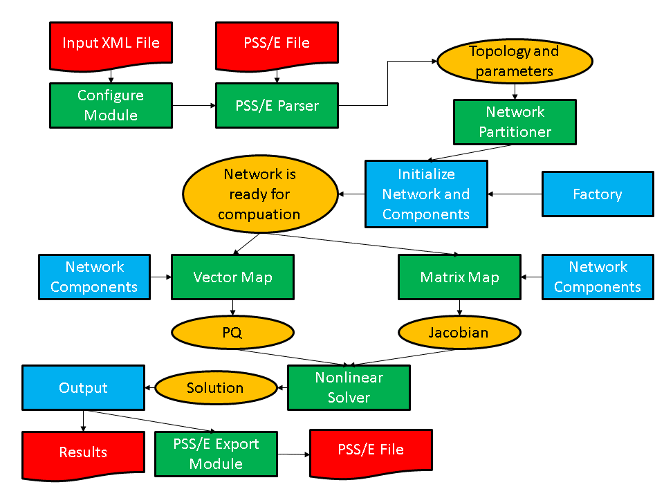

Developing Applications
=======================

The previous section outlined most of the basic modules in the GridPACK
framework. In this section, we provide an overview of how to use these
modules to create actual applications by discussing the development of a
power flow simulation in detail. Actual examples of a power flow
application can be found by looking at an example code located under the
top-level GridPACK directory in
``src/applications/examples/powerflow``. Users can also look at the
power flow module located in the

::

   src/applications/modules/powerflow 

directory. The main difference between the power flow example code and
the power flow module is that the module breaks up the power flow
calculation into more separate function calls and the module also has
options for using a non-linear solver. The power flow bus and branch
classes are located in the directory
``src/applications/components/pf_matrix``.

A schematic of a power flow code based on GridPACK is shown in
Figure `5.1 <#fig:pf-schematic>`__. For different power grid problems,
the details of the code will be different, but most of these motifs will
appear at some point or other. The main differences will probably be in
feedback loops as results from one part of the calculation are fed back
into other parts. For example, an iterative solver will need to update
the current values of the network components, which can then be used to
generate new matrices and vectors that are fed back into the next
iteration of the solver. The diagram in
Figure `5.1 <#fig:pf-schematic>`__ is not complete, but gives an overall
view of code structure and data movement.

   name: fig:pf-schematic
   :width: 6.5in
   :height: 4.5in

   Schematic of program flow for a power flow simulation. The yellow
   ovals are distributed data objects, the green blocks are GridPACK
   framework components and the blue blocks are application specific
   code. External files are red.

As shown in the figure, application developers will need to focus on
writing two or three sets of modules. The first is the network
components. These are the descriptions of the physics and/or
measurements that are associated with buses and branches in the power
grid network. The network factory is a module that initializes the grid
components on the network after the network is originally created by the
import module. The power flow problem is simple enough that it can use a
non-linear solver directly from the math module but even a
straightforward solution such as this requires the developer to
overwrite some functions in the factory that are used in the non-linear
solver iterations.

Most of the work involved in creating a new application is centered on
creating the bus and branch classes. This discussion will describe in
some detail the routines that need to be written in order to develop a
working power flow simulation. Additional application modules for
dynamic simulation and contingency analysis have also been included in
the distribution and users are encouraged to look at these modules for
additional coding examples on how to use GridPACK. The discussion below
is designed to illustrate how to build an application and for brevity
has left out some code compared to the working implementation. The
source code contains more comment lines as well as some additional
diagnostics that may not appear here. However, the overall design is the
same and readers who have a good understanding of the following text
should have no difficulty understanding the power flow source code.

For the power flow calculation, the buses and branches will be
represented by the classes ``PFBus`` and ``PFBranch``.
``PFBus`` inherits from the ``BaseBusComponent`` class, so it
automatically inherits the ``BaseComponent`` and
``MatVecInterface`` classes as well. The first thing that must be
done in creating the ``PFBus`` component is to overwrite the load
function in the ``BaseComponent`` class. The original function is
just a placeholder that performs no action. The ``load`` function
should take parameters from the ``DataCollection`` object associated
with each bus and use them to initialize the bus component itself. For
the ``PFBus`` component, a simplified ``load`` function is

::

   void gridpack::powerflow::PFBus::load(
       const boost::shared_ptr<gridpack::component
       ::DataCollection> &data)
   {
     data->getValue(CASE_SBASE, &p_sbase);
     data->getValue(BUS_VOLTAGE_ANG, &p_angle);
     data->getValue(BUS_VOLTAGE_MAG, &p_voltage);
     p_v = p_voltage;
     double pi = 4.0*atan(1.0;
     p_angle = p_angle*pi/180.0;
     p_a = p_angle;
     int itype; data->getValue(BUS_TYPE, &itype);
     if (itype == 3) {
       setReferenceBus(true);
     }
     bool lgen;
     int i, ngen, gstatus;
     double pg, qg;
     if (data->getValue(GENERATOR_NUMBER, &ngen)) {
       for (i=0; i<ngen; i++) {
         lgen = true;
         lgen = lgen && data->getValue(GENERATOR_PG, &pg,i);
         lgen = lgen && data->getValue(GENERATOR_QG, &qg,i);
         lgen = lgen && data->getValue(GENERATOR_STAT, &gstatus,i);
         if (lgen) {
           p_pg.push_back(pg);
           p_qg.push_back(qg);
           p_gstatus.push_back(gstatus);
         }
       }
     }
   }

This version of the ``load`` function has left off additional
properties, such as shunts and loads and some transmission parameters,
but it serves to illustrate how ``load`` is suppose to work. The
``load`` method in the base factory class will run over all buses,
get the ``DataCollection`` object associated with each bus and then
call the ``PFBus::load`` method using the ``DataCollection``
object as the argument. The parameters ``p_sbase``, ``p_angle``,
``p_voltage`` are private members of ``PFBus``. The variables
corresponding to the keys ``CASE_SBASE``, ``BUS_VOLTAGE_ANG``,
``BUS_VOLTAGE_MAG`` were stored in the ``DataCollection`` object
when the network configuration file was parsed. They are retrieved from
this object using the ``getValue`` functions and assigned to
``p_sbase``, ``p_angle``, ``p_voltage``. Additional internal
variables are also assigned in a similar manner. The value of the
``BUS_TYPE`` variable can be used to determine whether the bus is a
reference bus. As mentioned previously, the ``CASE_SBASE`` etc.
symbols are just preprocessor symbols that are defined in the
``dictionary.hpp`` file, which must be included in the file defining
the ``load`` function. The ``dictionary.hpp`` and associated
files can be found in the ``src/parser`` directory of the GridPACK
distribution.

The variables referring to generators have a different behavior than the
bus voltage variables. A bus can have multiple generators and these are
stored in the ``DataCollection`` object with an index. The total
number of generators on the bus is also stored in the
``DataCollection`` object with the key ``GENERATOR_NUMBER``.
First, the number of generators is retrieved and then a loop is set up
so that all the generator variables can be accessed. The generator
parameters are stored in local private arrays. The loop shows how the
return value of the ``getValue`` function can be used to verify that
all three parameters for a generator were found. If they aren’t found,
then the generator is incomplete and the generator is not added to the
local data. The boolean return value can also be used to determine if
the bus has other properties and to set internal flags and parameters
accordingly. The load function for the ``PFBranch`` is constructed
in a similar way, except that the focus is on extracting branch related
parameters from the ``DataCollection`` object.

Both the ``PFBus`` and ``PFBranch`` classes contain an
application-specific function called ``setYBus`` that is used to set
up values in the Y-matrix. There is also a function in the powerflow
factory class that runs over all buses and branches and calls this
function. The ``setYBus`` function in ``PFBus`` is

::

   void gridpack::powerflow::PFBus::setYBus(void)
   {
     gridpack::ComplexType ret(0.0,0.0);
     std::vector<boost::shared_ptr<BaseComponent> > branches;
     getNeighborBranches(branches);
     int size = branches.size();
     int i;
     for (i=0; i<size; i++) {
       gridpack::powerflow::PFBranch *branch
         = dynamic_cast<gridpack::powerflow::PFBranch*>
           (branches[i].get());
       ret -= branch->getAdmittance();
       ret -= branch->getTransformer(this);
       ret += branch->getShunt(this);
     }
     if (p_shunt) {
       gridpack::ComplexType shunt(p_shunt_gs,p_shunt_bs);
       ret += shunt;
     }
     p_ybusr = real(ret);
     p_ybusi = imag(ret);
   }

This function evaluates the contributions to the Y-Matrix associated
with buses. The real and imaginary parts of this number are stored in
the internal variables ``p_ybusr`` and ``p_ybusi``. The
subroutine first creates the local variable ``ret`` and then gets a
list of pointers to neighboring branches from the
``BaseBusComponent`` function ``getNeighborBranches``. The
function then loops over each of the branches and uses the dynamic cast
function in C++ to convert the ``BaseComponent`` pointer to a
``PFBranch`` pointer. Note that the cast is necessary since the
``getNeighborBranches`` function only returns a list of
``BaseComponent`` object pointers. The ``BaseComponent`` class
does not contain application-specific functions such as
``getAdmittance``. The ``getAdmittance``, ``getTransformer``
and ``getShunt`` methods return the contributions from transmission
elements, transformers, and shunts associated with the branch. These are
accumulated into the ``ret`` variable.

The reason that the ``getAdmittance`` variable has no argument while
both ``getTransformer`` and ``getShunt`` take the pointer
“``this``” as an argument is that the admittance contribution from
simple transmission elements is symmetric with respect to whether or not
the calling bus is the “from” or “to” buses while the transformer and
shunt contributions are not. This can be seen by examining the
``getTransformer`` function.

::

   gridpack::ComplexType
     gridpack::powerflow::PFBranch::getTransformer(
       gridpack::powerflow::PFBus *bus)
   {
     gridpack::ComplexType ret(p_resistance,p_reactance);
     if (p_xform) {
       ret = -1.0/ret;
       gridpack::ComplexType a(cos(p_phase_shift),sin(p_phase_shift));
       a = p_tap_ratio*a;
       if (bus == getBus1().get()) {
         ret = ret/(conj(a)*a);
       } else if (bus == getBus2().get()) {
         // ret is unchanged
       }
     } else {
       ret = gridpack::ComplexType(0.0,0.0);
     }
     return ret;
   }

The variables ``p_resistance``, ``p_reactance``,
``p_phase_shift``, and ``p_tap_ratio`` are all internal
variables that are set based on the variables read in from using the
``load`` method or are set in other initialization steps. The
boolean variable ``p_xform`` variable is set to true in the
``PFBranch::load`` method if transformer-related variables are
detected in the ``DataCollection`` objects associated with the
branch, otherwise it is false.

The ``PFBranch`` version of the ``setYBus`` function is

::

   void gridpack::powerflow::PFBranch::setYBus(void)
   {
     gridpack::ComplexType ret(p_resistance,p_reactance);
     ret = -1.0/ret;
     gridpack::ComplexType a(cos(p_phase_shift),sin(p_phase_shift));
     a = p_tap_ratio*a;
     if (p_xform) {
       p_ybusr_frwd = real(ret/conj(a));
       p_ybusi_frwd = imag(ret/conj(a));
       p_ybusr_rvrs = real(ret/a);
       p_ybusi_rvrs = imag(ret/a);
     } else {
       p_ybusr_frwd = real(ret);
       p_ybusi_frwd = imag(ret);
       p_ybusr_rvrs = real(ret);
       p_ybusi_rvrs = imag(ret);
     }
     gridpack::powerflow::PFBus *bus1 =
       dynamic_cast<gridpack::powerflow::PFBus*>(getBus1().get());
     gridpack::powerflow::PFBus *bus2 =
       dynamic_cast<gridpack::powerflow::PFBus*>(getBus2().get());
     p_theta = (bus1->getPhase() - bus2->getPhase());
   }

Note that the branch version of the ``setYBus`` function calculates
different values Y-matrix contribution for the forward and reverse
directions, where forward and reverse are defined depending on whether
the first index in the Y-matrix element corresponds to bus 1 (the
forward direction) or bus 2 (the reverse direction). These are stored in
the separate variables ``p_ybusr_frwd`` and ``p_ybusi_frwd`` for
the forward direction and ``p_ybusr_rvrs`` and ``p_ybusi_rvrs``
for the reverse direction. This routine also calculates the variable
``p_theta`` which is equal to the difference in the phase angle
variable associated with the two buses at either end of the branch. This
last variable provides an example of calculating a branch parameter
based on the values of parameters located on the terminal buses.

The ``setYBus`` functions are used in the power flow components to
set some basic parameters that eventually incorporated into the Jacobian
matrix and PQ vector. These constitute the matrix and right hand side
vector of the power flow equations. To build the matrix, it is necessary
to implement the matrix size and matrix values functions in the
``MatVecInterface``. The functions for setting up the matrix are
discussed in detail below, the vector functions are simpler but follow
the same pattern. The mode used for setting up the Jacobian matrix is
“``Jacobian``”. The corresponding ``matrixDiagSize`` routine is

::

   bool gridpack::powerflow::PFBus::matrixDiagSize(int *isize,
        int *jsize) const
   {
     if (p_mode == Jacobian) {
       *isize = 2;
       *jsize = 2;
       return true;
     } else if (p_mode == YBus) {
       *isize = 1;
       *jsize = 1;
       return true;
     }
   }

This function handles two modes, stored in the internal variable
``p_mode``. If the mode equals ``Jacobian``, then the function
returns a contribution to a 2\ :math:`\mathrm{\times}`\ 2 matrix. In the
case that the mode is “``YBus``” the function would return a
contribution to a 1\ :math:`\mathrm{\times}`\ 1 matrix. (The Jacobian is
treated as a real matrix where the real and complex parts of the problem
are treated as separate variables, the Y-matrix is handle as a regular
complex matrix). The corresponding code for returning the diagonal
values is

::

   bool gridpack::powerflow::PFBus::matrixDiagValues(ComplexType *values)
   {
     if (p_mode == YBus) {
       gridpack::ComplexType ret(p_ybusr,p_ybusi);
       values[0] = ret;
       return true;
     } else if (p_mode == Jacobian) {
       if (!getReferenceBus()) {
         values[0] = -p_Qinj - p_ybusi * p_v *p_v;
         values[1] = p_Pinj - p_ybusr * p_v *p_v;
         values[2] = p_Pinj / p_v + p_ybusr * p_v;
         values[3] = p_Qinj / p_v - p_ybusi * p_v;
         if (p_isPV) {
           values[1] = 0.0;
           values[2] = 0.0;
           values[3] = 1.0;
         }
         return true;
       } else {
         values[0] = 1.0;
         values[1] = 0.0;
         values[2] = 0.0;
         values[3] = 1.0;
         return true;
       }
     }
   }

In this implementation, the return values are of type
``ComplexType``, even if they are real. For real values, the
imaginary part is set to zero. If the mode is “``YBus``”, the
function returns a single complex value. If the mode is
“``Jacobian``”, the function checks first to see if the bus is a
reference bus or not. If the bus is not a reference bus, then the
function returns a 2\ :math:`\mathrm{\times}`\ 2 block corresponding to
the contributions to the Jacobian matrix coming from a bus element. If
the bus is a reference bus, the function returns a
2\ :math:`\mathrm{\times}`\ 2 identity matrix. This is a result of the
fact that the variables associated with a reference bus are fixed. In
fact, the variables contributed by the reference bus could be eliminated
from the matrix entirely by returning false for both the matrix size and
matrix values routines if the mode is “``Jacobian``” and the bus is
a reference bus. This would also require some adjustments to the
off-diagonal routines as well so that the size and matrix values
routines for off-diagonal block both return false if either end of the
branch is connected to the reference bus. There is an additional
condition for the case where the bus is a “PV” bus. In this case one of
the independent variables is eliminated by setting the off-diagonal
elements of the block to zero and the second diagonal element equal to
1. The values are returned in column-major order, so ``values[0]``
corresponds to the (0,0) location in the 2\ :math:`\mathrm{\times}`\ 2
block, ``values[1]`` is the (1,0) location, ``values[2]`` is the
(0,1) location and ``values[3]`` is the (1,1) location.

The ``matrixForwardSize`` and ``matrixForwardValues`` routines,
as well as the corresponding Reverse routines, are implemented in the
``PFBranch`` class. These functions determine the off-diagonal
blocks of the Jacobian and Y-matrix. The ``matrixForwardSize``
routine is given by

::

   bool gridpack::powerflow::PFBranch::matrixForwardSize(int *isize,
        int *jsize) const
   {
     if (p_mode == Jacobian) {
       gridpack::powerflow::PFBus *bus1
         = dynamic_cast<gridpack::powerflow::PFBus*>(getBus1().get());
       gridpack::powerflow::PFBus *bus2
         = dynamic_cast<gridpack::powerflow::PFBus*>(getBus2().get());
       bool ok = !bus1->getReferenceBus();
       ok = ok && !bus2->getReferenceBus();
       if (ok) {
         *isize = 2;
         *jsize = 2;
         return true;
       } else {
         return false;
       }
     } else if (p_mode == YBus) {
       *isize = 1;
       *jsize = 1;
       return true;
     }
   }

If the mode is “``YBus``”, the size function returns a
1\ :math:`\mathrm{\times}`\ 1 block for the off-diagonal matrix block.
For the Jacobian, this function first checks to see if either end of the
branch is a reference bus by evaluating the Boolean variable “ok”. If
neither end is the reference bus then the function returns a
2\ :math:`\mathrm{\times}`\ 2 block, if one end is the reference bus
then the function returns false. The false value indicates that this
branch does not contribute to the matrix. For this system, the
``matrixReverseSize`` function is the same. For applications that
return a non-square block, the reverse function must transpose the block
dimensions relative to the forward direction.

The ``matrixForwardValues`` function is

::

   bool gridpack::powerflow::PFBranch::matrixForwardValues(
      ComplexType *values)
   {
     if (p_mode == Jacobian) {
       gridpack::powerflow::PFBus *bus1
         = dynamic_cast<gridpack::powerflow::PFBus*>(getBus1().get());
       gridpack::powerflow::PFBus *bus2
         = dynamic_cast<gridpack::powerflow::PFBus*>(getBus2().get());
       bool ok = !bus1->getReferenceBus();
       ok = ok && !bus2->getReferenceBus();
       if (ok) {
         double cs = cos(p_theta);
         double sn = sin(p_theta);
         values[0] = (p_ybusr_frwd*sn - p_ybusi_frwd*cs);
         values[1] = (p_ybusr_frwd*cs + p_ybusi_frwd*sn);
         values[2] = (p_ybusr_frwd*cs + p_ybusi_frwd*sn);
         values[3] = (p_ybusr_frwd*sn - p_ybusi_frwd*cs);
         values[0] *= ((bus1->getVoltage())*(bus2->getVoltage()));
         values[1] *= -((bus1->getVoltage())*(bus2->getVoltage()));
         values[2] *= bus1->getVoltage();
         values[3] *= bus1->getVoltage();
         bool bus1PV = bus1->isPV();
         bool bus2PV = bus2->isPV();
         if (bus1PV & bus2PV) {
           values[1] = 0.0;
           values[2] = 0.0;
           values[3] = 0.0;
         } else if (bus1PV) {
           values[1] = 0.0;
           values[3] = 0.0;
         } else if (bus2PV) {
           values[2] = 0.0;
           values[3] = 0.0;
         }
         return true;
       } else {
         return false;
       }
     } else if (p_mode == YBus) {
       values[0] = gridpack::ComplexType(p_ybusr_frwd,p_ybusi_frwd);
       return true;
     }
   }

For the “``YBus``” mode, the function simply returns the complex
contribution to the Y-matrix. For the “``Jacobian``” mode, the
function first determines if either end of the branch is connected to
the reference bus. If it is, then the function returns false and there
is no contribution to the Jacobian. If neither end of the branch is the
reference bus then the function evaluates the 4 elements of the
2\ :math:`\mathrm{\times}`\ 2 contribution to the Jacobian coming from
the branch. To do this, the branch needs to get the current values of
the voltages on the buses at either end by using the ``getVoltage``
accessor functions that have been defined in the ``PFBus`` class.
Finally, if one end or the other of the branch is a PV bus, then some
variables need to be eliminated from the equations. This can be done by
setting appropriate values in the 2\ :math:`\mathrm{\times}`\ 2 block
equal to zero.

The ``matrixReverseValues`` function is similar to the
``matrixForwardValues`` functions with a few key differences. 1) the
variables ``p_ybusr_rvrs`` and ``p_ybusi_rvrs`` are used instead
of ``p_ybusr_frwd`` and ``p_ybusi_frwd`` 2) instead of using
``cos(p_theta)`` and ``sin(p_theta)`` the function uses
``cos(-p_theta)`` and ``sin(-p_theta)`` since ``p_theta`` is
defined as difference in phase angle on bus 1 minus the difference in
phase angle on bus 2 and 3) the values that are set to zero in the
conditions for PV buses are transposed. The PV conditions are the same
as the forward case if both bus 1 and bus 2 are PV buses, if only bus 1
is a PV bus then ``values[2]`` and ``values[3]`` are zero and if
only bus2 is a PV bus then ``values[1]`` and ``values[3]`` are
zero.

The functions for setting up vectors are similar to the corresponding
matrix functions, although they are a bit simpler. The vector part of
the ``MatVecInterface`` contains one function that does not have a
counterpart in the set of matrix functions and that is the
``setValues`` function. This function can be used to push values in
a vector object back into the buses that were used to generate the
vector. For the Newton-Raphson method used to solve the power flow
equations, it is necessary to push the current solution back into the
buses at each iteration so they can be used to evaluate new Jacobian and
right hand side vectors. The solution vector contains the current
increments to the voltage and phase angle. These are written back to the
buses using the function

::

   void gridpack::powerflow::PFBus::setValues(
       gridpack::ComplexType *values)
   {
     p_a -= real(values[0]);
     p_v -= real(values[1]);
     *p_vAng_ptr = p_a;
     *p_vMag_ptr = p_v;
   }

If the matrix equation ``Ax = b`` is being solved, then the mapper
used to create the right hand side vector ``b`` should be used to
push results back onto the buses using the ``mapToBus`` method. The
``setValues`` method above takes the contributions from the solution
vector and uses then to decrement the internal variables ``p_a``
(voltage angle) and ``p_v`` (voltage magnitude). The new values of
``p_a`` and ``p_v`` are then assigned to the buffers
``p_vAng_ptr`` and ``p_vMag_ptr`` so that they can be exchanged
with other buses. This is discussed below.

The two routines that need to be created in the ``PFBus`` class to
copy data to ghost buses are both simple. There is no need to create
corresponding routines in the ``PFBranch`` class since branches do
not exchange data in the power flow calculation. Two values need to be
exchanged between buses, the current voltage angle and the current
voltage magnitude. This requires a buffer that is the size of two
doubles so the ``getXCBufSize`` function is written as

::

   int gridpack::powerflow::PFBus::getXCBufSize(void)
   {
     return 2*sizeof(double);
   }

The ``setXCBuf`` assigns the buffer created in the base factory
``setExchange`` function to internal variables used within the
``PFBus`` component. It has the form

::

   void gridpack::powerflow::PFBus::setXCBuf(void *buf)
   {
     p_vAng_ptr = static_cast<double*>(buf);
     p_vMag_ptr = p_vAng_ptr+1;
     *p_vAng_ptr = p_a;
     *p_vMag_ptr = p_v;
   }

The buffer created in the ``setExchange`` routine is split between
the two internal pointers ``p_vAng_ptr`` and ``p_vMag_ptr``.
These are then initialized to the current values of ``p_a`` and
``p_v``. Whenever the ``updateBuses`` routine is called, the
buffers on the ghost buses are refreshed with the current values of the
variables from the processes that own the corresponding buses. Note that
both the ``getXCBufSize`` and the ``setXCBuf`` routines are only
called during the ``setExchange`` routine. They are not called
during the actual bus updates.

One final function in the ``PFBus`` and ``PFBranch`` class that
is worth taking a brief look at is the set mode function. This function
is used to set the internal ``p_mode`` variable that is defined in
both classes. The ``PFMode`` enumeration, which contains both the
“``YBus``” and “``Jacobian``” modes, is defined within the
gridpack::powerflow namespace. The ``setMode`` function for both
buses and branches has the form

::

   void gridpack::powerflow::PFBus::setMode(int mode)
   {
     p_mode = mode;
   }

This function is triggered on all buses and branches if the
``setMode`` method in the factory class is called. Once the
``PFBus`` and ``PFBranch`` classes have been defined, it is
possible to define a ``PFNetwork`` using a ``typdef`` statement.
This can be done using the line

::

   typedef network::BaseNetwork<PFBus, PFBranch > PFNetwork;

in the header file declaring the ``PFBus`` and ``PFBranch``
classes. This type can then be used in other powerflow files that need
to create objects from templated classes.

The discussion above summarizes many of the important functions in the
``PFBus`` and ``PFBranch`` classes. Additional functions are
included in these classes that are not discussed here, but the basic
principles involved in implementing the remaining functions have been
covered.

The first part of creating a new application is writing the network
component classes. The second part is implementing the
application-specific factory. For the power flow application, this is
the ``PFFactory`` class, which inherits from the ``BaseFactory``
class. Most of the important functionality in ``PFFactory`` is
derived from the ``BaseFactory`` class and is used without
modification, but several application-specific functions have been added
to ``PFFactory`` that are used to set internal parameters in the
network components. As an example, consider the ``setYBus`` function

::

   void gridpack::powerflow::PFFactory::setYBus(void)
   {
     int numBus = p_network->numBuses();
     int numBranch = p_network->numBranches();
     int i;
     for (i=0; i<numBus; i++) {
       p_network->getBus(i).get()->setYBus();
     }
     for (i=0; i<numBranch; i++) {
       p_network->getBranch(i).get()->setYBus();
     }
   }

This function loops over all buses and branches and invokes the
``setYBus`` method in the individual ``PFBus`` and
``PFBranch`` objects. The first two lines in the factory
``setYBus`` method get the total number of buses and branches on the
process. A loop over all buses on the process is initiated and a pointer
to the bus object is obtained via the ``getBus`` bus method in the
``BaseNetwork`` class. This pointer is returned as a pointer of type
``PFBus``, so it is not necessary to do a dynamic cast on it and the
``setYBus`` method, which is not part of the base class, can be
invoked. The same set of steps is then repeated for the branches. The
factory can be used to create other methods that invoke functions on
buses and/or branches.

Most of these functions follow the same general form as the
``setYBus`` method just described. The last part of building an
application is creating the top level application driver that actually
instantiates all the objects used in the calculation and controls the
program flow. Running the code is broken up into two parts. The first is
creating a main program and the second is creating the application
driver. The main routine is primarily responsible for initializing the
communication libraries and creating the application object, the
application object then controls the application itself. The main
program for the powerflow application is

::

   main(int argc, char **argv)
   {
     gridpack::parallel::Environment env(argc,argv);
     {
       gridpack::powerflow::PFApp app;
       app.execute();
     }
   }

The first line in this program creates a variable of type
``Environment`` that initializes the MPI and GA communication
libraries as well as the math initialization routine (the initialization
happens in the constructor, so all that is necessary is to create the
variable). More can be found out about the ``Environment`` class in
Section `6.2 <#environment>`__. The code then instantiates a power flow
application object and calls the execute method for this object. The
remainder of the power flow application is contained in the
``PFApp::execute`` method. Finally, when the application has
finished running, the main program cleans up the communication and math
libraries. The communication libraries are handled when the ``env``
variable goes out of scope and calls the ``Environment`` destructor.
The main reason for breaking the code up in this way instead of
including the execute function as part of ``main`` is to force the
invocation of all the destructors in the GridPACK objects used to
implement the application. Otherwise, these destructors get called after
the communication libraries have been finalized and the program will
fail to exit cleanly.

The top level control of the application is embedded in the power flow
``execute`` method. The ``execute`` method starts off with the
code

::

   gridpack::parallel::Communicator world;
     boost::shared_ptr<PFNetwork> network(new PFNetwork(world));

     gridpack::utility::Configuration *config
         = gridpack::utility::Configuration::configuration();
     config->open("input.xml",world);
     gridpack::utility::Configuration::Cursor *cursor;
     cursor = config->getCursor("Configuration.Powerflow");
     std::string filename;
     if (!cursor->get("networkConfiguration", &filename)) {
       printf("No network configuration specified\n");
       return;
     }
     gridpack::parser::PTI23_parser<PFNetwork> parser(network);
     parser.parse(filename.c_str());
     
     network->partition();

The first two lines create a communicator for this application and use
it to instantiate a ``PFNetwork`` object (note that this is really a
``BaseNetwork`` template class that is instantiated using the
``PFBus`` and ``PFBranch`` classes as template arguments). The
network object exists but has no buses or branches associated with it.
The next few lines get an instance of the configuration object and use
this to open the ``input.xml`` file. This filename has been
hardwired into this implementation but it could be passed in as a
runtime argument, if desired. The code then creates a ``Cursor``
object and initializes this to point into the
``Configuration.Powerflow`` block of the ``input.xml`` file. The
cursor can then be used to get the contents of the
``networkConfiguration`` block in ``input.xml``, which
corresponds to the name of the network configuration file containing the
power grid network. This file is assumed to use the PSS/E version 23
format. After getting the file name, the code creates a
``PTI23_parser`` object and passes in the current network object as
an argument. When the parse method is called, the parser reads in the
file specified in ``filename`` and uses that to add buses and
branches to the network object. The network now has all the bus and
branches from the configuration file, but no ghost buses or branches
exist and buses and branches are not distributed in an optimal way.
Calling the partition method on the network distributes the buses and
branches and adds appropriate ghost buses and branches.

The next set of calls initialize the network components and prepare the
network for computation.

::

   gridpack::powerflow::PFFactory factory(network);
     factory.load();

     factory.setComponents();
     factory.setExchange();
     
     network->initBusUpdate();

     factory.setYBus();

The first call creates a ``PFFactory`` object and instantiates it
with a reference to the current network. ``PFFactory`` inherits from
the ``BaseFactory`` class and assumes that a ``PFNetwork`` is
used as the template argument for the ``BaseFactory``. The next line
calls the ``BaseFactory load`` method which invokes the component
``load`` method on all buses and branches. These methods use data
from the ``DataCollection`` objects to initialize the corresponding
bus and branch objects. Note that when the partition function creates
the ghost bus and branch objects, it copies the associated
``DataCollection`` objects to these ghosts so the parameters from
the network configuration file are available to instantiate all objects
in the network. There is no need to do a data exchange at this point in
the code in order to get current values on the ghost objects.

The next two calls are implemented in the ``BaseFactory`` class. The
``setComponents`` method sets up pointers in the network components
that point to neighboring branches and buses (in the case of buses) and
terminal buses (in the case of branches). It is also responsible for
setting up internal indices that are used by the mapper functions to
create matrices and vectors. The ``setExchange`` method sets up the
buffers that are used to exchange data between locally owned buses and
branches and their corresponding ghost images on other processors. The
call to ``initBusUpdate`` creates internal data structures that are
used to exchange bus data between processors and the final factory call
to ``setYBus`` evaluates the Y-matrix contributions from all network
components. The network is fully initialized at this point and ready for
computation.

The next calls create the matrices used in the Newton-Raphson iteration
loop.

::

   factory.setSBus();
     factory.setMode(RHS);
     gridpack::mapper::BusVectorMap<PFNetwork> vMap(network);
     boost::shared_ptr<gridpack::math::Vector> PQ = vMap.mapToVector();

     factory.setMode(Jacobian);
     gridpack::mapper::FullMatrixMap<PFNetwork> jMap(network);
     boost::shared_ptr<gridpack::math::Matrix> J = jMap.mapToMatrix();
     boost::shared_ptr<gridpack::math::Vector> X(PQ->clone());

The factory calls the ``setSBus`` method that sets some additional
network component parameters used in the RHS vector (again, by looping
over all buses and invoking a ``setSBus`` method on each bus). The
next three lines set the mode to “``RHS``”, create a
``BusVectorMap`` object and create the right hand side vector in the
powerflow equations using the ``mapToVector`` method. This builds
the vector based on the “``RHS``” mode. The next three lines create
the Jacobian using the same pattern as for the Y-matrix. The mode gets
set to “``Jacobian``”, another ``FullMatrixMap`` object is
created and this is used to create the Jacobian using the
``mapToMatrix`` method. The last line creates a new vector by
cloning the PQ vector. The X vector has the same dimension and data
layout as PQ so it could be used with the ``vMap`` object.

This application only creates one matrix so only one
``FullMatrixMap`` object is needed. If multiple matrices are
required by an application then multiple ``FullMatrixMap`` objects
may need to be created, one for each matrix. In the case that multiple
matrices have exactly the same dimensions and fill pattern, it may be
possible to reuse a mapper for more than one matrix, but this will
generally not be the case.

Once the vectors and matrices for the problem have been created and set
to their initial values, it is possible to start the Newton-Raphson
iterations. The code to set up the first Newton-Raphson iteration is

::

   double tolerance = 1.0e-6;
     int max_iteration = 100;
     ComplexType tol;

     gridpack::math::LinearSolver solver(*J);
     solver.configure(cursor);

     int iter = 0;

     X->zero(); 
     solver.solve(*PQ, *X);
     tol = PQ->normInfinity();

The first three lines define some parameters used in the Newton-Raphson
loop. The tolerance and maximum number of iterations are hardwired in
this example but could be made configurable via the input deck using the
``Configuration`` class. The next line creates a linear solver based
on the current value of the Jacobian, ``J``. The call to the
configure method allows configuration parameters in the input file to be
passed directly to the newly created solver. The iteration counter is
set to zero and the value of ``X`` is also set to zero. The linear
solver is called with ``PQ`` as the right hand side vector and
``X`` as the solution. An initial value of the tolerance is set by
evaluating the infinity norm of ``PQ``. The calculation can now
enter the Newton-Raphson iteration loop

::

   while (real(tol) > tolerance && iter < max_iteration) {
       factory.setMode(RHS);
       vMap.mapToBus(X);
       network->updateBuses();

       vMap.mapToVector(PQ);
       factory.setMode(Jacobian);
       jMap.mapToMatrix(J);

       X->zero();
       solver.solve(*PQ, *X);
       tol = PQ->normInfinity();
       iter++;
     }

This code starts by pushing the values of the solution vector back on to
the buses using the same mapper that was used to create ``PQ``. The
network then calls the ``updateBus`` routine so that the ghost buses
have new values of the voltage angle and magnitude parameters from the
solution vector. New values of the Jacobian and right hand side vector
are created based on the solution values from the previous iteration.
Note that since ``J`` and ``PQ`` already exist, the mappers are
just overwriting the old values instead of creating new data objects.
The linear solver is already pointing to the Jacobian matrix so it
automatically uses the new Jacobian values when calculating the solution
vector ``X``. If the norm of the new ``PQ`` vector is still
larger than the tolerance, the loop goes through another iteration. This
continues until the tolerance condition is satisfied or the number of
iterations reaches the value of ``max_iteration``.

If the Newton-Raphson loop converges, then the calculation is
essentially done. The last part of the calculation is to write out the
results. This can be accomplished using the code

::

     factory.setMode(RHS);
     vMap.mapToBus();
     network->updateBuses();

     gridpack::serial_io::SerialBusIO<PFNetwork> busIO(128,network);
     busIO.header("\n   Bus Voltages and Phase Angles\n");
     busIO.header("\n   Bus Number      Phase Angle");
     busIO.header("      Voltage Magnitude\n");
     busIO.write();

The first three lines guarantee that current values of the solution
vector are available on all buses. The final five lines create a serial
bus IO object that assumes that no line of output will exceed more than
128 characters, write out the header for the output data and then write
a listing of data from all buses. The data from each bus is generated by
the ``serialWrite`` method defined in the ``PFBus`` class. A
similar set of calls can be used to write out data from the branches.
This completes the execute method and the overview of the power flow
application. ` <#topDoc>`__
