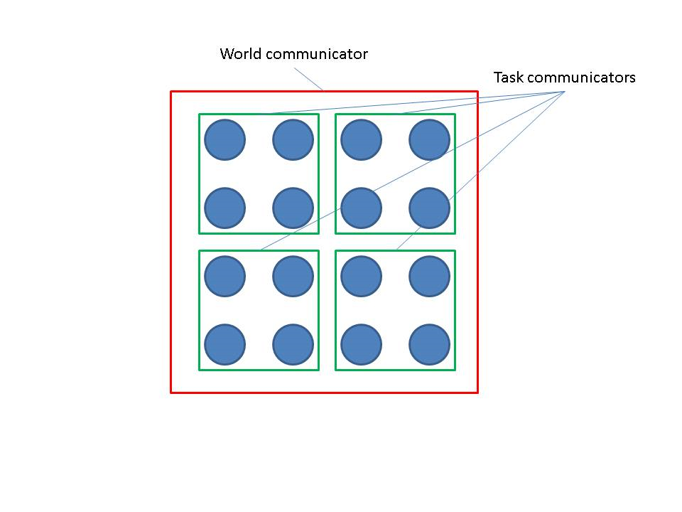
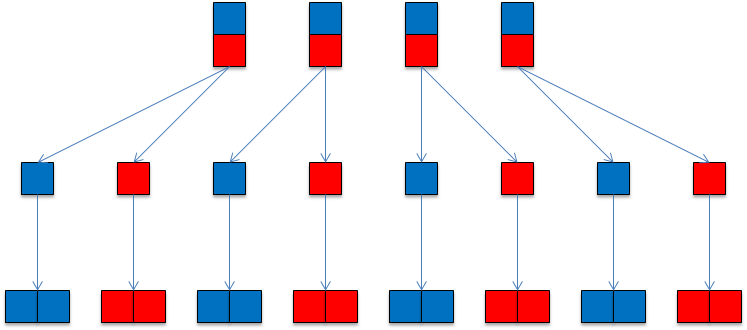
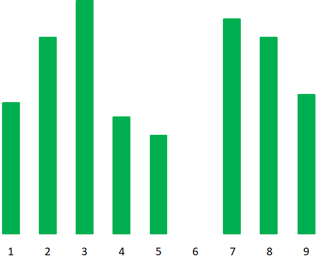
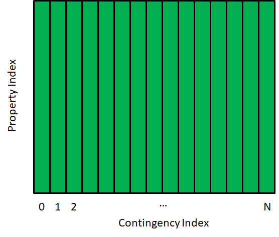

Advanced Functionality
======================

The core operations supported by GridPACK have been described above and
these can be used in to create many different kinds of power grid
applications. This section will describe features that are more advanced
but can be extremely useful in certain cases. Additional capabilities of
the GridPACK framework include

#. Communicators and task managers that can be used to create multiple
   levels of parallelism and implement dynamic load balancing schemes

#. A generalized matrix-vector interface to handle applications where
   the dependent and independent variables are associated with both
   buses and branches. The ``MatVecInterface`` described above can
   only be used for systems where the dependent and independent
   variables are associated solely with buses

#. A “slab” matrix-vector interface for creating matrices based on
   multiple values on each of the network components. This can be used
   for algorithms such as Kalman filter

#. Profiling and error handling capabilities

#. A hashed data distribution capability that can be used to direct
   network data to the processors that own the corresponding network
   components

This functionality is described in more detail in the following
sections.

.. _communicator:

Communicators
-------------

The subject of communicators has already been mentioned in the context
of the constructor for the ``BaseNetwork`` class. This section will
describe communicators in more detail and will show how the GridPACK
communicators can be used to partition a large calculation into separate
pieces that all run concurrently. A communicator can crudely be though
of as a communication link between a group of processors. Whenever a
process needs to communicate with another process it needs to specify
the communicator over which that communication will occur. When a
parallel job is started, it creates a “world” communicator to which all
processes implicitly belong. Any process can communicate with any other
process via the world communicator. Other communicators can be created
by an application and it is possible for a process to belong to multiple
communicators. The concept of communicators is particularly important
for restricting the scope of “global” operations. These are operations
that require every process in the communicator to participate. Failure
of a process to participate in the operation usually results in the
calculation stalling because multiple processors are waiting for a
communication from a process that is not part of the global operation. A
program can remain in this state indefinitely. Many of the module
functions in GridPACK represent global operations and contain embedded
calls that act collectively on a communicator. In order for two separate
calculations to proceed concurrently, they must be run on disjoint sets
of processors using separate communicators.

The use of communicators to create multiple concurrent parallel tasks
within an application is usually straightforward to implement but it is
frequently much more confusing to understand. A diagram of a set of 16
processes that are divided into 4 groups each containing 4 processes is
shown schematically in Figure 9. In this
example, each subgroup could potentially execute a separate parallel
task within the larger parallel calculation.



   Schematic diagram illustrating the use of multiple communicators.

Global operations on the world communicator involve all 16 processes,
global operations on one of the task communicators just involve the 4
processes in the group used to define the task communicator. If a
network object is created on one of the task communicators, then a
global operation such as the bus update only occurs between the 4
processes in the task communicator. The network object is, in a certain
sense, “invisible” to the processes outside that communicator. If a
network is created on a sub-communicator, then all objects derived from
the network, such as factories, parsers, serial IO objects, etc. are
also associated with the same sub-communicator.

The communicator supports some basic operations that are commonly used
in parallel programming. GridPACK has been designed to minimize the
amount of explicit communication that must be handled by application
developers, but it is occasionally useful to have access to standard
communication protocols in applications. In particular, it is useful to
be able to divide a given communicator into a set of non-overlapping
sub-communicators. The basic operations supported by the GridPACK
communicator class are described below.

The GridPACK ``Communicator`` class is in the
``gridpack::parallel`` namespace. Several constructors for the
communicator class are available. The simplest is

::

   Communicator(void)

and takes no arguments. This constructor returns a communicator that is
defined on the world group containing all processes available to the
calculation. Other constructors take an argument and can be used to
construct or copy communicators from a subset of processes. These
include

::

   Communicator(const Communicator& comm)
   Communicator(const boost::mpi::communicator& comm)
   Communicator(const MPI_Comm& comm)

The first constructor is a copy constructor and creates a separate
instance of the communicator, the remaining two constructors allow users
to create a communicator from MPI or Boost communicators. These can be
useful if using GridPACK in conjunction with other parallel applications
created outside the GridPACK framework.

Two basic functions associated with communicators are

::

   int size(void) const

and

::

   int rank(void) const

The first function returns the number of processors in the communicator
and the second returns the index of the processor within the
communicator. If the communicator contains N processes, then the rank
will be an integer ranging from 0 to N-1. The process corresponding to
rank 0 is often referred to as the head process or head node for the
communicator. Note that if a process belongs to more than one
communicator, its rank may differ depending on which communicator is
being referred to. Information on size and rank is used extensively when
explicitly programming in parallel. GridPACK has tried to abstract much
of this programming so that developers do not need to pay attention to
it, but it is still occasionally useful to be able to access these
numbers. For example, the header function in the SerialIO classes is
essentially equivalent to the following code fragment

::

   Communicator comm;
   if (comm.rank() == 0) {
     printf("My message\n");
   }

This code creates some output. If the condition was not there, the code
would print out the message from all N processors in the world
communicator and N copies of “My message” would appear in the output.
The condition restricting the print statement to process 0 guarantees
that the message appears only once.

A more important use of communicators is to divide up the world
communicator into separate communicators that can be used to run
independent parallel calculations. This is known as multi-level
parallelism. Two functions can be used to split up an existing
communicator into sub-communicators. The first is ``split``

::

   Communicator split(int color) const

This function divides the calling communicator into sub-communicators
based on the ``color`` variable. All processors with the same value
of the ``color`` variable end up in the same communicator. Thus, if
16 processors on the world communicator are divided up such that
processes 0-3 are color 0, processes 4-7 are color 1, processes 8-11 are
color 2 and processes 12-15 are color 3, then split will generate 4
sub-communicators from the world communicator such that 0-3 are on one
communicator, 4-7 are on another communicator and so on. Note that this
function divides the communicator completely into complementary pieces
with all processes in the old communicator ending up in a new
communicator and no process ending up in more than one new communicator.

A second function that can be used to decompose a communicator into
sub-communicators is ``divide``. This function has the form

::

   Communicator divide(int nsize) const

Each sub-communicator returned by this function contains at most
``nsize`` processes. The function will try and create as many
communicators of size ``nsize`` as possible. For example, if the
calling communicator contains 10 processes and ``nsize`` is set to
4, then this function will create 3 sub-communicators, two of which
contain 4 processors and one containing 2 processors.

An example of how communicators can be used to create multiple levels of
parallelism is illustrated in Figure 10. The example has 8 tasks that
can be evaluated independently. The first row in
Figure 10 shows four processors. Two of the 8
tasks are run on each processor so if each task has been parallelized
then it needs to run on a communicator with only 1 processor in it. The
second row shows the same calculation running on 8 processors. In this
case, each processor only has 1 task associated with it but each task is
still running on a single processor. If the tasks have not been
parallelized, then this is as far as you can go. However, if the tasks
*have* been parallelized, then you can move on to the configuration
shown in the third line using 16 processors. In this case, the system
has been divided into 8 groups, each containing two processors. Each
group has its own separate subcommunicator and each task can be run in
parallel on two processors. This gives additional speed-up over what can
be achieved by simply distributing tasks to separate processors.



   Schematic diagram of 8 tasks evaluated using multiple levels of
   parallelism. The first row represents 8 tasks on 4 processors, the
   second row is 8 tasks on 8 processors and the third row is 8 tasks
   running on 16 processors.

Additional functions are available for communicators that support basic
parallel computing tasks. The objective of GridPACK is to abstract most
aspects of parallel computing so that users do not need to deal with
them directly, but there are some tasks, particularly those associated
with collecting and organizing data, that are not difficult to program
but are difficult to generalize. Some support for simple parallel
operations is useful in these cases. The following operations can be
used to sum data across all processors

::

   void sum(float *x, int nvals) const
   void sum(double *x, int nvals) const
   void sum(int *x, int nvals) const
   void sum(long *x, int nvals) const
   void sum(ComplexType *x, int nvals) const

The array ``x`` holds the values to be summed and ``nvals`` is
the number of values in ``x``. This operation can be used to compute
the total of some quantity after partial sums have been calculated on
each processor. It can also be used to collect an array of values across
a collection of processors by having each processor compute a portion of
an array and then using the sum operation to create a complete copy of
the array on all processors.

Maximum and minimum values can be calculated using the functions

::

   void max(float *x, int nvals) const
   void max(double *x, int nvals) const
   void max(int *x, int nvals) const
   void max(long *x, int nvals) const

   void min(float *x, int nvals) const
   void min(double *x, int nvals) const
   void min(int *x, int nvals) const
   void min(long *x, int nvals) const

Again, a global maximum or minimum can be calculated by first computing
the local maximum or minimum on each processor and then evaluating it
across processors.

One other common parallel construct that may be useful in some contexts
is the barrier or synchronization function. In GridPACK, this is
available as the function

::

   void sync() const

The ``sync`` function does not allow any processor in the
communicator to proceed beyond this call until all processors in the
communicator have reached the call. This is used in some parallel
programming situations to guarantee a consistent state across all
processors. In general, there should be relatively little need for this
call in GridPACK. See, however, the comment below at the end of the
section `6.9 <#global_store>`__ on ``GlobalStore``.

Environment
-----------

GridPACK applications need to initialize several libraries in order to
execute properly. These can be initialized explicitly by the user in
their application but they can also be initialized by creating a single
``Environment`` object at the start of the code. This module uses
just the ``gridpack`` namespace. The constructor for this object
will automatically call all the appropriate initialization functions for
libraries used by GridPACK. This object can also be used to support an
inline help message that can be used to document how to use the
application.

There are two main constructors for this class

::

   Environment(int argc, char **argv)

::

   Environment(int argc, char **argv, const char* help)

The ``argc`` and ``argv`` arguments are the standard command
line variables used in C and C++ ``main`` programs. These will be
passed to the math library and MPI initialization. Other options can
also be passed from the command line as well. Currently, the only
command line options that are supported directly by the
``Environment`` class are ``-h`` and ``-help``. If the
application is invoked with these options, then the program will print
out whatever information is stored in the ``help`` variable and then
exit.

When using the ``Environment`` object to initialize GridPACK, it is
important to set the main body of the code apart from the creation of
the ``Environment`` object. The code should have a structure that
looks like

::

   int main(int argc, char **argv)
   {
     gridpack::Environment env(argc,argv);
     {
       // Main body of code goes here
     }
     return 0;
   }

This form guarantees that all objects created by the application are
destroy first before the ``Environment`` destructor is called. This
is important since otherwise the destructors for some objects in the
application may be called after the Global Array or MPI environments
have been shut down and if they rely on calls in the Global Array or MPI
libraries, the application will not exit cleanly.

Task Manager
------------

The task manager functionality is designed to parcel out tasks on a
first come, first serve basis to processes in a parallel application.
Each processor can request a task ID from the task manager and based on
the value it receives, it will execute a block of work corresponding to
the ID. The task manager guarantees that all IDs are sent out once and
only once. The unique feature of the task manager is that if the tasks
take unequal amounts of time, then processes with longer tasks will make
fewer requests to the task manager than processes that have relatively
short tasks. This leads to an automatic dynamic load balancing of the
application that can substantially improve performance. The task manager
also supports multi-level parallelism and can be used in conjunction
with the sub-communicators described above to implement parallel tasks
within a parallel application. An example of the use of communicators
and task managers to create a code that uses multiple levels of
parallelism can be found in the contingency analysis application that is
part of the GridPACK distribution. This application is located in
``src/applications/examples/contingency_analysis``.

Task managers use the ``gridpack::parallel`` namespace and can be
created either on the world communicator or on a subcommunicator. Two
constructors are available.

::

   TaskManager(void)

   TaskManager(Communicator comm)

The first constructor must be called on all processors in the system and
creates a task manager on the world communicator, the second is called
on all processors within the communicator ``comm``. Once the task
manager has been created, the number of tasks must be set. This can be
done with the function

::

   void set(int ntask)

where the variable ``ntask`` corresponds to the total number of
tasks to be performed. This call is collective on all processes in the
communicator and each process must use the same value of ``ntask``.
The task IDs returned by the task manager will range from 0 to
``ntask-1``.

Once the task manager has been created, task IDs can be retrieved from
the task manager using one of the functions

::

   bool nextTask(int *next)

   bool nextTask(Communicator &comm, int *next)

The first function is called on a single processor and returns the task
ID in the variable ``next``. The second is called on the
communicator ``comm`` by all processors in ``comm`` and returns
the same task ID on all processors (note that if all processors in
``comm`` called the first ``nextTask`` function, each processor
in ``comm`` would end up with a different task ID). The communicator
argument in the second ``nextTask`` call should be a subcommunicator
relative to the communicator that was used to create the task manager.
Both functions return ``true`` if the task manager has not run out
of tasks, otherwise they return ``false`` and the value of
``next`` is set to -1.

The task manager also has a function

::

   void printStats(void)

that can be used to print out information to standard out about how many
tasks were assigned to each process. Thise function should be called
collectively on all processes.

A simple code fragment shows how communicators and task managers can be
combined to create an application exhibiting multi-level parallelism.

::

   gridpack::parallel::Communicator world
     int grp_size = 4;
     gridpack::parallel::Communicator task_comm = world.divide(grp_size);
     App app(task_comm);
     gridpack::parallel::TaskManager taskmgr;
     taskmgr.set(ntasks);
     int task_id;
     while(taskmgr.nextTask(task_comm, &task_id) {
       app.execute(task_data[task_id]);
     }

This code divides the world communicator into sub-communicators
containing at most 4 processes. An application is created on each task
communicator and a task manager is created on the world group. The task
manager is set to execute ``ntasks`` tasks and a while loop is
created to execute each task. Each call to ``nextTask`` returns the
same value of ``task_id`` to the processors in ``task_comm``.
This ID is used to index into an array ``task_data`` of data
structures that contain the input data necessary to execute the task.
The size of ``task_data`` corresponds to the value of
``ntasks``. When the task manager runs out of tasks, the loop
terminates. Note that this structure does not guarantee that tasks are
mapped to processors in any fixed order. There is no guarantee that task
0 is executed on process 0 or that some process will execute a given
number of tasks. If one task takes significantly longer than other tasks
then it is likely that other processors will pick up work from the
processors executing the longer task. This balances the workload if each
process is involved in multiple tasks. Once the workload drops to 1 task
per process, this advantage is lost. There is also no guarantee that if
the calculation is repeated, that the same processes will end up
executing the same tasks. However, the final results should be the same.

Timers
------

Profiling applications is an important part of characterizing
performance, identifying bottlenecks and proposing remedies. Profiling
in a parallel context is also extremely tricky. Unbalanced applications
can lead to incorrect conclusions about performance when load imbalance
in one part of the application appears as poor performance in another
part of the application. This occurs because the part of the application
that appears slow has a global operation that acts as an accumulation
point for load imbalance. Nevertheless, the first step in analyzing
performance is to be able to time different parts of the code. GridPACK
provides a timer functionality that can help users do this. These
modules are designed to do relatively coarse-grained profiling, they
should not be used to time the inside of computationally intensive
loops.

GridPACK contains two different types of timers. The first is a global
timer that can be used anywhere in the code and accumulates all results
back to the same place for eventual display. Users can get a copy of
this timer from any point in the calculation. The second timer is
created locally and is designed to only time portions of the code. The
second class of timers was created to support task-based parallelism
where there was an interest in profiling individual tasks instead of
getting timing results averaged over all tasks. Both timers can be found
in the ``gridpack::utility`` namespace.

The ``CoarseTimer`` class represents a timer that is globally
accessible from any point in the code. A pointer to this timer can be
obtained by calling the function

::

   static CoarseTimer *instance()

A category within the timer corresponds to a portion of the code that is
to be timed. A new category in the timer can be created using the
command

::

   int createCategory(const std::string title)

This command creates a category that is labeled by the name in the
string ``title``. The function returns an integer handle that can be
used in subsequent timing calls. For example, suppose that all calls to
``function1`` within a code need to be timed. The first step is to
get an instance of the timer and create the category “``Function1``”

::

   gridpack::utility::CoarseTimer *timer =
     gridpack::utilitity::CoarseTimer::instance();
   int t_func1 = timer->createCategory("Function1");

This code gets a copy of the timer and returns an integer handle
``t_func1`` corresponding to this category. If the category has
already been created, then ``createCategory`` returns a handle to
the existing category, otherwise it adds the new category to the timer.

Time increments can be accumulated to this category using the functions

::

   void start(const int idx)

   void stop(const int idx)

The ``start`` command begins the timer for the category represented
by the handle ``idx`` and ``stop`` turns the timer off and
accumulates the increment. At the end of the program, the timing results
for all categories can be printed out using the command

::

   void dump(void) const

The results for each category are printed to standard out. An example of
a portion of the output from ``dump`` for a power flow code is shown
below.

::

   Timing statistics for: Total Application
           Average time:               14.7864
           Maximum time:               14.7864
           Minimum time:               14.7863
           RMS deviation:               0.0000
       Timing statistics for: PTI Parser
           Average time:                0.1553
           Maximum time:                1.2420
           Minimum time:                0.0000
           RMS deviation:               0.4391
       Timing statistics for: Partition
           Average time:                2.8026
           Maximum time:                2.9668
           Minimum time:                1.7142
           RMS deviation:               0.4398
       Timing statistics for: Factory
           Average time:                1.2424
           Maximum time:                1.2540
           Minimum time:                1.2336
           RMS deviation:               0.0056
       Timing statistics for: Bus Update
           Average time:                0.0019
           Maximum time:                0.0025
           Minimum time:                0.0016
           RMS deviation:               0.0003

For each category, the dump command prints out the average time spent in
that category across all processors, the minimum and maximum times spent
on a single processor and the RMS standard deviation from the mean
across all processors. It is also possible to get more detailed output
from a single category. The commands

::

   void dumpProfile(const int idx) const

   void dumpProfile(const std::string title)

can both be used to print out how much time was spent in a single
category across all processors. The first command identifies the
category through its integer handle, the second via its name.

Some other timer commands also can be useful. The function

::

   double currentTime()

returns the current time in seconds (if you want to do timing on your
own). If you want to control profiling in different sections of the code
the command

::

   void configureTimer(bool flag)

can be used to turn timing off (``flag = false``) or on
(``flag = true``). This can be used to restrict timing to a
particular section of code and can be used for debugging and performance
tuning.

In addition to the ``CoarseTimer`` class, there is a second class of
timers called ``LocalTimer``. ``LocalTimer`` supports the same
functionality as ``CoarseTimer`` but differs from the
``CoarseTimer`` class in that ``LocalTimer`` has a conventional
constructor. When an instance of a local timer goes out of scope, the
information associated with it is destroyed. Apart from this, all
functionality in ``LocalTimer`` is the same as ``CoarseTimer``.
The ``LocalTimer`` class was created to profile individual tasks in
applications such as contingency analysis. Each contingency can be
profiled separately and the results printed to a separate file. The only
functions that are different from the ``CoarseTimer`` functions are
the functions that print out results. The ``dumpProfile`` functions
are not currently supported and the ``dump`` command has been
modified to

::

   void dump(boost::shared_ptr<ofstream> stream) const

This function requires a stream pointer that signifies which file the
data is written to.

Exceptions
----------

The math module has been implemented so that failures throw exceptions.
These can be caught by other parts of code and managed so that code does
something more graceful than simply crash when an error is encountered.
For example, a calculation that fails because the solver throws an
exception might try to run again using a different solver. In a
contingency analysis calculation, a contingency that fails because the
solver did not converge can be marked as a failed calculation and the
code can proceed to the next contingency. This allows the code to
evaluate all contingencies even if some do not converge. A solver
exception can be handled using the following construct

::

   LinearSolver solver(*A);
       // User code...
       try {
         solver.solve(*B,*X);
       } catch (const gridpack::Exception e) {
         // Do something to manage exception
       }

If the solve command fails, it throws a ``gridpack::Exception`` that
can then be managed by the code. This could consist of simply exiting
cleanly or the code could try and take corrective action by using a
different algorithm.

Exceptions can also be added to error conditions that are detected in
user written code so that the error can be picked up in some other part
of the application and managed there. Exceptions have two constructors
that can be used in applications

::

   Exception(const std::string msg)

   Exception(const char* msg)

where ``msg`` is a text string describing the error that was
encountered. This message can be read later using the function

::

   const char* what()

Exceptions are usually created in user code using the following syntax

::

   if (...some_condition_is_violated...) {
         throw gridpack::Exception("Describe error condition");
       }

The error message can be printed out to standard out (or standard error)
by catching the exception and calling ``what``

::

   try {
          // Some action
       } catch (const gridpack::Exception e) {
         std::cout << e.what() << std::endl;
         // After printing error take some action
       }


Hash Distribution Module
------------------------

The hash distribution functionality provides a simple mechanism for
quickly distributing data associated with individual buses and branches
to the processors that own those buses and branches. This situation can
come up in several contexts, particularly when network data is
distributed across multiple files. For example, the information on
measurements in the state estimation calculation is contained in a file
that is distinct from the file that holds the network configuration. The
program starts by reading in the network configuration and partitioning
it. The program next reads in the measurements, but there is no simple
map between the measurements, each of which is associated with either a
branch or a bus, and the distributed network. Even if the measurements
are read in before the network is distributed, there is still no simple
map between measurements and their corresponding buses and branches,
since some components may have no measurements associated with them and
other components may have multiple measurements. Moving this data to the
right processor and providing a simple way of mapping it to the correct
bus or branch on that processor is a non-trivial task.

The ``HashDistribution`` module is a templated class that assumes
that the data that is to be sent to the buses and branches are held in
user-defined structs. It is contained in the
``gridpack::hash_distr`` namespace. The structs used for branches
can be different from the structs used for buses. If we designate the
bus and branch structs by the names ``BusData``\ ````\ and
``BranchData`` then the constructor for the ``HashDistribution``
class has the form

::

   HashDistribution<MyNetwork, BusData, BranchData>
           (const boost::shared_ptr<MyNetwork> network)

Both the ``BusData`` and ``BranchData`` structs must be
specified when creating a new ``HashDistribution`` object, even if
only bus or branch data is actually being used. If you are just using
bus data you can simply repeat the ``BusData`` type in the branch
slot without causing any problems. Similarly, you can also use
``BranchData`` in both slots if you are only interested in moving
data to branches.

The following command can be used to move bus data to the processors
that actually hold the corresponding buses

::

   void distributeBusValues(std::vector<int> &keys,
                            std::vector<BusData> &values)

The integer array “``keys``” holds the original indices of the buses
that the data in the vector “``values``” is supposed to map to. The
``keys`` and ``values`` vectors should be the same length and
the data in the ``values`` array at index *n* should be mapped to
the bus indicated by the original index stored at the same location in
the ``keys`` array. This function is collective and must be called
on all processors. The amount of data on each processor does not need to
be the same and some processors, or even most of them, can have no data
(it is still necessary to call the ``distributeBusValues`` function
across all processors even if some processors contain no data). It also
possible that the same original index can appear multiple times in the
keys array, i.e., multiple pieces of data can map to the same bus. On
output, the values array contains all the data objects that map to buses
on that processor and the keys array contains the *local* indices of the
bus. This will include data that maps to ghost buses so a piece of data
may map to more than one processor in a distributed system.

An analogous command can be used to distribute data to branches. It has
the form

::

   void distributeBranchValues(std::vector<std::pair<int,int> > &keys,
                               std::vector<int> &branch_ids,
                               std::vector<BranchData> &values)

Branches are uniquely identified by the buses at each end of the branch,
so the ``keys`` array in this case is a vector consisting of index
pairs representing the original indices of these buses. The
``values`` array contains the data to be distributed to the branches
and the ``branch_ids`` array contains the *local* index of the
branch on output. Unlike the command to distribute bus values, the
``keys`` array cannot be reused to store the destination index of
the data. Similar to buses, multiple data items can be mapped to the
same branch.

The distribute values methods each have a generalization that allows
users to distribute a vector of values to individual buses and branches.
These functions have the form

::

   void distributeBusValues(std::vector<int> &keys,
                            std::vector<BusData*> &values, int nvals)

and

::

   void distributeBranchValues(std::vector<std::pair<int,int> > &keys,
                               std::vector<int> &branch_ids,
                               std::vector<BranchValues*>, int nvals)

Instead of moving a single value struct for each bus or branch, these
functions move a vector of structs. Each struct must be the same size
and contain ``nvals`` elements. These functions are useful for
assigning a time series of data to buses and branches.

.. _string_utils:

String Utilities
----------------

At some point, users may want to develop their own parsers for reading
in information in external files. The ``StringUtils`` class is
contained in the ``gridpack::utility`` namespace and is designed to
provide some useful string manipulation routines that can be used to
parse individual lines of a file. Other capabilities are available in
standard C routines such as ``strcmp`` and the Boost libraries also
have many useful routines. The ``StringUtils`` class is just a
convenient container for different string manipulation methods; it has
no internal state.

Some basic routines for modifying strings so that they can be compared
with other strings are

::

   void trim(std::string &str)

which can be used to remove white space at the beginning and end of a
string. This function will also convert all tabs and carriage returns to
white space before trimming the white space at the ends of the string.
The functions

::

   void toUpper(std::string &str)

   void toLower(std::string &str)

can be used to convert all characters in the string to either upper or
lower case.

Many devices in power grid applications are characterized by a one or
two character alphanumeric string. It is useful to get these strings
into a standard form so that they can be compared with other strings.
The function

::

   std::string clean2Char(std::string &str)

returns a two character string that is left-justified. It will also
remove any quotes that may or may not be around the original string. The
strings C1, ‘C1’, “C1” and “ C1” will all return a string containing the
two characters C1. A single character string will return a two character
string with a blank as the second character.

The function

::

   std:: string trimQuotes(std::string &string)

can be used to remove either single or double quotation marks from
around a string and remove any remaining white space at the beginning
and end of the string.

Tokenizers can be used to break up a long string into individual
elements. This is useful for comma or blank delimitted strings
representing a sequence of values. The function

::

   std::vector<std::string> blankTokenizer(std::string &str)

will take a string in which individual elements are delimited by blank
spaces and return a vector in which each element is a separate string
(token). This function treats anything inside the original string that
may be delimited by quotes as a single token, even if there are
additional blank spaces between the quotes. Thus, the string

::

   1 5 "ATLANTA 001" 0.00056 1.02

is broken up into a vector containing the strings

::

   1

   5

   "ATLANTA 001"

   0.00056

   1.02

Both single and double quotes can be used as delimiters for internal
strings.

The function

::

   std::vector<std::string> charTokenizer(std::string &str, const char *sep)

will break up a string using the character string ``sep`` as a
delimiter. Thus, the string

::

   1, 5, "ATLANTA 001", 0.00056, 1.02

would be broken up into a vector containing the strings

::

   1

    5

    "ATLANTA 001"

    0.00056

    1.02

if ``sep`` is set to “,”. Note the presence of the leading white
space in the last four tokens. This may need to be removed using the
``trim`` function before using these strings in any comparisons.

Finally, the functions

::

   bool getBool(std::string &str)
   bool getBool(const char *str)

can be used to convert a string to a bool value. These functions will
convert the strings “True”, “Yes”, “T”, “Y” and “1” to the bool value
“true” and the strings “False”, “No”, “F”, “N” and “0” to the bool value
“false”. Both functions are case insensitive and will treat the strings
“TRUE”, “True” and “true”, etc. as equivalent.

Advanced Network Functionality
------------------------------

Most users will create networks by reading in an external configuration
file using a parser and let that function create and populate the
network. Users that are interested in creating networks through another
channel will need functionality in the ``BaseNetwork`` class that
was not described earlier. These can be used, for example, to write
routines for creating networks from external configuration formats not
currently supported in GridPACK. The functions described below can be
used to populate a network directly with buses and branches.

When a network is originally created, it is just an empty object with no
buses or branches associated with it. Adding buses and branches directly
to a networks is straightforward in certain respects and complicated in
others. Buses and branches can be added to the network in any order and
any process can add buses and branches without regard to topology. The
partition algorithm will sort out which buses and branches should be
grouped together based on connectivity, as well as adding whatever ghost
buses and branches that are required to the system. Buses are originally
characterized by a unique index. This index does not need to start at 0
or 1 and the indices do not need to form a contiguous sequence. The only
requirement is that each bus has a unique index. When using one of the
GridPACK parsers to read in an external configuration file, GridPACK
internally assigns a second index, called the global index, that starts
at 0 and forms a continuous sequence that runs up to N-1, where N is the
number of unique buses in the network. Information written out by the
serial IO modules, for example, will be ordered based on the global
index. To add a bus to the network and to get all other module functions
to work, the user must assign both these indices to the bus. The
function to add a new bus to the network is

::

   void addBus(int idx);

The argument ``idx`` is the original index of the bus. The function
to set the global index of the bus is

::

   bool setGlobalBusIndex(int ldx, int gdx);

The argument ``ldx`` is the local index of the bus in the network,
the argument ``gdx`` is the global index assigned by the user. This
function will return false if the local index exceeds the number of
buses on the processor. The existing GridPACK parsers assign the
original index based on the index used in the configuration file and the
global index based on the position of the bus in the configuration file.
For other sources, it may be necessary for users to develop their own
strategies for assigning indices.

Once the bus has been added, its properties can be modified using
methods in the ``BaseBusComponent`` class. Note that creating the
bus simultaneously creates the associated ``DataCollection`` object.
This can be accessed using the network function

::

   boost::shared_ptr<DataCollection> getBusData(int ldx);

where ``ldx`` is once again the local bus index. Once the data
collection object is available, properties can be added to it as
described earlier.

New buses are added to the system with the assumption that they are
local to the processor. This means the “active” flag is originally set
to true. The partitioner can then be used to redistribute buses and
branches and add ghost components. If the user wants to set their own
local/ghost status, then this can be done through the function

::

   bool setActiveBus(int ldx, bool flag);

The index ``ldx`` is a local index, ``flag`` is the status of
the bus (true for local buses, false for ghost buses) and the function
returns false if the local bus index does not correspond to a bus on the
process. The status of a bus as a reference bus can be set using the
function

::

   void setReferenceBus(int ldx);

where ``ldx`` is a local index.By default, buses are created as
ordinary buses.

Branches can be added to the system using a similar set of functions.
Note that there is no requirement that branches be created on processes
that contain either of the endpoint buses. In an extreme case, the
complete set of buses and branches can be created on separate processes.
To add a new branch to the system, the user must supply the original
indices of the buses at each end of the branch and a global index for
each individual branch. Again, the global index runs consecutively from
0 to M-1, where M is the total number of unique branches in the system.
A new branch is added to the network using the function

::

   void addBranch(int idx1, int idx2);

where ``idx1`` is the original index of the “from” bus and
``idx2`` is the original index of the “to” bus. The global index of
the branch can be set with the function

::

   bool setGlobalBranchIndex(int ldx, int gdx);

where ``ldx`` is the local index of the branch on the processor and
``gdx`` is the global index. As in the case of buses, the
complicated part of adding a branch to the network is to determine a
global index for the branch. When a branch is created, a
``DateCollection`` object for the branch is created along and can be
accessed using

::

   boost::shared_ptr<DataCollection> getBranchData(int ldx);

where ``ldx`` is the local index of the branch. Once a pointer to
the data collection object is available, parameters can be added to it
or modified as described earlier. The active status of the branch can be
set with

::

   bool setActiveBranch(int ldx, bool flag);

The arguments ``ldx`` and ``flag`` are the local branch index
and the branch status and the function returns false if the local index
is not in the range of branches on the processor.

These functions are all that is needed to create a network from scratch
or to write a parser for a new network configuration file format. These
are currently used in the PSS/E parser classes to implement the network
setup functionality.

.. _global_store:

Global Store
------------

The ``GlobalStore`` class was created to make large amounts of data
globally accessible to any processor when replicating the data would be
inefficient in terms of the amount of memory required. The premise of
the ``GlobalStore`` class is that processors generate vectors of
data and this data is added to a ``GlobalStore`` object. After all
processors have completed adding data, the data is “uploaded” to the
``GlobalStore`` object so that it is visible to all processors in
the system. Prior to the upload operation, the data is held locally on
the processor that generated it. The original motivation for creating
this class was to save system state variables that represent the results
of individual simulations in a contingency analysis context. These
variables could then be used to initialize additional calculations.

The module ``GlobalStore`` is a templated class that is located in
the ``gridpack::parallel`` namespace. The ``GlobalStore``
constructor is

::

   GlobalStore<data_type>(const gridpack::parallel::Communicator &comm)

The constructor takes a communicator as an argument so data in the
``GlobalStore`` object will only be visible to processors in the
communicator. It also takes the template argument ``data_type`` that
can be any fixed-sized data type. This includes standard data types such
as ``int``, ``float``, ``double``, etc. but could also
represent user-defined structs.

Data can be added to the ``GlobalStore`` object using the command

::

   void addVector(const int idx, const std::vector<data_type> &vec)

This command assumes that the user has some way of uniquely identifying
each contributed vector by an index ``idx``. The indices do not have
to be complete, i.e. not all indices in some interval [0,…,N-1] need to
be added to the storage object, although large gaps between contributed
indices are potentially wasteful. The length of the vectors can differ
for different indices and there are also no restrictions on which
processor contributes which index, so contributions can be made in any
order from any processor. The only restriction on indices is that they
are not used more than once, i.e. ``addVector`` is not call more
than once on any processor for a given index. This behavior maps fairly
well to contingency calculations where the index represents the index of
a particular contingency. The data layout in the GlobalStore object is
illustrated schematically in Figure 11.



   Schematic diagram of data storage in a GlobalStore object. Vectors
   can have any length and some indices can be missing data.

Once the processors have completed adding vectors to the storage object,
the data is still only stored locally. To make it globally accessible,
it is necessary to move it from local buffers to a globally accessible
data structure. This is accomplished by calling the function

::

   void upload()

This function takes no arguments. After calling ``upload``, it is no
longer possible to continue adding data to the storage object using the
``addVector`` function.

Once data has been uploaded to the storage object, any processor can
retrieve the data associated with a particular index using the function

::

   void getVector(const int idx, std::vector<data_type> &vec)

This function retrieves the data corresponding to index ``idx`` from
global storage and stores it in a local vector. The ``getVector``
function can be called an arbitrary number of times after the data has
been uploaded. If no data is found, the return vector will have length
zero.

One note about using the ``getVector`` function is worth mentioning.
The implementation of the ``GlobalStore`` class uses some Global
Array calls that can potentially interfere with MPI calls in a
subsequent function call, resulting in the code hanging. If this occurs,
it is usually possible to prevent the hang by calling
``Communicator::sync`` on the communicator that was used to define
the ``GlobalStore`` object. This should be done after completing all
``getVector`` calls but before making calls to other parallel
functions.

.. _global_vector:

Global Vector
-------------

The ``GlobalVector`` class was created to allow data to be stored in
a linear array that is accessible from any processor. Each processor can
upload a list of elements and their locations to the
``GlobalVector``. All processors can then access any portion of the
vector. Processors generate elements and assign an index to each
element. Generally, the elements in each processor will represent a
contiguous block in the global vector, but other patterns are possible.
After uploading, a processor can copy any portion of the global vector,
or the whole vector, back to a local vector. This functionality is
primarily used for constructing a data set that is accessible to the
entire system using contributions from individual processors.

The module ``GlobalVector`` is a templated class that is located in
the ``gridpack::parallel`` namespace. The ``GlobalVector``
constructor is

::

   GlobalVector<data_type>(const gridpack::parallel::Communicator &comm)

The constructor takes a communicator as an argument so data in the
``GlobalVector`` object will only be visible to processors in the
communicator. Similar to the ``GlobalStore`` class,
``GlobalVector`` also takes a template argument ``data_type``
that can be any fixed-sized data type. This includes standard data types
such as ``int``, ``float``, ``double``, etc. but could also
represent user-defined structs.

Data can be added to the ``GlobalVector`` object using the command

::

   void addElements(std::vector<int> &idx,
                    const std::vector<data_type> &vec)

The vector ``idx`` contains the index locations of each of the
elements in the vector ``vec``. The indices do not have to be
complete, i.e. not all indices in some interval [0,…,N-1] need to be
added to the storage object, although the data in those locations will
be undefined and it is up to the application to avoid accessing those
locations. The length of the vectors can differ for different processors
and there are also no restrictions on which processor contributes which
set of indices, so contributions can be made in any order from any
processor. The only restriction on indices is that they are not used
more than once.

Once the processors have completed adding elements to the storage
object, the data is still only stored locally. To make it globally
accessible, it is necessary to move it from local buffers to a globally
accessible data structure. This is accomplished by calling the function

::

   void upload()

This function takes no arguments. After calling ``upload``, it is no
longer possible to continue adding data to the storage object using the
``addElements`` function.

After calling upload, any processor can retrieve data using the function

::

   void getData(const std::vector<int> &idx,
                std::vector<data_type> &vec)

This function retrieves the data corresponding to indices in ``idx``
from global storage and stores it in a local vector. The ``getData``
function can be called an arbitrary number of times after the data has
been uploaded.

If all the data in the global vector is needed, then it can be recovered
using the function

::

   void getAllData(std::vector<data_type> &vec)

The return vector contains all values stored in the global vector. The
number of elements can be found by checking the size of ``vec``.

Similar to the ``GlobalStore`` class, it is worth noting that the
implementation of the ``GlobalVector`` class uses some Global Array
calls that can potentially interfere with MPI calls in a subsequent
function call, resulting in the code hanging. If this occurs, it is
usually possible to prevent the hang by calling
``Communicator::sync`` on the communicator that was used to define
the ``GlobalVector`` object. This should be done after completing
all ``getData`` calls but before making calls to other parallel
functions.

Bus Tables
----------

The bus table I/O module was created to allow applications to update the
properties of buses over multiple scenarios. This module is designed to
read files of the form

::

   11002 BL   0.0011 0.0009 0.0018 0.0023
        11003 BL   0.2232 0.2113 0.2202 0.2317
        11005 BL   0.1188 0.1076 0.1211 0.1197
        11008 BL   0.0053 0.0045 0.0067 0.0072

The first column is a bus ID, the second column is a one- or
two-character tag identifying some device on the bus (e.g. a generator)
and the remaining columns are properties of the bus for different
scenarios. The columns are delimited by white space. If there are *N*
columns of properties for the buses then the total number of columns in
the file is *N*\ +2, where the extra two columns represent the bus
indices and the device tags. The columns containing data are indexed
from 0 to *N*-1. If the properties apply to the bus as a whole and not
some device on the bus, then the tags can be ignored but some arbitrary
one- or two-character string still needs to be included in the file for
the second column. The scenarios themselves can represent different
times, different parameter sets, different loads etc. The properties are
assumed to be double precision values. Integer values can be used as
properties by storing them as double precision values and then casting
them back to integers inside the application. Not all buses need to be
included in the table and in many cases, where a device is not present
on a bus, it is undesirable to require that each bus be represented.

The ``BusTable`` module is a templated class that takes the network
type as a parameter. It is located in the ``gridpack::bus_table``
namespace. The constructor has the form

::

   BusTable<MyNetwork>(const boost::shared_ptr<MyNetwork> network)

An external file with the format described above can be read in using
the function

::

   bool readTable(std::string filename)

where ``filename`` points to the appropriate file. This function
will ingest the file and store the contents in a distributed form that
can be readily access by the application. This function is collective
and must be called by all processes over which the network is defined.

Accessing the data in the table can be accomplished using the following
three functions

::

   void getLocalIndices(std::vector<int> &indices)

   void getTags(std::vector<std::string> &tags)

   void getValues(int idx, std::vector<double> &values)

The first function returns a list of the local bus indices to which the
data applies, the second function returns a list of the corresponding
device tags and the third function returns the values from column
``idx`` in the table. The index ``idx`` refers to the columns of
bus data, not the actual numbers of columns in the file, so it ignores
the columns describing the bus indices and the device tags. Index 0 in
this function refers to the first column of bus data, which is actually
the third column in the file.

After calling the functions, the data can be applied to the appropriate
buses using a loop of the form

::

   MyBus *bus;
   For (i=0; i<indices.size(); i++) {
     bus = network->getBus(indices[i]).get();
     bus->setProperty(tags[i], values[i]);
   }

where ``setProperty`` is a user-defined function in the
``MyBus`` class that does something useful with the data. This
example assumes that the ``getLocalIndices``, ``getTags`` and
``getValues`` functions have already been called outside the loop.

The number of columns of properties can be accessed using the function

::

   int getNumColumns()


Analysis
--------

Calculations such as contingency analysis can generate enormous amounts
of data that can be further analyzed to discover instabilities or weak
points in the system. The ``StatBlock`` class described in this
section is designed to provide users with a mechanism for storing all
this information in a distributed way and then allowing them to perform
some analyses on the resulting data array. The basic idea is that each
contingency calculation produces a vector of results and this vector can
be stored in a large array where one axis is an index that labels the
contingency and the other index labels the elements of the vector. Each
contingency must produce a vector of the same length. The vector may
contain values such as the voltage magnitude on each bus, the real or
reactive power generation on each generator, the power flow on each
transmission line, or some similar quantity. The assumption is that each
element in the vector represents a property of some device on either a
bus or a branch and this device can be uniquely identified by a
collection of indices that identify the bus or branch and a second two
character ID that identifies the device within the bus or branch.

For *N* contingencies, the contingency index runs between 0 and *N*,
with 0 representing a base case in which no contingency is present. A
schematic figure of the data layout is shown in
Figure 12.



   Schematic diagram of ``StatBlock`` data layout. The entire array can
   be distributed over multiple processors. Data for an entire
   contingency is added in a single operation.

Once data has been added to the array, a number of different analyses
can be performed on it and the results written to a file. This array and
the operations that can be used to analyze data are included in the
``StatBlock`` data class. A complete description of this class and
the operations that are supported by it is given below.

This class has been used to extend the capabilities of the contingency
analysis application under
``src/applications/contingency_analysis``. The new output from this
calculation is described in the ``README.md`` file in this
directory. The ``ca_driver.cpp`` file contains examples of how to
use this functionality in an application. The constructor for the
``StatBlock`` class has the form

::

   StatBlock(const Communicator &comm, int nrows, int ncols)

The ``Communictor`` represents the collection of processors over
which the ``StatBlock`` array is defined, the variable ``nrows``
is the total number of elements in each data vector that will be added
to the array and ``ncols`` is the number of columns in the array.
For a contingency calculation, ``ncols`` should be equal to *N*\ +1,
where the extra column is for the base case. The number of rows and
columns are defined at the outset of the calculation, so they must be
evaluated before any other calculations are performed.

Data can be added to the array from any processor using the function

::

   void addColumnValues(int idx, std::vector<double> vals,
                        std::vector<int> mask)

The value ``idx`` is the index of the column into which the vector
will be placed. The length of the ``vals`` and ``mask`` vectors
needs to match the value of ``nrows`` used in the constructor. The
``vals`` vector contains the actual values that are being placed in
the ``StatBlock`` array. All values are doubles. If an integer value
is to be stored in the array, it should first be converted to the
corresponding double. The ``mask`` vector is a set of set of integer
values that can be used to control whether the corresponding value in
the ``vals`` array is included in any of the statistical operations
in ``StatBlock``. For example, a particular contingency calculation
might fail altogether and no values are recorded. In this case, the
``vals`` vector could be filled with ``nrows`` values (these can
be any number, but 0.0 is convenient) and the corresponding ``mask``
array fill with ``nrows`` values of 0. For successful calculations,
the ``mask`` array is filled with 1s. Later calculations can then
exclude the failed contingencies by only including values with a
corresponding mask value of 1 (or greater). This guarantees that some
information is extracted from the calculation, even if some
contingencies fail. Furthermore, by excluding these contingencies
instead of setting their values to zero or some other dummy value, the
results are not biased by the dummy values. The ``addColumnValues``
can be called by any processor.

In addition to the array values, several other vectors can be added to
the array. These are used either to label the output in useful ways or
to control some of the analyses. The function

::

   void addRowLabels(std::vector<int> indices,
                     std::vector<std::string> tags)

can be used to label data quantities derived from buses. The length of
these arrays should correspond to the value of ``nrows`` used in the
constructor. For each row there is a corresponding index in the
``indices`` vector and a 2-character tag in the ``tags`` vector
that can be used to uniquely identify the corresponding row quantity.
For example, if each row represents the real power for a generator, then
the index for each row is the ID of the bus to which the generator is
attached and the tag is the 2-character identifier for that generator
within the bus. This information will be printed out along with any
statistical analyses that are performed on the data. The
``addRowLabels`` function can be called from any processor. It
should be called at least once before doing any analyses. It can be
called more than once, but the data contained in multiple calls should
be the same.

Similarly, for data associated with branches, there is the function

::

   void addRowLabels(std::vector<int> idx1, std::vector<int> idx2,
                     std::vector<std::string> tags)

In this case, two vectors of indices, ``idx1`` and ``idx2``, are
included for each row. These can represent the IDs of the “from” and
“to” buses for a branch and the tag can represent the 2-character
identifier of a single transmission line within the branch. In general,
only one set of indices should be added to the ``StatBloc``\ k
object, depending on whether the values are derived from buses or
branches.

Some additional information can be added to the ``StatBlock``
object. If the data quantity should be bounded by some parameters, then
these can be included in the output by adding the bounds using the
functions

::

   void addRowMinValue(std::vector<double> min)

   void addRowMaxValue(std::vector<double> max)

Again, the ``min`` and ``max`` vectors should both have
``nrows`` elements. Both of these vectors are optional. If added to
the ``StatBlock`` object, they will be included in some of the
output. This can simplify subsequent analysis and display. Like the
``addRowLabels`` function, these functions can be called more than
once, but they should contain the same data.

Once information has been added to the ``StatBlock`` object, some
analyses can be performed and the results written to a file by calling a
few methods. The average value of a parameter for each row and its RMS
fluctuation can be printed to a file with the method

::

   void writeMeanAndRMS(std::string filename, int mval=1, bool flag=true)

The parameter ``filename`` is the name of the file to which results
are written, all values with the corresponding mask value greater than
or equal to ``mval`` will be included in the calculation and
``flag`` can be set to false if it is not necessary to write out the
2-character device ID to the file. For buses, the first column of output
is the row index, the second column is the bus ID, the third column is
the device ID (optional) and the next three columns are the average
value of the parameter across each row, the RMS deviation with respect
to the average value, defined as

.. math:: RMS={\left[\frac{1}{M-1}\left(\sum^M_{i=1}{x^2_i-M{\overline{x}}^2}\right)\right]}^{1/2}

where *M* is the total number of elements in the row that satisfy the
criteria that the mask value is greater than ``mval``, and the RMS
deviation with respect to the base case value, :math:`x_b`, defined as

.. math:: RMS={\left[\frac{1}{M-1}\sum^M_{i=1,\ i\neq b}{{\left(x_i-x_b\right)}^2}\right]}^{1/2}

This RMS deviation with respect to the base case value is designed to
identify cases where the base case may be unstable and almost any
contingency has a tendency to disturb it. The results for branches have
a similar format, except that the bus ID column is replaced by two
columns, one representing the bus ID for the “from” bus and the other
representing the bus ID of the “to” bus.

The minimum and maximum values for the parameter can be evaluated by
calling

::

   void writeMinAndMax(std::string filename,int mval=1,bool flag=true)

The arguments have the same interpretation as the
``writeMeanAndRMS`` function. This function will scan each row and
determine the minimum and maximum value for the parameter in that row,
as well calculating the maximum and minimum deviation from the base case
and the contingency index at which the minimum and maximum values occur.
If the allowed minimum and maximum values for the parameter have been
set using the ``addRowMinValue`` and ``addRowMaxValue``
functions, these values will be printed as well. The first columns in
the file produced by this function follow the same rules as the
``writeMeanAndRMS`` function. Following the columns identifying the
bus or branch and the device ID, the next three columns of output
contain the base case value for each row, the minimum value for each row
and the maximum value for each row. The next two columns are the
deviation of the minimum value from the base case value and the
deviation of the maximum value from the base. These five columns are
always included in the file. The next two columns are optional and only
appear if the minimum and maximum allowed values are added to the
``StatBlock`` object. If both values have been added, then the
minimum value appears before the maximum value. The last two columns are
integers and represent the index of the contingency at which the minimum
and maximum values of the parameter occur.

The number of contingencies corresponding to a particular value of the
mask variable for each row can be evaluated with the function

::

   void writeMaskValueCount(str::string filename,
                            int mval, bool flag=true)

This function evaluates the total number of times the mask value
``mval`` occurs in each row. This can be used to identify the number
of contingencies for which a device violates its operating parameters.
For example, if a contingency is successfully evaluated and there is no
violation of operating parameters then the mask value for that device
and that contingency is set equal to 1. If the contingency is
successfully evaluated but there is a violation of operating parameters,
the mask value is set to 2 (the mask value of 0 would still be reserved
for contingency calculations that fail completely). Calling the
``writeMaskValueCount`` method with ``mval`` set to 2 would then
reveal the total number of contingencies for each device for which there
was a violation. The format for the output file follows the previous
pattern, the first columns identify the bus or branch and the device ID
and the last column is the number of times the value ``mval`` occurs
in the mask array for each row.

Even with these methods, it is still complicated to use this
functionality so we will examine code to store the generator parameters
from a contingency analysis calculation based on power flow simulations
of a network. This example is drawn from the existing contingency
analysis application released with GridPACK. We start by assuming that
the ``TaskManager`` is being used to distribute power flow
simulations on different processor groups within the main calculation.
The data for generators is exported from the individual buses using the
serialWrite method base component class. For the buses, this has a
section that writes out the real and reactive power for each generator
on the bus

::

   } else if (!strcmp(signal,"gen_str") ||
              !strcmp(signal,"gfail_str")) {
     bool fail = false;
     if (!strcmp(signal,"gfail_str")) fail = true;
     char sbuf[128];
     int slen = 0;  
     char *ptr = string;  
     for (int i=0; i<ngen; i++) {
       if (!fail) {
            :
         // Evaluate real power p and reactive power q
         // for each generator
            :
       } else {
         p = 0.0;
         q = 0.0;
       }
       sprint(sbuf,"%6d %s %20.12e %20.12e\n"
              getOriginalIndex(),gid[i].c_str(),p,q);
     }
     int len = strlen(sbuf);
     if (slen+len <= bufsize) {
       sprint(ptr,"%s",sbuf);
       slen +=len;
       ptr += len;
     }
     if (slen > 0) return true;
     return false;
   } else if ...

This code snippet will return a string containing the real and reactive
power of each generator on the bus. The string includes a large number
of decimal places for the floating point values to avoid large roundoff
errors. The length of the string will vary with the number of generators
on the bus. The number of generators on the bus is given by the variable
``ngen`` and the vector of strings ``gid`` contains the two
character identifier tag for each generator. The ``fail`` variable
is designed to prevent the calculation from writing out strings that may
cause problems in other parts of the code if the powerflow calculation
is unsuccessful.

The real and reactive power output for all generators can be gathered
into a single vector using the ``writeBusString`` method in the
``PFAppModule`` class (this is base, in turn, on the
``writeStrings`` method in the ``SerialBusIO`` class). This will
gather the strings being returned from each bus into a single vector of
strings. The code for doing this is

::

       int nsize = gen_strings.size();
       std::vector<int> ids;
       std::vector<std::string> gen_tags;
       std::vector<double> pgen;
       std::vector<double> qgen;
       std::vector<mask>
       StringUtils util;

       if (pf_app.solve()) {
         std::vector<std::string> gen_strings =
           pf_app.writeBusString("gen_str");
         for (int i=0; i<nsize; i++) {
           std::vector<std::string> tokens =
                util.blankTokenizer(gen_strings[i]);
           int ngen = tokens.size();
           for (int j=0; j<ngen; j++) {
             ids.push_back(atoi(tokens[j*4].c_str()));
             gen_tags.push_back(tokens[j*4+1]);
             pgen.push_back(atof(tokens[j*4+2].c_str()));
             qgen.push_back(atof(tokens[j*4+3].c_str()));
             mask.push_back(1);
           }
         }
       } else {
         std::vector<std::string> gen_strings =
              pf_app.writeBusString("gfail_str");
         for (int i=0; i<nsize; i++) {
           std::vector<std::string> tokens =
             util.blankTokenizer(gen_strings[i]);
           int ngen = tokens.size();
           for (int j=0; j<ngen; j++) {
             ids.push_back(atoi(tokens[j*4].c_str()));
             gen_tags.push_back(tokens[j*4+1]);
             pgen.push_back(0.0);
             qgen.push_back(0.0);
             mask.push_back(0);
           }
         }
       }

The ``serialWrite`` method should return a string that writes out
generator properties in groups of four non-blank characters. The
``blankTokenizer`` utility will then return a vector of strings
whose length is a multiple of four. If the powerflow calculation is
successful, the ``serialWrite`` method is called with the argument
``gen_str`` to get the real and reactive power values. If the
calculation fails, it is still necessary to find out how many generators
are in the system and this can be done by calling ``serialWrite``
with the argument ``gfail_str``. This returns the bus ID and two
character tag for each generator without performing any calculations or
returning a value that might otherwise cause a segmentation fault or
other problem in the code. The loop over all strings is designed to
construct the data vectors ``pgen`` and ``qgen`` that can then
be added to ``StatBlock`` objects. In addition, these loops also
contruct the ``ids`` and ``gen_tags`` arrays that can be used to
set the row labels. The vectors only have a non-zero length on rank 0 of
whatever communicator the power flow calculation is running on but it is
not necessary to put a condition on the calculation to check for this.
The variable ``nsize`` will be set to zero on processes other than
rank 0 and the loops will be skipped. It is necessary, however, to check
the rank when adding these vectors to the ``StatBlock`` object.

The remaining issue is how to make use of these calculations in the
context of a contingency analysis calculation. The ``StatBlock``
object should be visible to all processors in the system, so it must be
created using the world communicator. Until a power flow calculation has
been run it will be difficult to determine the number of elements in a
column, which is needed by the constructor. As a result, it is easiest
to create the ``StatBlock`` objects after the base case power flow
calculation has been run. In the example contingency analysis
application included with GridPACK, all task communicators run the base
case power flow example. After the base case has been run, all
processors need to initialize the ``StatBlock`` object using the
same values for the number of elements and the number of contingencies.
The number of contingencies should already be known by all processors,
since this is required by the task manager. The number elements can be
evaluated using

::

       int ngen = pgen.size();
       world.max(&ngen,1);

where ``world`` is a communicator on the world group. The vector
``pgen`` either has zero elements or the full set of generators, so
taking the maximum value gives the correct number for setting up the
statistics array. This can be created using the line

::

   StatBlock pgen_stats(world,ngen,ntasks+1);

The the number of contingencies being evaluated is ``ntasks`` and
the extra increment of 1 is for the base case. Only one processor needs
to add the base case values and the row labels to the pgen_stats. Since
these are available on process 0 on the world communicator, this
information can be added using the following code

::

       if (world.rank() == 0) {
         pgen_stats.addRowLabels(ids,gen_tags);
         pgen_stats.addColumnValues(0,pgen,mask);
       }

The individual tasks are similar. After completing the power flow
calculation and constructing the mask values vectors, the data can be
added to the ``StatBlock`` array with the code

::

   if (task_comm.rank() == 0) {
     pgen_stats.addColumnValues(task_id+1,pgen,mask);
   }

The labels only need to be added to ``pgen_stats`` once, so they are
not included in the conditional. The conditional itself is for rank 0 on
the task communicator, since at this point in the calculation, the
results from each task are different. The ``task_id`` variable in
this example is zero-based, so it is incremented by 1 to get the correct
column. Once all tasks (contingencies have been completed) the data can
be written out using the commands

::

   pgen_stats.writeMeanAndRMS("pgen.txt",1,true);
   pgen_stats.writeMinAndMax("pgen_min_max.txt",1,true);

The first line generates a file containing the average value and
standard deviations across all successful calculations and the second
line generates a file with the minimum and maximum values across all
successful calculations.
