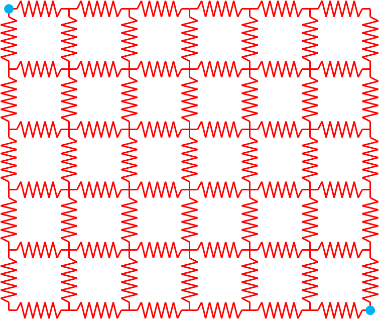

GridPACK Examples
=================

This section will expand on the discussion of the power flow application
and provide additional examples of how GridPACK can be used to develop
applications. Two of these are simple, non-power grid applications that
have been provided in GridPACK to illustrate how the code works, without
necessarily getting involved in the details that would be needed to
implement a realistic power grid model. The third example is an in-depth
discussion of a simplified version of the contingency analysis
application. This provides a good illustration of how to create
multi-task simulations and also an example of how to use modules. A more
complicated version of contingency analysis is available in the
application area. The main difference between the two is that the
contingency analysis simulation in the application area performs much
more analysis on the results of the individual contingencies.

All the codes discussed here can be found under the top-level GridPACK
directory in ``src/applications/examples``. The first of the simple
examples consists of a “hello world” program that writes a message from
a small :math:`10 \times 10` square grid of buses and branches. The
second example calculates the electric current flow through a square
grid of resistors. Both examples are designed to show how the basic
features of the GridPACK framework interact with each other. More
realistic examples for power grid models can be found in the modules and
components directories under applications. Athough these examples
represent more complicated bus and branch models, they contain many of
the same characteristics that can be found in the hello world and
resistor grid programs.

The simplified contingency analysis example illustrates a great many of
the advanced features of GridPACK in a fairly short code. These features
include creating your own parser, using subcommunicators and the task
manager, using modules and controlling output. ` <#topDoc>`__

.. _hello_world:

“Hello World”
-------------

The “Hello world” program is a famous example problem from C
programming. Many other packages have adopted the spirit of this
program, if not the specifics, to describe the simplest non-trivial
program that can be written using the package. In this section, a
program that prints out a message from each of the buses and branches on
a small grid is described. This application requires the user to define
branch and bus classes, create a network class and implement a top level
application. The source code for this example can be found in the
``hello_world`` directory.

We start by implementing the ``load`` and ``serialWrite``
methods in the ``BaseComponent`` class for the bus and branch
classes of our “Hello world” application. The bus and branch classes for
this application are called ``HWBus`` and ``HWBranch`` and have
the header file ``hw_components.hpp``

::

   #ifndef _hw_components_h_
   #define _hw_components_h_

   #include "boost/smart_ptr/shared_ptr.hpp"
   #include "gridpack/include/gridpack.hpp"

   namespace gridpack {
   namespace hello_world {
   class HWBus
     : public gridpack::component::BaseBusComponent {

     public:

       HWBus();  // Constructor
       ~HWBus()  // Destructor

       void load(const boost:shared_ptr
                 <gridpack::component::DataCollection> &data);

       bool serialWrite(char *string, const int bufsize,
                        const char *signal = NULL);

     private:

       int p_original_idx;

       friend class boost::serialization::access;
       template<class Archive> void serialize(Archive &ar,
         const unsigned int version)
       {
         ar & boost::serialization::base_object
            <gridpack::component::BaseBusComponent>(*this)
            & p_original_idx;
       }
   };

   class HWBranch
     : public gridpack::component::BaseBranchComponent {

     public:

       HWBranch();   //Constructor
       ~HWBranch();  //Destructor

       void load(const boost::shared_ptr
             <gridpack::component::DataCollection> &data);

       bool serialWrite(char *string, const int bufsize,
                        const char *signal = NULL);

     private:

       int p_original_idx1;
       int p_original_idx2;

       friend class boost::serialization::access;
       template<class Archive> void serialize(Archive & ar,
         const unsigned int version)
       {
         ar & boost::serialization::base_object
            <gridpack::component::BaseBranchComponent>(*this)
            & p_original_idx1
            & p_original_idx2;
       }
   };

   typedef network::BaseNetwork<HWBus, HWBranch > HWNetwork;

   }     // hello_world
   }     // gridpack
   #endif

The ``HWBus`` class has one private member, ``p_original_idx``,
which is the index of the bus in the network configuration file.
Similarly, the ``HWBranch`` class has two private members,
``p_original_idx1`` and ``p_original_idx2``, representing the
buses at the “from” and “to” ends of the branch. The first two lines of
the file are the standard preprocessor protection flags that guarantee
that any declarations in this file only appear in another file a single
time. The next two lines include the Boost smart pointer header file and
the header files from the GridPACK framework. The next two lines declare
that all functions and classes in the file are in the
``gridpack::hello_world`` namespace. The use of namespaces is up to
the user and other choices are possible. The declaration of the
``HWBus`` class inherits from the ``BaseBusComponent`` class so
all functions in the ``BaseBusComponent`` class are available to
``HWBus``. ``BaseBusComponent`` also provides some virtual
functions, along with their default implementations, that can be
overwritten in ``HWBus``. Two of these are the ``load`` and
``serialWrite`` functions. Only these functions are used in the
“Hello world” application, the remaining functions in the bases classes
are represented by the default implementations. Inside ``HWBus`` are
declarations for the constructor, destructor, ``load`` and
``serialWrite`` functions. These will be implemented in the
``hw_components.cpp`` file.

The final component in ``HWBus`` is the implementation of the
serialize method. This method is used when copying the class from one
processor to another and allows the program to move all the data
associated with a particular instance of ``HWBus`` to another
processor. The friend declaration means that
``boost::serialization::access`` has access to protected methods and
data in ``HWBus`` and the templated serialization function is used
to declare all internal data members that need to be transferred with
the ``HWBus`` instance if it is moved from one processor to another.
These elements include whatever base class ``HWBus`` may be derived
from, which is represented by the element

::

   boost::serialization::base_object<gridpack::component
        ::BaseBusComponent>(*this)

The remaining data element moved by the serialization method is
``p_original_idx``. The variable ``ar`` of type ``Archive``
is appended using the operator ``&``. In this case the data appended
to ``ar`` is any serialized data coming from the base class and the
variable ``p_original_idx``. The serialization function is
recursive, so including the base class is enough to guarantee that any
variables beneath that are also included in the serialization.

The declaration for ``HWBranch`` is very similar. The only major
difference is that there are two private variables representing the
buses at either end of the branch and these must both be included in the
``serialize`` function. The bottom of the file contains a typedef
declaration for a network using HWBus and HWBranch for it bus and branch
classes. This is a convenience and makes it easier to define other
functions and classes in the application.

The ``hw_components.cpp`` file contains the actual implementation of
the functions declared in ``hw_components.hpp``. The declarations
for STL vectors and iostreams and the ``hw_components.hpp`` file are
included at the top of the file so that all functions in the class are
defined. For ``HWBus``, the constructor and destructor are trivial
and are given by

::

   gridpack::hello_world::HWBus::HWBus()}}}
       {
         p_original_idx = 0;
       }

       gridpack::hello_world::HWBus::~HWBus()
       {
       }

The ``load`` function is more interesting and is designed to
transfer data that was read in from the network configuration file to
the internal parameters of the bus. In this case, there is only one
internal parameter, so ``load``\ ````\ is fairly simple. The bus ID
is stored in the variable ``BUS_NUMBER``, so the load implemention
is

::

   void gridpack::hello_world::HWBus::load(const
            boost::shared_ptr<gridpack::component::DataCollection> &data)
       {
          data->getValue(BUS_NUMBER,&p_original_idx);}}}
       }

All the parameters associated with the bus that came from the network
configuration file are stored in the ``data DataCollection`` object,
so the ``getValue`` statement is used to get the value from
``data`` and assign it to ``p_original_index``. A completely
listing of all variables that might be found in a ``DataCollection``
object can be found in the ``dictionary.hpp`` file located in the
``src/parser`` directory. The ``serialWrite`` function returns a
string with a message from the bus if called by some other program (in
this case an instance of ``SerialBusIO``). For “Hello world”, the
bus reports back the bus index using the function

::

   bool gridpack::hello_world::HWBus::serialWrite(char *string,
                const int bufsize, const char *signal)
        {
          sprintf(string,"Hello world from bus %d\n",p_original_idx);
          return true;
        }

For this case, both the incoming variables ``bufsize`` and
``signal`` are ignored since “Hello world” only has one type of
output and it is guaranteed to fit in the buffer, but both variables
could be used in more complicated implementations. The ``bufsize``
variable can be used to make sure that the string does not exceed an
internal buffer size and ``signal`` can by used to produce different
outputs depending on what the actual contents of signal are. For the
``serialWrite`` implementations described for this application,
guaranteeing that the strings fit inside the buffer is straightforward,
since all strings are the same size. For real applications, this may not
be the case. For example, when printing out generator properties, the
strings from buses can vary in size because the number of generators on
a bus can vary. The implementations of the analogous functions in
``HWBranch`` are similar. The constructor and destructor are

::

   gridpack::hello_world::HWBranch::HWBranch(void)}}}
       {
         p_original_idx1 = 0;
         p_original_idx2 = 0;
       }

       gridpack::hello_world::HWBranch::~HWBranch(void)
       {
       }

The ``load`` function is given by

::

   void gridpack::hello_world::HWBranch::load(
           const boost::shared_ptr<gridpack::component::DataCollection> &data)
       {
         data->getValue(BRANCH_FROMBUS,&p_original_idx1);
         data->getValue(BRANCH_TOBUS,&p_original_idx2);
       }

This is similar to the implementation of the load function for
``HWBus``, except that the internal data members are mapped to the
values of the ``BRANCH_FROMBUS`` and ``BRANCH_TOBUS`` elements
of the data collection object. The serialWrite function is

::

   bool gridpack::hello_world::HWBranch::serialWrite(char *string,
            const int bufsize, const char *signal)
        {
          sprintf(string,
              "Hello world from the branch connecting bus %d to bus %d\n",
              p_original_idx1, p_original_idx2);
          return true;
        }

Every branch prints out a string describing the branch in terms of the
bus IDs at each end of the branch. Again, the incoming bufsize and
signal variables are ignored in this case and it is assumed that the
buffer size assigned to the ``SerialBranchIO`` object when it is
instantiated is sufficiently large to guarantee that all strings from
every branch will fit.

The implementation of the factory class for the “Hello world”
application is straightforward, since the class only needs the
functionality in the BaseFactory class. The complete class is given by

::

   #ifndef _hw_factory_h\_
   #define _hw_factory_h_

   #include "boost/smart_ptr/shared_ptr.hpp"
   #include "gridpack/include/gridpack.hpp"
   #include "hw_components.hpp"

   namespace gridpack {
   namespace hello_world {

   class HWFactory
     : public gridpack::factory::BaseFactory<HWNetwork> {

     public:

       HWFactory(boost::shared_ptr<HWNetwork> network)
         : gridpack::factory::BaseFactory<HWNetwork>(network) {}

       ~HWFactory() {}

   };
   } // hello_world
   } // gridpack

   #endif

This class is defined in the ``hw_factory.hpp`` file. Because the
class is so simple, the complete class declaration is given in
``hw_factory.hpp`` and there is no corresponding ``.cpp`` file.
In addition to including the ``gridpack.hpp`` header, this file also
includes ``hw_components.hpp``, so it has the definitions of
``HWNetwork``. The ``HWFactory`` constructor is used to
initialize the underlying ``BaseFactory`` object with the network
that is passed in through the argument list. That is the only
functionality that is defined in this class.

The application class that is built on top of the component and factory
classes consists of the class

::

   #ifndef _hw_app_h_
       #define _hw_app_h_

       namespace gridpack {
       namespace hello_world {

       class HWApp
       {
         public:

           HWApp(void);
           ~HWApp(void);
           void execute(int argc, char** argv);

       };
       } // hello_world
       } // gridpack
       #endif

This class is declared in ``hw_app.hpp``. Apart from the constructor
and destructor, there is only the function execute, which is used to
actually run the program. This takes the standard ``argc`` and
``argv`` variables as arguments, which could be passed in from the
top level calling program.

The implementation of these functions are relatively simple, most of the
complexity for this program is in defining the bus and branch classes.
The implementations are defined in the file hw_app.cpp

::

   #include <iostream>
   #include "boost/smart_ptr/shared_ptr.hpp"

   #include "gridpack/include/gridpack.hpp"
   #include "hw_app.hpp"
   #include "hw_factory.hpp"

   gridpack::hello_world::HWApp::HWApp(void)
   {
   }

   gridpack::hello_world::HWApp::~HWApp(void)
   {
   }

   void gridpack::hello_world::HWApp::execute(int argc, char** argv)
   {
     gridpack::parallel::Communicator world;
     boost::shared_ptr<HWNetwork> network(new HWNetwork(world));

     std::string filename = "10x10.raw";

     gridpack::parser::PTI23_parser<HWNetwork> parser(network);

     parser.parse(filename.c_str());
     gridpack::hello_world::HWFactory factory(network);

     factory.load();

     gridpack::serial_io::SerialBusIO<HWNetwork> busIO(128,network);
     busIO.header("\nMessage from buses\n");
     busIO.write();

     gridpack::serial_io::SerialBranchIO<HWNetwork>
       branchIO(128,network);
     branchIO.header("\nMessage from branches\n");
     branchIO.write();}}}
   }

The top of the file contains the ``gridpack.hpp`` header as well as
the application headers. The constructor and destructors for the
``HWApp`` class are the standard defaults, so only the
``execute`` function has any significant behavior. This function
starts by defining a communicator on the set of all processors and using
that to instantiate an instance of an ``HWNetwork``. At this point
the network exists, but it contains no buses or branches. The next step
is to read in a network configuration file with the name
``10x10.raw``. This file is written using the standard PSS/E version
23 format. For this simple application, it is assumed that the file is
available in the directory in which the program is being run (this file
is included in the ``hello_world`` directory as part of the GridPACK
distribution). The program creates an instance of a ``PTI23_parser``
and uses this to parse the configuration file. The program now has a
copy of the full network stored internally, but the buses and nodes are
not distributed in a way that is convenient for computation. Calling the
partition method on the network redistributes all buses and branches so
that each process has a relatively connected chunk of the network.

The next step is to create an ``HWFactory`` instance and use this to
call the base class ``load`` method. This method in turn calls the
``load`` method on all the individual buses and branches and
transfers data from the data collection objects to the internal
parameters of the buses and branches. The data collection objects were
initialized with data collected from the ``10x10.raw`` file when the
``parse`` function was called. The remaining lines create
``SerialBusIO`` and ``SerialBranchIO`` objects that are used to
print out the messages from individual bus and branch objects. The
``busIO`` object is used to print out a header (“Message from
buses”) and then a message from each bus identifying itself by the bus
ID defined in the PSS/E file. Similarly, the ``branchIO`` obect
writes out a header and then a message from each branch identifying
itself by the IDs of the buses at either end. The final part of the
“Hello world” application is the main calling program, located in the
file hw_main.cpp. This program consists of the lines

::

   #include "gridpack/include/gridpack.hpp"
   #include "hw_app.hpp"

   int main(int argc, char **argv)
   {
     gridpack::parallel::Environment env(argc, argv);
     {
       gridpack::hello_world::HWApp app;
       app.execute(argc, argv);
     }

     return 0;
   }

The program consists of a line creating a parallel environment, a line
instantiating an ``HWApp``, and a line calling the execute method on
the application. The constructor for the parallel environment
initializes the underlying parallel communication libraries. The
destructor is called at the end of main and terminates all communication
libraries so that the program exits cleanly. The ``HWApp`` instance
runs the application when ``execute`` is called. A portion of the
output looks like

::

   Message from buses
   Hello world from bus 1
   Hello world from bus 2
   Hello world from bus 3
   Hello world from bus 4
   Hello world from bus 5
   Hello world from bus 6
   Hello world from bus 7
        :
   Message from branches
   Hello world from the branch connecting bus 1 to bus 2
   Hello world from the branch connecting bus 2 to bus 3
   Hello world from the branch connecting bus 3 to bus 4
   Hello world from the branch connecting bus 4 to bus 5
   Hello world from the branch connecting bus 5 to bus 6
       :

Note that this output would be the same, regardless of the number of
processors that are used to run the code. This is in spite of the fact
that the distribution of buses and branches may be different for
different numbers of processors. ` <#topDoc>`__

Resistor Grid Application
-------------------------

The resistor grid is a more complicated example that illustrates how
GridPACK can be used to set up equations describing a physical system
and then solve the system using a linear solver. The physical system is
a rectangular grid with resistors connecting all the nodes. Two nodes
are chosen to be set at fixed potentials, these then drive currents
through the rest of the network resulting in different currents on the
individual branches and different voltages on the different buses
(nodes). The system is illustrated schematically in
Figure `9.1 <#fig:resistor>`__.


   name: fig:resistor
   :width: 5in

   A schematic diagram of a simple resistor grid network. The buses
   (nodes) in blue are set at fixed external voltages, the remaining bus
   voltages and branch currents are calculated by the application.

The topology and choice of nodes held at fixed potential is determined
by the network configuration file, as are the values of the resistance
on each of the branches. The system is described by a set of coupled
equations representing the application of Kirchhoff’s law to each of the
nodes that is not held at a fixed potential. Kirchhoff’s law is
expressed by the equations\ 

.. math:: \sum_{\beta \in \left\{\alpha \right\}}{i_{\alpha \beta }=0}

where :math:`i_{\alpha \beta }` is the current flowing between nodes
:math:`\alpha` and :math:`\beta` and :math:`\left\{\alpha \right\}` is
the set of nodes connected directly to :math:`\alpha`. The current can
be found from Ohm’s law

.. math:: i_{\alpha \beta }=\frac{V_{\alpha }-V_{\beta }}{R_{\alpha \beta }}

Where :math:`V_{\alpha }` and :math:`V_{\beta }` are the voltage
potentials on nodes :math:`\alpha` and :math:`\beta` and
:math:`R_{\alpha \beta }` is the resistance on the branch connecting
nodes :math:`\alpha` and :math:`\beta`. Plugging the expression for the
current back into Kirchhoff’s law gives the equation

.. math:: \sum_{\beta \in \left\{\alpha \right\}}{\frac{V_{\alpha }-V_{\beta }}{R_{\alpha \beta }}=V_{\alpha }\sum_{\beta \in \left\{\alpha \right\}}{\frac{1}{R_{\alpha \beta }}}-\sum_{\beta \in \left\{\alpha \right\}}{\frac{V_{\beta }}{R_{\alpha \beta }}}=0}

The unknowns in this system are the potentials :math:`V_{\alpha }`.
Kirchhoff’s law applies to any node that does not have an applied value
of the potential. The nodes that do have a fixed potential appear as
part of the right hand side vector. Assuming that any node with a
non-fixed value of the potential is attached to at most one fixed node,
then the :math:`\alpha`\ th element of the right hand side vector is

.. math:: \frac{V^{\boldsymbol{0}}_{\boldsymbol{\beta }}}{R_{\alpha \beta }}

where :math:`V^{\boldsymbol{0}}_{\boldsymbol{\beta }}` is the value of
the fixed potential on node :math:`\beta` and :math:`\alpha` is attached
to :math:`\beta`. If :math:`\alpha` is not attached to :math:`\beta`,
then the element is zero. The voltages can be evaluated by solving the
matrix equation

.. math:: \overline{\overline{C}}\cdot \overline{V}={\overline{I}}_0

The voltage vector and right hand side have already been discussed. The
matrix elements have the form

.. math:: C_{\alpha \alpha }=\sum_{\beta \in \left\{\alpha \right\}}{\frac{1}{R_{\alpha \beta }}}

.. math:: C_{\alpha \beta }=-\frac{1}{R_{\alpha \beta }}\ \mathrm{\;\;\;\;\;if}\ \alpha \neq \beta

With this background, we can talk about the implementation of the
resistor grid application.

Much of the basic structure of the classes has already been discussed in
the “Hello world” example in section `9.1 <#hello_world>`__, so we will
limit ourselves to discussing new features. The source code for this
example can be found in the ``resistor_grid`` directory. The
``RGBus`` class inherits from the ``BaseBusComponent`` class and
implements the following functions (in addition to the constructor and
destructor)

::

   void load(const boost::shared_ptr
     <gridpack::component::DataCollection> &data);
   bool isLead() const;
   double voltage() const;
   bool matrixDiagSize(int *isize, int *jsize) const;
   bool matrixDiagValues(ComplexType *values);
   bool vectorSize(int *isize) const;
   bool vectorValues(ComplexType *values);
   void setValues(gridpack::ComplexType *values);
   int getXCBufSize();
   void setXCBuf();
   bool serialWrite(char *string, const int bufsize,
     const char *signal = NULL);

In addition, the ``RGBus`` class has three private members

::

   bool p_lead;
   double *p_voltage;
   double p_v;

The variable ``p_lead`` keeps track of whether a bus has a fixed
voltage applied to it. In order to correctly calculate the currents, it
is necessary to exchange voltages at the end of the calculation. The
voltages at each bus are stored in an exchange buffer that can be
accessed by the pointer ``p_voltage``. The voltages in the external
PSS/E file are read in before the exchange buffer is allocated, so to
make sure there is a variable to store the value, the variable
``p_v`` is also included as a private member. In addition to
implementing ``load`` and ``serialWrite``, the ``RGBus``
class implements several functions in the ``MatVecInterface``, as
well as two functions, ``isLead()`` and ``voltage()``, that are
unique to this class.

Similarly, the ``RGBranch`` class implements the functions

::

   void load(const boost::shared_ptr
     <gridpack::component::DataCollection> &data);
   double resistance(void) const;
   bool matrixForwardSize(int *isize, int *jsize) const;
   bool matrixReverseSize(int *isize, int *jsize) const;
   bool matrixForwardValues(ComplexType *values);
   bool matrixReverseValues(ComplexType *values);
   bool serialWrite(char *string, const int bufsize,
     const char *signal = NULL);

and has the private member

::

   double p_resistance;

The ``RGBus`` load method has the implementation

::

   void gridpack::resistor_grid::RGBus::load(const
            boost::shared_ptr<gridpack::component::DataCollection> &data)
   {
      int type;
      data->getValue(BUS_TYPE,&type);
      if (type == 2) {
        p_lead = true;
        data->getValue(BUS_BASEKV,&p_v);
      }
   }

The PSS/E file that is used to run this application has been configured
so that the bus type parameter is set to 2 if the bus has a fixed
voltage and the value of the voltage is stored in the ``BUS_BASEKV``
variable. The private member ``p_lead`` is initialized to false in
the ``RGBus`` constructor and ``p_v`` is initialized to zero. In
the ``load`` method, the bus type is assigned from the
``BUS_TYPE`` variable in the data collection. If it is 2, the bus
has a fixed value of the potential and ``p_lead`` is set to true.
The value of ``p_v`` is assigned to whatever is stored in the
``BUS_BASEKV`` variable when the bus type is 2. The contents of
``p_v`` will eventually be mapped to ``p_voltage``, once the
exchange buffers are allocated.

The ``load`` function for ``RGBranch`` simply assigns the data
collection variable ``BRANCH_R`` to the private member
``p_resistance``.

::

   void gridpack::resistor_grid::RGBranch::load(
       const boost::shared_ptr
       <gridpack::component::DataCollection> &data)
   {
     data->getValue(BRANCH_R,&p_resistance,0);
   }

Once the bus and branch private members have been set using the load
methods, the values can be recovered by other objects using the
accessors ``isLead``, ``voltage``, and ``resistance``. These
functions are used in the math interface implementations to calculate
values of the matrix elements and right hand side vectors and have the
relatively simple forms

::

   bool gridpack::resistor_grid::RGBus::isLead() const
   {
     return p_lead;
   }

   double gridpack::resistor_grid::RGBus::voltage() const
   {
     return *p_voltage;
   }

   double gridpack::resistor_grid::RGBranch::resistance(void) const
   {
     return p_resistance;
   }

Note that the ``voltage`` function is returning the contents of
``p_voltage``, which will contain up-to-date values of the voltage
once the calculation begins.

The diagonal matrix block routines in the bus class have the
implementations

::

   bool gridpack::resistor_grid::RGBus::matrixDiagSize(int *isize,
      int *jsize) const
   {
     if (!p_lead) {
       *isize = 1;
       *jsize = 1;
       return true;
     } else {
       return false;
     }
   }

   bool gridpack::resistor_grid::RGBus::matrixDiagValues(
      ComplexType *values)
   {
     if (!p_lead) {
       gridpack::ComplexType ret(0.0,0.0);
       std::vector<shared_ptr<BaseComponent> > branches;
       getNeighborBranches(branches);
       int size = branches.size();
       int i;
       for (i=0; i<size; i++) {
         gridpack::resistor_grid::RGBranch *branch
           = dynamic_cast<gridpack::resistor_grid::RGBranch*>
             (branches[i].get());
         ret += 1.0/branch->resistance();
       }
       values[0] = ret;
       return true;
     } else {
       return false;
     }
   }

The ``matrixDiagSize`` routine returns a single element in the
``values`` array if the bus is not a lead with a fixed voltage,
otherwise it returns false and there are no values in the ``values``
array. The ``matrixDiagValues`` function sets the first element of
the ``values`` array equal to the sum of the reciprocal of the
resistances on all the attached branches, if the bus is not a lead. To
calculate this quantity, it starts by calling the
``getNeighborBranches`` function to get a list of pointers to
attached branches. These pointers are all of type ``BaseComponent``,
so they need to be cast to pointers of type ``RGBranch`` before
functions like ``resistance`` can be called on them. This is done by
first calling the ``get`` function on the ``shared_ptr`` to the
``BaseComponent`` object to get a bare pointer to the neighboring
branch and then doing a dynamic cast to a pointer of type
``RGBranch``. The resistance method can now by called on the
``RGBranch`` pointer to get the resistance of the branch and use it
to calculate the contribution to the diagonal matrix element. This value
is assigned to ``values[0]``. If the bus is a lead, then no values
are calculated and the function returns false. It is also worth noting
that this function will only be called on buses that are local to the
process, so each bus that evaluates a diagonal matrix element will have
a complete set of branches attached to it. This is not the case for
ghost buses. These have only one branch attached to them, no matter how
many branches are attached to it in the original network.

The off-diagonal elements are calculated by the branch components in the
functions ``matrixForwardSize``, ``matrixReverseSize``,
``matrixForwardValues``, and ``matrixReverseValues``. The matrix
:math:`\overline{\overline{C}}` for the resistor grid problem is
completely symmetric, so in this case, the forward and reverse
calculations are identical. For realistic power problems, this is not
generally true, and the forward and reverse functions will have
different implementations. The forward functions are described below,
the implementation of the reverse functions is identical. The branch
forward size and value functions are

::

   bool gridpack::resistor_grid::RGBranch::matrixForwardSize(
      int *isize, int *jsize) const
   {
     gridpack::resistor_grid::RGBus *bus1
       = dynamic_cast<gridpack::resistor_grid::RGBus*>(getBus1().get());
     gridpack::resistor_grid::RGBus *bus2
       = dynamic_cast<gridpack::resistor_grid::RGBus*>(getBus2().get());
     if (!bus1->isLead() && !bus2->isLead()) {
       *isize = 1;
       *jsize = 1;
       return true;
     } else { 
       return false;
     }
   }

   bool gridpack::resistor_grid::RGBranch::matrixForwardValues(
      ComplexType *values)
   {
     gridpack::resistor_grid::RGBus *bus1
       = dynamic_cast<gridpack::resistor_grid::RGBus*>(getBus1().get());
     gridpack::resistor_grid::RGBus *bus2
       = dynamic_cast<gridpack::resistor_grid::RGBus*>(getBus2().get());
     if (!bus1->isLead() && !bus2->isLead()) {
       values[0] = -1.0/p_resistance;
       return true;
     } else {
       return false;
     }
   }

Before these functions can calculate return values, they must first
determine if one of the buses at either end of the branch is a lead bus.
To do this, the functions need to get pointers to the “from” and “to”
buses at either end of the branch. They can do this through the
``getBus1`` and ``getBus2`` calls in the
``BaseBranchComponent`` class which return pointers of type
``BaseComponent``. These pointers can then be converted to
``RGBus`` pointers by a dynamic cast. The ``isLead`` functions
can be called to find out if either bus is a lead bus. If neither bus is
a lead bus, the size of the off-diagonal block is returned as a 1x1
matrix and the off-diagonal matrix element is calculated and returned in
``values[0]``. Otherwise both functions return false to indicate
that there is no contribution to the matrix from this branch.

In addition to calculating values of the matrix
:math:`\overline{\overline{C}}`, it is also necessary to set up the
right hand side vector. This is done via the functions
``vectorSize`` and ``vectorValues`` defined on the buses. Only
buses that are not lead buses contribute to the right hand side vector.
On the other hand, the only non-zero values in the right hand side
vector come from non-lead buses that are attached to lead buses. The
``vectorSize`` function has the implementation

::

   bool gridpack::resistor_grid::RGBus::vectorSize(int *isize) const
   {
     if (!p_lead) {
       *isize = 1;
       return true;
     } else {
       return false;
     }
   }

If a bus is not a lead bus, it contributes a single value, otherwise it
does not and the function returns false. The ``vectorValues``
function is a bit more complicated. It has the form

::

   bool gridpack::resistor_grid::RGBus::vectorValues(ComplexType *values)
   {
     if (!p_lead) {
       std::vector<boost::shared_ptr<BaseComponent> > branches;
       getNeighborBranches(branches);
       int size = branches.size();
       int i;
       gridpack::ComplexType ret(0.0,0.0);
       for (i=0; i<size; i++) {
         gridpack::resistor_grid::RGBranch *branch
           = dynamic_cast<gridpack::resistor_grid::RGBranch*>
             (branches[i].get());
         gridpack::resistor_grid::RGBus *bus1
           = dynamic_cast<gridpack::resistor_grid::RGBus*>
             (branch->getBus1().get());
         gridpack::resistor_grid::RGBus *bus2
           = dynamic_cast<gridpack::resistor_grid::RGBus*>
             (branch->getBus2().get());
         if (bus1 != this && bus1->isLead()) {
           ret += bus1->voltage()/branch->resistance();
         } else if (bus2 != this && bus2->isLead()) {
           ret += bus2->voltage()/branch->resistance();
         }
       }
       values[0] = ret;
       return true;

     } else {
       return false;
     }
   }

The ``vectorValues`` function starts by getting a list of branches
that are attached to the calling bus and then looping over the list.
Pointers to each of the branches, as well as the buses at each end of
the branch are obtained using the ``getBus1`` and ``getBus2``
functions. It is still necessary to determine which end of the branch is
opposite the calling bus and this can be done by checking the conditions
``bus1 != this`` and ``bus2 != this``. One of these will be true
for the bus opposite the calling bus. If this bus is also a lead bus,
then a contribution is added to the right hand side vector element. The
contribution can be calculated by getting the value of the fixed voltage
from the lead bus and dividing it by the resistance of the branch. These
values can be obtained by calling the bus ``voltage`` function and
the branch ``resistance`` function. The \*\ ``p_voltage`` value
of the calling bus is not used. If the calling bus is a lead bus, then
the function returns false.

The last function related to vectors that is implemented in the
``MatVecInterface`` is the ``setValues`` function

::

   void gridpack::resistor_grid::RGBus::setValues(
      gridpack::ComplexType *values)
   {
     if (!p_lead) { 
       *p_voltage = real(values[0]);
     }
   }

Once the voltages have been calculated by solving Kirchhoff’s equations,
it is necessary to have some way of pushing these back on the buses so
they can be written to output. The results of the linear solver are
returned in the ``values`` array. The number of values in this array
corresponds to the number of values contributed to the right hand side
vector (in this case 1 if the bus is not a lead). Thus, the value is
assigned to the internal ``p_voltage`` variable if the bus is not a
lead bus. This function will be called by all buses as part of the
``mapToBus`` function in the ``BusVectorMap``. In order to
correctly calculate the current on all branches for export to standard
out, it is necessary to have up-to-date values of the voltage on all
buses, including ghost buses. This requires a data exchange at the end
of the calculation. To enable this exchange, the ``getXCBufSize``
``and setXCBuf`` functions must be implemented in the ``RGBus``
class. These functions have the form

::

   int gridpack::resistor_grid::RGBus::getXCBufSize()
   {
     return sizeof(double);
   }

   void gridpack::resistor_grid::RGBus::setXCBuf(void *buf)
   {
     p_voltage = static_cast<double*>(buf);
     *p_voltage = p_v;
   }

The only variable that needs to be exchanged is the value of the
potential, so ``getXCBufSize`` returns the number of bytes in a
single double precision variable. The ``setXCBuf`` function assigns
the buffer pointed to by the variable ``buf`` to the internal data
member ``p_voltage``. At the same time, it initializes the contents
of ``p_voltage`` to the variable ``p_v``, which contains the
voltage read in from the external PSS/E file. The ``serialWrite``
functions on the buses and branches are used to write the voltages and
currents on all buses and branches to standard output. The
``serialWrite`` function on the buses has the form

::

   bool gridpack::resistor_grid::RGBus::serialWrite(char *string,
       const int bufsize, const char *signal)
   {
     if (p_lead) {
       sprintf(string,"Voltage on bus %d: %12.6f (lead)\n",
           getOriginalIndex(),*p_voltage);

     } else {
       sprintf(string,"Voltage on bus %d: %12.6f\n",
           getOriginalIndex(),*p_voltage);
     }
     return true;
   }

All buses return a string so the function always returns true. The
printout consists of the bus index, obtained with the
``getOriginalIndex`` function, and the value of the voltage on the
bus. Lead buses are marked in the output, indicating that the voltage is
the same as that specified in the input file, the remaining voltages are
calculated by solving Kirchhoff’s equations. For branches, the
serialWrite function is used to calculate and print the current flowing
across each branch

::

   bool gridpack::resistor_grid::RGBranch::serialWrite(char *string,
       const int bufsize,  const char *signal)
   {
     gridpack::resistor_grid::RGBus *bus1
       = dynamic_cast<gridpack::resistor_grid::RGBus*>(getBus1().get());
     gridpack::resistor_grid::RGBus *bus2
       = dynamic_cast<gridpack::resistor_grid::RGBus*>(getBus2().get());
     double v1 = bus1->voltage();
     double v2 = bus2->voltage();
     double icur = (v1 - v2)/p_resistance;
     sprintf(string,"Current on line from bus %d to %d is: %12.6f\n",
         bus1->getOriginalIndex(),bus2->getOriginalIndex(),icur);
     return true;
   }

All branches report the current flowing through them, so this function
also returns true for all branches. To calculate the current, it is
necessary to get the value of the voltages at both ends of the branch
using methods already described and then calculate the current by
dividing the difference in voltages by the resistance of the branch. The
print line prints the current and uniquely identifies each branch by
including the IDs of the buses at either end.

The factory class for resistor grid application only uses functionality
in the BaseFactory class and has the simple form

::

   class RGFactory
     : public gridpack::factory::BaseFactory<RGNetwork> {
     public:
       RGFactory(boost::shared_ptr<RGNetwork> network)
         : gridpack::factory::BaseFactory<RGNetwork>(network) {}

       ~RGFactory() {}
   };

Again, the ``BaseFactory`` class from which ``RGFactory``
inherits is initialized by passing the network argument through the
constructor. The declaration for this class is in the file
``rg_factory.hpp``. There is no corresponding ``.cpp`` file.

The ``RGApp`` class declaration is also simple and consists of the
functions

::

   class RGApp
   {
     public:

       RGApp(void);
       ~RGApp(void);
       void execute(int argc, char** argv);
   };

Again, arguments from the top level main program can be passed through
to the ``execute`` function, which is responsible for implementing
the actual resistor grid calculation. The ``RGApp`` class
declaration is contained in the ``rg_app.hpp`` file. The
implementation is contained in the ``rg_app.cpp`` file. The only
complicated function in the implementation is ``execute``, which
consists of

::

   void gridpack::resistor_grid::RGApp::execute(int argc, char** argv)
   {
     // read configuration file
     gridpack::parallel::Communicator world;
     gridpack::utility::Configuration *config =
       gridpack::utility::Configuration::configuration();
     config->open("input.xml",world);
     gridpack::utility::Configuration::CursorPtr cursor;
     cursor = config->getCursor("Configuration.ResistorGrid");


     // create network and read in external PTI file
     // with network configuration
     boost::shared_ptr<RGNetwork> network(new RGNetwork(world));
     gridpack::parser::PTI23_parser<RGNetwor> parser(network);
     std::string filename;
     if (!cursor->get("networkConfiguration",&filename)) {
       filename = "small.raw";
     }
     parser.parse(filename.c_str());


     // partition network
     network->partition();

     // create factory and load parameters from input
     // file to network components
     gridpack::resistor_grid::RGFactory factory(network);
     factory.load();

     // set network components using factory and set up exchange
     // of voltages between buses
     factory.setComponents();
     factory.setExchange();
     network->initBusUpdate();

     // create mapper to generate voltage matrix
     gridpack::mapper::FullMatrixMap<RGNetwork> vMap(network);
     boost::shared_ptr<gridpack::math::Matrix> V = vMap.mapToMatrix();

     // create mapper to generate RHS vector
     gridpack::mapper::BusVectorMap<RGNetwork> rMap(network);
     boost::shared_ptr<gridpack::math::Vector> R = rMap.mapToVector();

     // create solution vector by cloning R
     boost::shared_ptr<gridpack::math::Vector> X(R->clone());

     // create linear solver and solve equations
     gridpack::math::LinearSolver solver(*V);
     solver.configure(cursor);
     solver.solve(*R, *X);

     // push solution back on to buses
     rMap.mapToBus(X);

     // exchange voltages so that all buses have correct values. This
     // guarantees that current calculations on each branch are correct
     network->updateBuses();

     // create serial IO objects to export data
     gridpack::serial_io::SerialBusIO<RGNetwork> busIO(128,network);
     char ioBuf[128];
     busIO.header("\nVoltages on buses\n\n");
     busIO.write();

     gridpack::serial_io::SerialBranchIO<RGNetwork>
       branchIO(128,network);
     branchIO.header("\nCurrent on branches\n\n");
     branchIO.write();
   }

The beginning of the resistor grid application is more complicated than
“Hello world” in that it uses an input file to control the properties of
the linear solver that is used to solve current equations. To read in
the input file, the application starts by creating a communicator on the
set of all processors. Only one configuration object is available to the
application and the ``execute`` function gets a pointer to this
instance by calling the static function
``Configuration::configuration()``. This pointer can then be used to
read in the input file, “``input.xml``”, across all processes in the
communicator ``world`` using the ``open`` method. All processors
now have access to the contents of ``input.xml``. The input file
contains two pieces of information, the name of the PSS/E-formatted
resistor grid configuration file and the parameters for the linear
solver. The input file has the form

::

   <?xml version="1.0" encoding="utf-8"?>
   <Configuration>
     <ResistorGrid>
       <networkConfiguration> small.raw </networkConfiguration>
       <LinearSolver>
         <PETScOptions>
           -ksp_view
           -ksp_type richardson
           -pc_type lu
           -pc_factor_mat_solver_package superlu_dist
           -ksp_max_it 1
         </PETScOptions>
       </LinearSolver>
     </ResistorGrid>
   </Configuration>

The resistor grid file name can be obtained by getting a
``CursorPtr`` that is pointed at the ``ResistorGrid`` block in
the input file by using the ``getCursor`` function and then using
the ``get`` function to retrieve the actual file name located in the
``networkConfiguration``\ ````\ field. If no file is specified in
the input deck, the file name defaults to “``small.raw``”. At the
same time, an ``RGNetwork`` object is instantiated and used to
initialize an instance of ``PTI23_parser``. This can then read in
the resistor grid configuration file using the parse function.

At this point, all buses and branches have been created, but they may
not be distributed in a way that supports computation. The network
``partition`` function is called to redistribute the network so that
each process has maximal connections between components located on the
process and minimal connections to components located on other
processes. The ghost buses and branches are also added by the
``partition`` function.

After partitioning, an ``RGFactory`` object is created and the base
class ``load`` method is called to initialize the internal data
elements on each bus and branch in the network. This function
initializes both locally held components as well as ghost components, so
there is no need for a data exchange to guarantee that all components
are up to date. The factory also calls the base class
``setComponents`` method, which determines several types of internal
indices that are used to set up calculations. The buffers needed to
exchange data at the end of the calculation are set up by a call to the
factory ``setExchange`` method. Additional internal data structures
needed for the data exchange between buses are created by calling the
network ``initBusUpdate`` method. No data exchanges are needed
between branch components.

The next step in the algorithm is to create the matrix
:math:`\overline{\overline{C}}`, the right hand side vector and a vector
to contain the solution. Two separate mappers are needed, one for the
matrix :math:`\overline{\overline{C}}` and the other for the right hand
side vector. For the matrix, the code creates an instance of a
``FullMatrixMap`` that is initialized with the resistor grid
network. The ``mapToMatrix`` function is called to create the matrix
``V``. The right hand side vector is created by creating instance of
a ``BusVectorMap`` and using the ``mapToVector`` function to
create the vector ``R``. The solution vector ``X`` does not need
to be initialized to any particular value, it just needs to be the same
size as ``R`` so it is created by having ``R`` call the
``clone`` method in the ``Vector`` class and using the result to
initialize ``X``.

Once ``V``, ``R``, and ``X`` are available, the equations
can be solved using a linear solver. The linear solver is created by
initializing an instance of ``LinearSolver`` with the matrix
``V``. The solver class ``configure`` method can be used to
transfer solver parameters in the ``LinearSolver``\ ````\ block in
``input.xml`` to the solver. The ``cursor`` pointer that is
taken as an argument to ``configure`` is already pointing to the
``ResistorGrid`` block in the input file, so ``configure`` will
pick up any parameters in a ``LinearSolver`` block within the
``ResistorGrid`` block. After configuring the solver, the solution
vector can be obtained by calling the ``solve`` method and the
resulting voltages are pushed back to buses using the ``mapToBus``
method in the ``BusVectorMap`` class.

After calling ``mapToBus``, all locally held buses have correct
values of the voltage, but ghost buses still have their initial values.
To correct the voltages on ghost buses, it is necessary to call the
network ``updateBuses`` function. The buffer ``p_voltage`` now
contains correct values of the voltage on all buses.

The only remaining step is to write the results to standard output. The
voltages are written by creating an instance of ``SerialBusIO``. The
maximum buffer size is set to 128 characters, which is enough to hold
any lines of output coming from the buses. A header labeling the bus
output is written to standard out using the ``header`` method and
then bus voltages are written by calling ``write``. Similarly,
output from the branches can be written by creating an instance of
``SerialBranchIO``, writing a header using the
``header``\ ````\ method and then calling ``write``. Since only
one type of output comes from the branches and buses, no character
string is passed in as an argument to the ``write`` functions. The
``execute`` function has now completed all tasks associated with
solving the resistor grid problem and passes control back to the main
calling program.

The main calling program is relatively simple and consists of the code

::

   int main(int argc, char **argv)
   {
     gridpack::parallel::Environment env(argc, argv);
     {
       gridpack::resistor_grid::RGApp app;
       app.execute(argc, argv);
     }
     return 0;
   }

The parallel computing environment is set up by creating an instance of
``Environment``. The computing environment is also cleaned up at the
end of the calculation when the destructor for this object is called.
The math libraries are initialized ``Environment`` constructor and
cleaned up at the end of the calculation by a call to
thel\ ``Environment`` destructor. The only remaining calls are to
create an instance of an ``RGApp`` and call its ``execute``
method. The extra brackets around the ``resistor_grid`` instance
guarantees that the destructor for ``resistor_grid`` is called
before the destructor for ``Environment``. This ensures that any
data structure in the application are cleaned up before the parallel
environment is shut down.

A portion of the output from the resistor grid calculation is shown
below

::

   GridPACK math module configured on 8 processors
       :
   Voltages on buses

   Voltage on bus 1:     1.000000 (lead)
   Voltage on bus 2:     0.667958
   Voltage on bus 3:     0.467469
   Voltage on bus 4:     0.329598
   Voltage on bus 5:     0.227289
   Voltage on bus 6:     0.148733
   Voltage on bus 7:     0.088491
       :
   Current on branches

   Current on line from bus 1 to 2 is:    20.000000
   Current on line from bus 2 to 3 is:     4.009776
   Current on line from bus 3 to 4 is:     2.757436
   Current on line from bus 4 to 5 is:     2.046167
   Current on line from bus 5 to 6 is:     4.545785
       :

The first line is written by the call to the math library
``Initialize`` function and reports on the number of processors
being used in the calculation. This information is useful in keeping
track of the performance characteristics of different calculations. Some
information from the solvers is usually printed after this. At the end
of the calculation, the values of the voltages on the buses are printed
out and then the current on each of the branches. The buses with
externally applied voltages are identified with keywork ”lead”.
` <#topDoc>`__

Contingency Analysis
--------------------

An example contingency application has been included in the contingency
analysis directory. This contingency analysis is simpler than the one
available under the ``applications`` directory and provides a
relatively compact demonstration of some of the advanced features of
GridPACK. This application is built entirely around the power flow
module, so it has no network component classes of its own. The main
functionality is located in the ``CADriver`` class that consists of
two methods (other than the constructor and destructor). One function is
used to read in a list of contingencies and convert them to a
corresponding ``Contingency`` data structure and the other function
executes the contingency analysis calculation. These two functions will
be discussed in detail.

The function for reading in the contingencies and converting them to a
list of Contingency data structures has the calling signature

::

   std::vector<gridpack::powerflow::Contingency> getContingencies(

     gridpack::utility::Configuration::ChildCursors contingencies)

The ``Contingency`` data structures are defined as part of the power
flow module and exist in the ``gridpack::powerflow`` namespace. The
list of cursors represented by the contingencies variable is obtained by
the calling program before calling this function. The function itself is

::

   std::vector<gridpack::powerflow::Contingency> ret;
     int size = contingencies.size();
     int i, idx;
     gridpack::utility::StringUtils utils;
     for (idx = 0; idx < size; idx++) {
       std::string ca_type;
       contingencies[idx]->get("contingencyType",&ca_type);
       std::string ca_name;
       contingencies[idx]->get("contingencyName",&ca_name);
       if (ca_type == "Line") {
         std::string buses;
         contingencies[idx]->get("contingencyLineBuses",&buses);
         std::string names;
         contingencies[idx]->get("contingencyLineNames",&names);
         std::vector<std::string> string_vec = 
             utils.blankTokenizer(buses);
         std::vector<int> bus_ids;
         for (i=0; i<string_vec.size(); i++) {
           bus_ids.push_back(atoi(string_vec[i].c_str()));
         }
         string_vec.clear();
         string_vec = utils.blankTokenizer(names);
         std::vector<std::string> line_names;
         for (i=0; i<string_vec.size(); i++) {
           line_names.push_back(utils.clean2Char(string_vec[i]));
         }
         if (bus_ids.size() == 2*line_names.size()) {
           gridpack::powerflow::Contingency contingency;
           contingency.p_name = ca_name;
           contingency.p_type = Branch;
           int i;
           for (i = 0; i < line_names.size(); i++) {
             contingency.p_from.push_back(bus_ids[2*i]);
             contingency.p_to.push_back(bus_ids[2*i+1]);
             contingency.p_ckt.push_back(line_names[i]);
             contingency.p_saveLineStatus.push_back(true);
           }
           ret.push_back(contingency);
         }
       }se if (ca_type == "Generator") {
         std::string buses;
         contingencies[idx]->get("contingencyBuses",&buses);
         std::string gens;
         contingencies[idx]->get("contingencyGenerators",&gens);
         std::vector<std::string> string_vec =
             utils.blankTokenizer(buses);
         std::vector<int> bus_ids;
         for (i=0; i<string_vec.size(); i++) {
           bus_ids.push_back(atoi(string_vec[i].c_str()));
         }
         string_vec.clear();
         string_vec = utils.blankTokenizer(gens);
         std::vector<std::string> gen_ids;
         for (i=0; i<string_vec.size(); i++) {
           gen_ids.push_back(utils.clean2Char(string_vec[i]));
         }
         if (bus_ids.size() == gen_ids.size()) {
           gridpack::powerflow::Contingency contingency;
           contingency.p_name = ca_name;
           contingency.p_type = Generator;
           int i;
           for (i = 0; i < bus_ids.size(); i++) {
             contingency.p_busid.push_back(bus_ids[i]);
             contingency.p_genid.push_back(gen_ids[i]);
             contingency.p_saveGenStatus.push_back(true);
           }
           ret.push_back(contingency);
         }
       }
     }
     return ret;

This function is designed to parse input of the form

::

   <?xml version="1.0" encoding="utf-8"?>
   <ContingencyList>
     <Contingency\_analysis>
       <Contingencies>
         <Contingency>
           <contingencyType>Line</contingencyType>
           <contingencyName>CTG1</contingencyName>
           <contingencyLineBuses> 13 14</contingencyLineBuses>
           <contingencyLineNames> B1 </contingencyLineNames>
         </Contingency>
         <Contingency>
           <contingencyType>Generator</contingencyType>
           <contingencyName>CTG2</contingencyName>
           <contingencyBuses> 2  </contingencyBuses>
           <contingencyGenerators>1 </contingencyGenerators>
         </Contingency>
       </Contingencies>
     </Contingency\_analysis>
   </ContingencyList>

The ``contingencies`` list in the argument consists of a vector of
``Configuration`` module cursors, each of which is pointing to one
of the ``Contingency`` blocks in this input.

The first few lines in the ``getContingencies`` function are used to
create the return list, determine the number of contingencies in the
``ChildCursors`` list and create a ``StringUtils`` object that
can be used to parse the input. The function then loops over all cursors
in the ``contingencies`` list. All contingencies should contain the
``contingencyType`` and ``contingencyName`` field, so these
values are obtained using the ``get`` function from the
``Configuration`` module. The type can be either “``Line``” or
“``Generator``”. Based on the type, the function bifurcates into two
branches. The “``Line``” branch looks for the strings corresponding
to ``contingencyLineBuses`` and ``contingencyLineNames`` and
assigns these to the string variables ``buses`` and ``names``.
More than one transmission element may be involved in the contingency.
The ``StringUtils`` ``blankTokenizer`` function is used to parse
the ``buses`` string into a list of strings that can then be
converted to a list of integers. These represent the original indices of
the buses at each end of the branch. The ``names`` string is also
converted to a list representing the two character tag identifying the
individual transmission element between the two buses. This is then
reformatted to a consistent 2-character format using the
``StringUtils`` ``clean2Char`` function. The string vector
``string_vec`` is used to hold the results from
``blankTokenizer``, and the final list of integers and character
tags are stored in the variables ``bus_ids`` and ``line_names``.
Each transmission element is characterized by two buses and a character
tag, so the number of bus IDs should be twice the number of tags. If
this condition is met, then the contingency is assumed to be well formed
and a ``Contingency`` struct is created for it. After copying the
data stored in the variables ``ca_type``, ``ca_name``,
``bus_ids`` and ``line_names``, this contingency is added to the
return variable ``ret``.

The “``Generator``” branch is similar to the “Line” branch. The
strings in the ``contingencyBuses`` and
``contingencyGenerators`` fields are copied into the string
variables ``buses`` and ``gens``. These are then converted into
a list of bus IDs and generator tags using the blankTokenizer function
and stored in the list ``bus_ids`` and ``gen_ids``. A generator
is characterized by the original index of the bus that it is associated
with and the 2-character generator tag so the size of the
``bus_ids`` and ``gen_ids`` vectors must be equal. If this
condition is met, then a ``Contingency`` struct is created, the
contingency data is copied to it and the struct is added to the return
variable ``ret``.

After all cursor in contingencies have been processed, the
``getContingencies`` function returns a list of ``Contingency``
structs representing all the contingencies in the original XML input
file.

The ``execute`` function actually runs the simulation and starts
with the code block

::

   void gridpack::contingency_analysis::CADriver::execute(int argc, char** argv)
   {
     gridpack::parallel::Communicator world;
     gridpack::utility::CoarseTimer *timer =
       gridpack::utility::CoarseTimer::instance();
     int t_total = timer->createCategory("Total Application");
     timer->start(t_total);

     gridpack::utility::Configuration *config
       = gridpack::utility::Configuration::configuration();
     if (argc >= 2 && argv[1] != NULL) {
       char inputfile[256];
       sprintf(inputfile,"%s",argv[1]);
       config->open(inputfile,world);
     } else {
       config->open("input.xml",world);
     }
   }

The user can pass in the name of the input file when they invoke the
contingency analysis application, and this is transmitted via the
variables ``argc`` and ``argv`` in the argument list. If an
argument is detected, then the code will try and open a file using the
argument as the filename, otherwise it will assume the input file is
called “``input.xml``”. Once the input file is open, all processors
have access to its contents. This section also creates a timing category
for the calculation and starts the timer. The call to
``CoarseTime::instance`` returns the timer object and the
``createCategory`` call creates a timer category with the name
“``Total Application``”. It also returns a handle to this category.
The ``start`` call begins the timer. The timer can be started and
stopped multiple times for the same category.

The next few lines are used to parse the input file and determine the
size of the communicators that should be used to run individual tasks.

::

   gridpack::utility::Configuration::CursorPtr cursor;
     cursor = config->getCursor("Configuration.Contingency_analysis");
     int grp_size;
     double Vmin, Vmax;
     if (!cursor->get("groupSize",&grp_size)) {
       grp_size = 1;
     }
     if (!cursor->get("minVoltage",&Vmin)) {
       Vmin = 0.9;
     }
     if (!cursor->get("maxVoltage",&Vmax)) {
       Vmax = 1.1;
     }
     gridpack::parallel::Communicator task_comm = world.divide(grp_size);

A ``CursorPtr`` is defined and set to point to the contents of the
``Contingency_analysis`` block in the input file using the
``getCursor`` function. This block contains parameters defining some
of the properties of the simulation. The ``groupSize`` parameter
sets the size of the communicator on which individual power flow
calculations are run. The power flow is not very scalable in GridPACK
and it is usually fastest to run it on one processor, so the default
value is 1. The ``minVoltage`` and ``maxVoltage`` parameters are
the limits, in p.u., for acceptable voltage variations on individual
buses. Once the group size has been set, the world communicator is
divided into subcommunicators using the divide function. This guarantees
that each subcommunicator contains at most the number of processes
specified using ``groupSize`` (one subcommunicator may contain less
than this number). Each process is now part of both the world
communicator and one subcommunicator.

The next block of code creates a power flow application on each task
communicator and initializes it.

::

   boost::shared_ptr<gridpack::powerflow::PFNetwork>
       pf_network(new gridpack::powerflow::PFNetwork(task_comm));
     gridpack::powerflow::PFAppModule pf_app;
     pf_app.readNetwork(pf_network,config);
     pf_app.initialize();
     pf_app.solve();
     pf_app.ignoreVoltageViolations(Vmin,Vmax);

The first line creates a power flow network on the task communicator.
The second line creates a power flow application. The
``readNetwork`` function assigns the powerflow network (which
currently has nothing in it) to the power flow application, along with
the pointer to the configuration module. The input file is expected to
have a ``Powerflow`` block that contains parameters for the power
flow application. These include the location of the network
configuration file and the type of solver that is to be used. An example
of a complete input file is

::

   <?xml version="1.0" encoding="utf-8"?>
   <Configuration>
     <Contingency\_analysis>
       <contingencyList>contingencies.xml</contingencyList>
       <groupSize>2</groupSize>
       <maxVoltage>1.1</maxVoltage>
       <minVoltage>0.9</minVoltage>
     </Contingency\_analysis>
     <Powerflow>
       <networkConfiguration> IEEE14\_ca.raw </networkConfiguration>
       <maxIteration>50</maxIteration>
       <tolerance>1.0e-6</tolerance>
       <LinearSolver>
         <PETScOptions>
           -ksp\_type richardson
           -pc\_type lu
           -pc\_factor\_mat\_solver\_package superlu\_dist
           -ksp\_max\_it 1
         </PETScOptions>
       </LinearSolver>
     </Powerflow>
   </Configuration>

Note that it has two blocks, ``Contingency_analysis`` and
``Powerflow``. The parameters describing the contingency calculation
and the location of the contingencies are located in the first block and
the power flow parameters are located in the second block. The
``readNetwork`` function will read in the network configuration file
and partition the network. The ``initialize`` function is used to
initialize the network components from the ``DataCollection``
objects and assign exchange buffers. The call to ``solve`` is used
to obtain a power solution to the base problem with no contingencies.
Since all tasks have the same data at this point, the network solution
is duplicated across all subcommunicators. This duplication is faster
than solving the base case powerflow on one processor and then
broadcasting the result across the system. The final call to
``ignoreVoltageViolations`` sets a parameter in each network
component that violates the voltage bounds for base case. These
components will be ignored in any subsequent checks for voltage
violations. This call is used to prevent all contingencies from
reporting a violation.

The next step is to read in the contingencies and convert these to a
list of contingency data structs.

::

   std::string contingencyfile;
     if (!cursor->get("contingencyList",&contingencyfile)) {
       contingencyfile = "contingencies.xml";
     }
     bool ok = config->open(contingencyfile,world);
     cursor = config->getCursor(
         "ContingencyList.Contingency_analysis.Contingencies");
     gridpack::utility::Configuration::ChildCursors contingencies;
     if (cursor) cursor->children(contingencies);
     std::vector<gridpack::powerflow::Contingency>
       events = getContingencies(contingencies);
     if (world.rank() == 0) {
       int idx;
       for (idx = 0; idx < events.size(); idx++) {
         printf("Name: %s\n",events[idx].p_name.c_str());
         if (events[idx].p_type == Branch) {
           int nlines = events[idx].p_from.size();
           int j;
           for (j=0; j<nlines; j++) {
             printf(" Line: (from) %d (to) %d (line) \'%s\'\n",
                 events[idx].p_from[j],events[idx].p_to[j],
                 events[idx].p_ckt[j].c_str());
           }
         } else if (events[idx].p_type == Generator) {
           int nbus = events[idx].p_busid.size();
           int j;
           for (j=0; j<nbus; j++) {
             printf(" Generator: (bus) %d (generator ID) \'%s\'\n",
                 events[idx].p_busid[j],events[idx].p_genid[j].c_str());
           }
         }
       }
     }

The location of the contingency file is contained in the
``contingencyList`` field in the input file. If this field is not
present, the code defaults to the file name ``contingencies.xml``.
The contintency file is then opened using the ``open`` function in
the ``Configuration`` module and a cursor is set to the
``Contingencies`` block within this file. The
``Configuration::children`` function returns a list of cursor
pointers that point to each of the individual ``Contingency``
blocks. The ``getContingencies`` function described above parses
each of these blocks and returns a vector of contingency data structs.
The contingency list is replicated on all processors. Process 0 is used
to provide a listing of the contingencies to standard output by looping
over the ``events`` vector returned by the ``getContingencies``
function.

Once the contingencies have been determined, the code next sets up a
task manager on the world communicator and sets the number of tasks
equal to the number of contingencies.

::

   gridpack::parallel::TaskManager taskmgr(world);
     int ntasks = events.size();
     taskmgr.set(ntasks);

The task loop is created by defining a ``task_id`` variable and a
character string buffer that is used inside the loop to create messages.
The task manager then begins iterating over different tasks.

::

   int task_id;
     char sbuf[128];
     while (taskmgr.nextTask(task_comm, &task_id)) {
       printf("Executing task %d on process %d\n",task_id,world.rank());

The call to ``nextTask`` takes the task communicator as one of its
arguments so the value of ``task_id`` that is returned is the same
for all processors on the task communicator. This guarantees that each
of the processors in this copy of the power flow applicatin is working
on the same contingency. If the ``nextTask`` function returns false,
the tasks have been completed and the code exits from the ``while``
loop. At the start of the task, the code prints out a statement to
standard out describing which tasks are being executed by each
processor.

The next few lines in the task loop are used to open a file so that the
output from each task is directed to a separate file. This can be used
later to examine individual tasks.

::

   sprintf(sbuf,"%s.out",events[task_id].p_name.c_str());
       pf_app.open(sbuf);
       sprintf(sbuf,"\nRunning task on %d processes\n",task_comm.size());
       pf_app.writeHeader(sbuf);
       if (events[task_id].p_type == Branch) {
         int nlines = events[task_id].p_from.size();
         int j;
         for (j=0; j<nlines; j++) {
           sprintf(sbuf," Line: (from) %d (to) %d (line) \'%s\'\n",
               events[task_id].p_from[j],events[task_id].p_to[j],
               events[task_id].p_ckt[j].c_str());
         }
       } else if (events[task_id].p_type == Generator) {
         int nbus = events[task_id].p_busid.size();
         int j;
         for (j=0; j<nbus; j++) {
           sprintf(sbuf," Generator: (bus) %d (generator ID) \'\%s\'\n",
           events[task_id].p_busid[j],
           events[task_id].p_genid[j].c_str());
         }
       }
       pf_app.writeHeader(sbuf);

The first line is used to create a name for the output file using the
contingency name. The output from the power flow calculation is then
redirected to this file using the power flow ``open`` function.
Next, some information about this particular contingency is written to
the file using some calls to the ``writeHeader`` method. This
includes the number of processors used to calculate the contingency and
the details of the contingency itself.

The remaining lines in the while loop are used to solve the power flow
equations.

::

   pf_app.resetVoltages();
       pf_app.setContingency(events[task_id]);
       if (pf_app.solve()) {
         pf_app.write();
         bool ok = pf_app.checkVoltageViolations(Vmin,Vmax);
         ok = ok && pf_app.checkLineOverloadViolations();
         if (ok) {
           sprintf(sbuf,"\nNo violation for contingency %s\n",
               events[task_id].p_name.c_str());
         } else {
           sprintf(sbuf,"\nViolation for contingency %s\n",
               events[task_id].p_name.c_str());
         }
         pf_app.print(sbuf);
       }
       pf_app.unSetContingency(events[task_id]);
       pf_app.close();
     }

Before doing the calculation, all voltages are returned to the original
values defined in the network configuration file using
``resetVoltages``. The contingency parameters are set to the values
specified by the ``task_id`` element in the ``events`` list
using the ``setContingency`` method.

The system is then solved using the power flow ``solve`` function.
If the solution succeeds, the calculation writes out the voltages and
branch power flow values to the outpuf file. The calculation also checks
for voltage violations and line overload violations. The results of
these checks are written to the output file for each power flow
calculation. After this is complete, the powerflow calculation returns
all contingency related parameters to their original values using
``unSetContingency`` and closes the output file. This is repeated
until all contingencies in the event list have been evaluated.

At this point, the contingency application is essentially complete. The
remaining lines of code

::

   taskmgr.printStats();
     timer->stop(t_total);
     if (events.size()*grp_size >= world.size()) {
       timer->dump();
     }

are used to print out a list of how many tasks were evaluated on each
processor and to stop the timing of the “``Total Application``”
category. The timer ``dump`` method will print statistics on the
amount of time spent in the total application as well as reporting
timings inside the power flow application. The check on the ``dump``
call is to verify that all processors have participated in at least one
power flow calculation. If this condition is not met, then the timing
statistics will not be valid (note that if this condition is not
fulfilled, then it indicates that too many processors were requested for
the calculation). ` <#topDoc>`__

.. |image1| image:: figures/PartitionFull.png
   :width: 4in
.. |image2| image:: figures/Partition0.png
   :width: 4in
.. |image3| image:: figures/Partition1.png
   :width: 4in
.. |image| image:: figures/Mapper-a.png
   :width: 6.5in
   :height: 2.3in
.. |image4| image:: figures/Mapper-b.png
   :width: 6.5in
   :height: 2.3in
.. |image5| image:: figures/Mapper-c.png
   :width: 6.5in
   :height: 1.8in
.. |image6| image:: figures/Mapper-d.png
   :width: 6.5in
   :height: 1.8in

